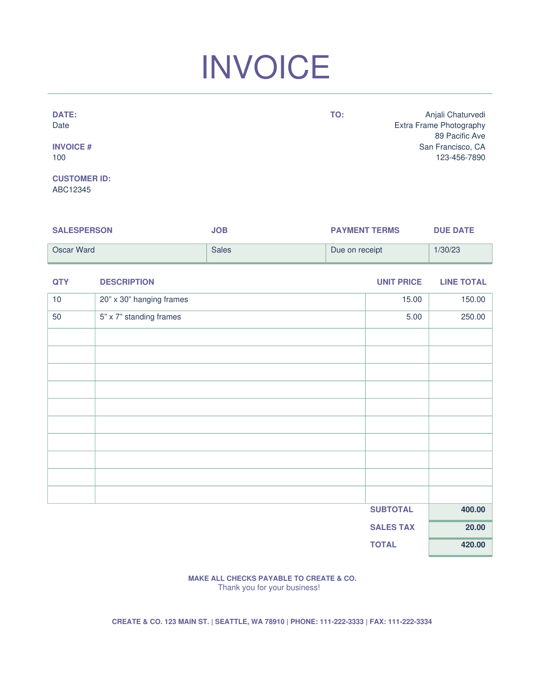
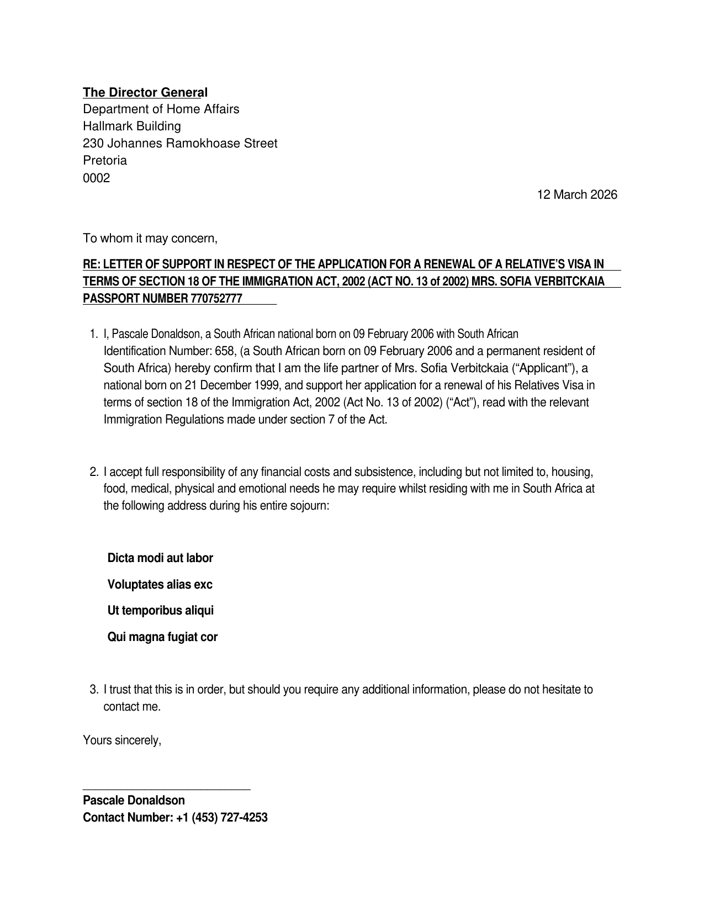

# MiniPdf vs Reference PDF Comparison Report

Generated: 2026-03-15T17:29:33.963958

## Summary

| # | Test Case | Text Sim | Visual Avg | Pages (M/R) | Overall |
|---|-----------|----------|------------|-------------|--------|
| 1 | ⚪ Confirmatory_Affidavit | N/A | N/A | ?/? | **N/A** |
| 2 | 🟢 Invoice | 1.0 | 0.939 | 1/1 | **0.9756** |
| 3 | 🟡 MODERN LIVING | 0.831 | 0.7808 | 2/2 | **0.8447** |
| 4 | 🟢 OSCAR WARD | 0.9941 | 0.842 | 1/1 | **0.9344** |
| 5 | 🟡 SA8000 ch sample | 0.9362 | 0.5684 | 2/3 | **0.7018** |
| 6 | 🔴 Support_Letter | 1.0 | 0.4758 | 2/1 | **0.6903** |

**Average Overall Score: 0.6911**

## Visual Comparison

<table>
<tr><th>MiniPdf</th><th>LibreOffice (Reference)</th></tr>
<tr>
  <td><b>Confirmatory_Affidavit</b></td>
  <td colspan="1">Confirmatory_Affidavit N/A</td>
</tr>
<tr>
  <td colspan="2"><i>No images</i></td>
</tr>
<tr>
  <td><b>Invoice</b></td>
  <td colspan="1">Invoice <span style="color:#3fb950">⬤</span> 97.6%</td>
</tr>
<tr>
  <td></td>
  <td></td>
</tr>
<tr>
  <td><b>MODERN LIVING</b></td>
  <td colspan="1">MODERN LIVING <span style="color:#d29922">⬤</span> 84.5%</td>
</tr>
<tr>
  <td></td>
  <td></td>
</tr>
<tr>
  <td></td>
  <td></td>
</tr>
<tr>
  <td><b>OSCAR WARD</b></td>
  <td colspan="1">OSCAR WARD <span style="color:#3fb950">⬤</span> 93.4%</td>
</tr>
<tr>
  <td></td>
  <td></td>
</tr>
<tr>
  <td><b>SA8000 ch sample</b></td>
  <td colspan="1">SA8000 ch sample <span style="color:#d29922">⬤</span> 70.2%</td>
</tr>
<tr>
  <td></td>
  <td></td>
</tr>
<tr>
  <td></td>
  <td></td>
</tr>
<tr>
  <td><i>missing</i></td>
  <td></td>
</tr>
<tr>
  <td><b>Support_Letter</b></td>
  <td colspan="1">Support_Letter <span style="color:#f85149">⬤</span> 69.0%</td>
</tr>
<tr>
  <td></td>
  <td></td>
</tr>
<tr>
  <td></td>
  <td><i>missing</i></td>
</tr>
</table>

## Detailed Results

### Confirmatory_Affidavit

**Error:** Reference PDF not found

### Invoice

- **Text Similarity:** 1.0
- **Visual Average:** 0.939
- **Overall Score:** 0.9756
- **Pages:** MiniPdf=1, Reference=1
- **File Size:** MiniPdf=20080 bytes, Reference=65867 bytes

<details><summary>Text Diff</summary>

```diff
--- minipdf/Invoice.pdf
+++ reference/Invoice.pdf
@@ -1,9 +1,12 @@
 INVOICE

 DATE: TO: Anjali Chaturvedi

-Date Extra Frame Photography

+Date

+Extra Frame Photography

 89 Pacific Ave

-INVOICE # San Francisco, CA

-100 123-456-7890

+INVOICE #

+San Francisco, CA

+100

+123-456-7890

 CUSTOMER ID:

 ABC12345

 SALESPERSON JOB PAYMENT TERMS DUE DATE

```
</details>

### MODERN LIVING

- **Text Similarity:** 0.831
- **Visual Average:** 0.7808
- **Overall Score:** 0.8447
- **Pages:** MiniPdf=2, Reference=2
- **File Size:** MiniPdf=321763 bytes, Reference=220316 bytes

<details><summary>Text Diff</summary>

```diff
--- minipdf/MODERN LIVING.pdf
+++ reference/MODERN LIVING.pdf
@@ -1,21 +1,30 @@
-MODERN LIVING

 OCTOBER / 20XX / ISSUE #10

+M O D E R N  L I V I N G

 Your guide to buy or rent

 Ready to settle? WHAT’S NEW

 By Peyton Davis

-TAKE A LOOK INSIDE

-Newsletters are periodicals used to advertise or update your subscribers with Add description text here to get your

+Newsletters are periodicals used to advertise or update your subscribers with TAKE A LOOK INSIDE

+information about your product or blog. They can be printed or emailed and

+Add description text here to get your

+are an excellent way to maintain regular contact with your subscribers and

 subscribers interested in your topic

-information about your product or blog. They can be printed or emailed and

-are an excellent way to maintain regular contact with your subscribers and

 drive traffic to your site. Type the content of your newsletter here.

 PROPERTY TRENDS

 Newsletters are periodicals used to advertise or update your subscribers with

 Add description text here to get your

 information about your product or blog. They are an excellent way to

 subscribers interested in your topic

+maintain regular contact with your subscribers. Type the content of your

+newsletter here.

+ARE YOU READY TO

+Newsletters are periodicals used to advertise or update your subscribers with LIST?

+information about your product or blog. Type the content of your newsletter

+Add description text here to get your

+here.

+subscribers interested in your topic

 ---PAGE---

-Take a look inside Property trends

+Take a look inside

+Property trends

 By Vanja Jovanovic

 By Kemen Ikaztegieta

 Newsletters are periodicals used to advertise or update your

@@ -26,15 +35,15 @@
 Newsletters are periodicals use to advertise or update your

 subscribers with information about your product or blog. They

 can be printed or emailed and are an excellent way to maintain

-regular contact with your subscribers and drive traffic to your Newsletters are periodicals used to

-site. Type your content here. advertise or update your subscribers with

+Newsletters are periodicals used to

+regular contact with your subscribers and drive traffic to your

+advertise or update your subscribers with

+site. Type your content here.

 information about your product or blog.

-Newsletters are periodicals use to advertise or update your

-They can be printed or emailed and are an

+Newsletters are periodicals use to advertise or update your They can be printed or emailed and are an

+excellent way to maintain regular contact

 subscribers with information about your product or blog. Type

-excellent way to maintain regular contact

-the content of your newsletter here.

-with your subscribers and drive traffic to

+the content of your newsletter here. with your subscribers and drive traffic to

 your site. Type the content of your

 newsletter here.

 Newsletters are periodicals used to

@@ -48,8 +57,8 @@
 Are you Newslett
... (635 more characters)

```
</details>

### OSCAR WARD

- **Text Similarity:** 0.9941
- **Visual Average:** 0.842
- **Overall Score:** 0.9344
- **Pages:** MiniPdf=1, Reference=1
- **File Size:** MiniPdf=13864 bytes, Reference=49023 bytes

<details><summary>Text Diff</summary>

```diff
--- minipdf/OSCAR WARD.pdf
+++ reference/OSCAR WARD.pdf
@@ -9,11 +9,12 @@
 conversation reinforced my enthusiasm for contributing to the team and bringing my expertise to

 the company’s ongoing initiatives. I found our discussion about future goals particularly

 inspiring, and it further solidified my excitement about this opportunity.

-The role’s focus on impactful work aligns with my professional background, and I look forward to

-the possibility of applying my skills to support the company’s growth. I am eager to bring my

+The role’s focus on impactful work aligns with my professional background, and I look forward

+to the possibility of applying my skills to support the company’s growth. I am eager to bring my

 experience in driving efficiency and innovation to the team while continuing to develop and

 refine my abilities in a fast-paced environment.

 Thank you again for your time and thoughtful discussion. I appreciate the chance to be

 considered and look forward to next steps. Please let me know if I can provide any additional

 details to assist in the decision-making process.

-Warm regards,
+Warm regards,

+Oscar Ward
```
</details>

### SA8000 ch sample

- **Text Similarity:** 0.9362
- **Visual Average:** 0.5684
- **Overall Score:** 0.7018
- **Pages:** MiniPdf=2, Reference=3
- **File Size:** MiniPdf=4178505 bytes, Reference=159484 bytes

<details><summary>Text Diff</summary>

```diff
--- minipdf/SA8000 ch sample.pdf
+++ reference/SA8000 ch sample.pdf
@@ -1,55 +1,55 @@
 SA8000 基础知识培训考试题

-部门： 工号： 姓名： 得分：

+部门：                工号：           姓名：            得分：

 一、判断题（共20 分，每题2 分）

-1、公司应在新员工入厂后一个月内与之签定劳动合同。（ √ ）

-2、劳动合同签订后如果员工需要则发给其一份，否公司可代为保管。（ × ）

-3、一般地说，公司的招聘广告不可有性别限制，法规允许的情形除外。（ √ ）

-4、公司员工每周至少要有一天休息。（ √ ）

-5、童工是指年龄在16 周岁以下的人（按照我国法律规定）。（ √ ）

-6、公司在员工辞职或解雇时应一次性把工资结算并支付。（ √ ）

-7、公司法定节假日安排上班的话，可以在其他时间安排调休。（ × ）

-8、当不同的法规、规章与SA8000 标准同一议题时，公司应遵守最严格的要求。（ √ ）

-9、根据劳动法规定，员工每月加班时间最多不超过36 小时。（ √ ）

-10、 某公司将职工食堂的饭票作为工资支付给职工。（ × ）

+1、公司应在新员工入厂后一个月内与之签定劳动合同。（ √  ）

+2、劳动合同签订后如果员工需要则发给其一份，否公司可代为保管。（  × ）

+3、一般地说，公司的招聘广告不可有性别限制，法规允许的情形除外。（  √   ）

+4、公司员工每周至少要有一天休息。（  √   ）

+5、 童工是指年龄在16 周岁以下的人（按照我国法律规定）。（  √   ）

+6、 公司在员工辞职或解雇时应一次性把工资结算并支付。（  √   ）

+7、 公司法定节假日安排上班的话，可以在其他时间安排调休。（  ×   ）

+8、 当不同的法规、规章与SA8000 标准同一议题时，公司应遵守最严格的要求。（  √    ）

+9、 根据劳动法规定，员工每月加班时间最多不超过36 小时。（  √    ）

+10、某公司将职工食堂的饭票作为工资支付给职工。（  ×   ）

 二、不定项选择题（共20 分，每题2 分）

-1、以下哪些形式属于强迫劳工（ ABD ）

-A、工厂对新员工要求扣押身份证一星期 B、工厂使用监狱劳工

-C、工厂只给1.2 倍的加班费 D、工厂要求员工晚上都加班，如果不加班就要罚款

-2、以下哪些属于特种作业，需要操作人员具有特种设备作业证（ ABCD ）

-A、电工作业 B、叉车 C、锅炉 D、电梯 E、冲床操作

-3、公司推行社会责任的好处（ ABC ）

-A、保护公司品牌形象 B、改善公司守法表现

-C、提高生产效率 D、避免股价上涨

-4、劳工标准包括（ ABCDE ）

-A、结社自由与集体谈判权 B、就业的自由选择权、禁止强迫劳动

-C、男女同工同酬的权利 D、禁止童工 E、合理的工作条件的权利

+1、以下哪些形式属于强迫劳工（ ABD  ）

+A、工厂对新员工要求扣押身份证一星期       B、工厂使用监狱劳工

+C、工厂只给1.2 倍的加班费                 D、工厂要求员工晚上都加班，如果不加班就要罚款

+2、以下哪些属于特种作业，需要操作人员具有特种设备作业证（ ABCD  ）

+A、电工作业      B、叉车    C、锅炉      D、电梯     E、冲床操作

+3、公司推行社会责任的好处（  ABC  ）

+A、保护公司品牌形象              B、改善公司守法表现

+C、提高生产效率                  D、避免股价上涨

+4、劳工标准包括（ ABCDE  ）

+A、结社自由与集体谈判权           B、就业的自由选择权、禁止强迫劳动

+C、男女同工同酬的权利      D、禁止童工      E、合理的工作条件的权利

 5、以下属于SA8000 标准要素的是（ ABCD ）

-A、童工 B、强迫性劳动 C、歧视 D、工作时间

-6、中国规定，未成年工是指任何年满 周岁但不满 周岁的工人（ B ）。

-A、14 , 16 B、16 , 18 C、16 ， 17 D、17 ， 18

-7、SA8000 标准中，强迫劳动说法正确的是（ B ）

-A、监狱劳动 B、标准禁止一切形式的强迫劳动

-C、契约劳动合法 D、抵债劳动

-8、社会责任管理体系审核的准则包括（ ABCD ）

-A、SA8000 社会责任国际标准； B、客户提供的供应商社会责任守则；

+A、童工     B、强迫性劳动        C、歧视          D、工作时间

+6、中国规定，未成年工是指任何年满     周岁但不满    周岁的工人（ B ）。

+A、14 , 16       B、16 , 18        C、16 ， 17      D、17 ， 18

+7、SA8000 标准中，强迫劳动说法正确的是（  B  ）

+A、监狱劳动                 B、标准禁止一切形式的强迫劳动

+C、契约劳动合法             D、抵债劳动

+8、社会责任管理体系审核的准则包括（  ABCD  ）

+A、SA8000 社会责任国际标准；    B、客户提供的供应商社会责任守则；

 C、适用的劳动保护及职业安全卫生法律法规和其他要求；

 D、公司社会责任管理手册，程序文件及其他社会责任管理体系文件。

-9、SA8000 现场审核包括（ ABCDE ）

-A、首次会议； B、收集审核证据； C、确定不符合项并编写不符合项报告；

-D、召开末次会议； E、宣布审核结果。

-10、公司应在新员工入厂后 ( A )个月内与之签定合同

-A、1 个月 B、二个月 C、3 个月 D、6 个月

+9、SA8000 现场审核包括（  ABCDE  ）

+A、首次会议；    B、收集审核证据； C、确定不符合项并编写不符合项报告；

+D、召开末次会议；  E、宣布审核结果。

+10、公司应在新员工入厂后 (  A  )个月内与之签定合同

+A、1 个月   B、二个月  C、3 个月   D、6 个月

 三、案例分析题（共10 分，每题5 分）

 针对以下事实描述分析是否违反社会责任要求，如果违反的话，请写出SA8000 的哪一条款。

-1、公司在运行SA8000 社会责任管理体系过程中，内审发现使用了2 名童工，公司的纠正措施是将2

-名童工立即开除。

+1、公司在运行SA8000 社会责任管理体系过程中，内审发现使用了2 名童工，公司的纠正措施

+是将2 名童工立即开除。

 STP 小组的含义是什么？

+---PAGE---

 ISO45001 基础知识培训考试题

----PAGE---

 一、 判断题（共20 分，每题2 分）

-1、一个管理十分严谨、设备精良并经消防主管部门审批
... (2049 more characters)

```
</details>

### Support_Letter

- **Text Similarity:** 1.0
- **Visual Average:** 0.4758
- **Overall Score:** 0.6903
- **Pages:** MiniPdf=2, Reference=1
- **File Size:** MiniPdf=4383 bytes, Reference=61824 bytes

<details><summary>Text Diff</summary>

```diff
--- minipdf/Support_Letter.pdf
+++ reference/Support_Letter.pdf
@@ -9,7 +9,7 @@
 RE: LETTER OF SUPPORT IN RESPECT OF THE APPLICATION FOR A RENEWAL OF A RELATIVE’S VISA IN

 TERMS OF SECTION 18 OF THE IMMIGRATION ACT, 2002 (ACT NO. 13 of 2002) MRS. SOFIA VERBITCKAIA

 PASSPORT NUMBER 770752777

-1. I, Pascale Donaldson, a South African national born on 09 February 2006 with South African

+1. I,  Pascale Donaldson, a South African national born on 09 February 2006 with South African

 Identification Number: 658, (a South African born on 09 February 2006 and a permanent resident of

 South Africa) hereby confirm that I am the life partner of Mrs. Sofia Verbitckaia (“Applicant”), a

 national born on 21 December 1999, and support her application for a renewal of his Relatives Visa in

@@ -22,11 +22,10 @@
 Voluptates alias exc

 Ut temporibus aliqui

 Qui magna fugiat cor

-3. I trust that this is in order, but should you require any additional information, please do not hesitate to

-contact me.

+3. I trust that this is in order, but should you require any additional information, please do not hesitate

+to contact me.

 Yours sincerely,

 ___________________________

 Pascale Donaldson

 Contact Number: +1 (453) 727-4253

----PAGE---

 E-Mail: wekygywis@mailinator.com
```
</details>

## Improvement Suggestions

### ⚠ Low-Score Test Cases (below 0.8)

1. **Support_Letter** (score: 0.6903)
1. **SA8000 ch sample** (score: 0.7018)

Review the text diffs and visual comparisons above to identify specific rendering issues.
