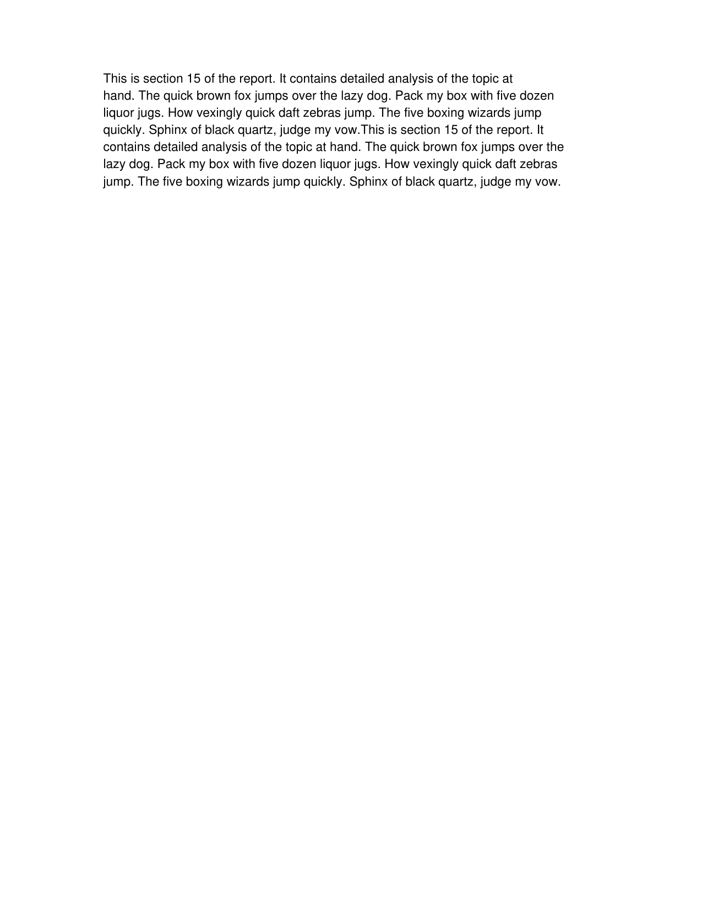

# MiniPdf vs Reference PDF Comparison Report

Generated: 2026-03-05T21:40:58.542917

## Summary

| # | Test Case | Text Sim | Visual Avg | Pages (M/R) | Overall |
|---|-----------|----------|------------|-------------|--------|
| 1 | 🟢 docx_classic01_single_paragraph | 1.0 | 0.9929 | 1/1 | **0.9972** |
| 2 | 🟢 docx_classic02_multiple_paragraphs | 1.0 | 0.9629 | 1/1 | **0.9852** |
| 3 | 🟢 docx_classic03_headings | 1.0 | 0.9877 | 1/1 | **0.9951** |
| 4 | 🟢 docx_classic04_bold_italic | 1.0 | 0.9971 | 1/1 | **0.9988** |
| 5 | 🟢 docx_classic05_font_sizes | 1.0 | 0.9831 | 1/1 | **0.9932** |
| 6 | 🟢 docx_classic06_font_colors | 1.0 | 0.9965 | 1/1 | **0.9986** |
| 7 | 🟢 docx_classic07_alignment | 1.0 | 0.9777 | 1/1 | **0.9911** |
| 8 | 🟢 docx_classic08_bullet_list | 0.9242 | 0.9944 | 1/1 | **0.9674** |
| 9 | 🟢 docx_classic09_numbered_list | 1.0 | 0.9907 | 1/1 | **0.9963** |
| 10 | 🟢 docx_classic10_simple_table | 1.0 | 0.9753 | 1/1 | **0.9901** |
| 11 | 🟢 docx_classic11_table_with_shading | 1.0 | 0.9218 | 1/1 | **0.9687** |
| 12 | 🟢 docx_classic12_merged_cells_table | 1.0 | 0.981 | 1/1 | **0.9924** |
| 13 | 🟢 docx_classic13_long_document | 1.0 | 0.9204 | 4/4 | **0.9682** |
| 14 | 🟢 docx_classic14_mixed_content | 0.9929 | 0.9651 | 1/1 | **0.9832** |
| 15 | 🟢 docx_classic15_indentation | 1.0 | 0.973 | 1/1 | **0.9892** |
| 16 | 🟢 docx_classic16_line_spacing | 1.0 | 0.9655 | 1/1 | **0.9862** |
| 17 | 🟢 docx_classic17_page_break | 1.0 | 0.9965 | 3/3 | **0.9986** |
| 18 | 🟢 docx_classic18_embedded_image | 1.0 | 0.952 | 1/1 | **0.9808** |
| 19 | 🟢 docx_classic19_multiple_images | 1.0 | 0.9354 | 1/1 | **0.9742** |
| 20 | 🟢 docx_classic20_table_with_many_rows | 1.0 | 0.9467 | 1/1 | **0.9787** |
| 21 | 🟢 docx_classic21_nested_lists | 0.9408 | 0.9901 | 1/1 | **0.9724** |
| 22 | 🟢 docx_classic22_horizontal_rule | 1.0 | 0.9909 | 1/1 | **0.9964** |
| 23 | 🟢 docx_classic23_mixed_formatting_runs | 1.0 | 0.996 | 1/1 | **0.9984** |
| 24 | 🟢 docx_classic24_two_column_table_layout | 0.9789 | 0.9736 | 1/1 | **0.981** |
| 25 | 🟢 docx_classic25_title_and_subtitle | 1.0 | 0.99 | 2/2 | **0.996** |
| 26 | 🟢 docx_classic26_table_alignment | 1.0 | 0.9791 | 1/1 | **0.9916** |
| 27 | 🟢 docx_classic27_long_paragraph_wrapping | 1.0 | 0.9205 | 1/1 | **0.9682** |
| 28 | 🟢 docx_classic28_special_characters | 1.0 | 0.9859 | 1/1 | **0.9944** |
| 29 | 🟢 docx_classic29_table_with_image | 1.0 | 0.9669 | 1/1 | **0.9868** |
| 30 | 🟢 docx_classic30_comprehensive_report | 0.9919 | 0.9727 | 3/3 | **0.9858** |

**Average Overall Score: 0.9868**

## Visual Comparison

<table>
  <thead>
    <tr>
      <th>Test Case</th>
      <th>MiniPdf</th>
      <th>LibreOffice (Reference)</th>
      <th>Score</th>
    </tr>
  </thead>
  <tbody>
    <tr>
      <td valign="top"><b>docx_classic01_single_paragraph</b></td>
      <td></td>
      <td></td>
      <td valign="top"><span style="color:#3fb950">⬤</span> 0.9972</td>
    </tr>
    <tr>
      <td valign="top"><b>docx_classic02_multiple_paragraphs</b></td>
      <td></td>
      <td></td>
      <td valign="top"><span style="color:#3fb950">⬤</span> 0.9852</td>
    </tr>
    <tr>
      <td valign="top"><b>docx_classic03_headings</b></td>
      <td></td>
      <td></td>
      <td valign="top"><span style="color:#3fb950">⬤</span> 0.9951</td>
    </tr>
    <tr>
      <td valign="top"><b>docx_classic04_bold_italic</b></td>
      <td></td>
      <td></td>
      <td valign="top"><span style="color:#3fb950">⬤</span> 0.9988</td>
    </tr>
    <tr>
      <td valign="top"><b>docx_classic05_font_sizes</b></td>
      <td></td>
      <td></td>
      <td valign="top"><span style="color:#3fb950">⬤</span> 0.9932</td>
    </tr>
    <tr>
      <td valign="top"><b>docx_classic06_font_colors</b></td>
      <td></td>
      <td></td>
      <td valign="top"><span style="color:#3fb950">⬤</span> 0.9986</td>
    </tr>
    <tr>
      <td valign="top"><b>docx_classic07_alignment</b></td>
      <td></td>
      <td></td>
      <td valign="top"><span style="color:#3fb950">⬤</span> 0.9911</td>
    </tr>
    <tr>
      <td valign="top"><b>docx_classic08_bullet_list</b></td>
      <td></td>
      <td></td>
      <td valign="top"><span style="color:#3fb950">⬤</span> 0.9674</td>
    </tr>
    <tr>
      <td valign="top"><b>docx_classic09_numbered_list</b></td>
      <td></td>
      <td></td>
      <td valign="top"><span style="color:#3fb950">⬤</span> 0.9963</td>
    </tr>
    <tr>
      <td valign="top"><b>docx_classic10_simple_table</b></td>
      <td></td>
      <td></td>
      <td valign="top"><span style="color:#3fb950">⬤</span> 0.9901</td>
    </tr>
    <tr>
      <td valign="top"><b>docx_classic11_table_with_shading</b></td>
      <td></td>
      <td></td>
      <td valign="top"><span style="color:#3fb950">⬤</span> 0.9687</td>
    </tr>
    <tr>
      <td valign="top"><b>docx_classic12_merged_cells_table</b></td>
      <td></td>
      <td></td>
      <td valign="top"><span style="color:#3fb950">⬤</span> 0.9924</td>
    </tr>
    <tr>
      <td rowspan="4" valign="top"><b>docx_classic13_long_document</b><br><small>p1</small></td>
      <td></td>
      <td></td>
      <td rowspan="4" valign="top"><span style="color:#3fb950">⬤</span> 0.9682</td>
    </tr>
    <tr>
      <td align="center"><small>p2</small></td>
      <td></td>
      <td></td>
    </tr>
    <tr>
      <td align="center"><small>p3</small></td>
      <td></td>
      <td></td>
    </tr>
    <tr>
      <td align="center"><small>p4</small></td>
      <td></td>
      <td></td>
    </tr>
    <tr>
      <td valign="top"><b>docx_classic14_mixed_content</b></td>
      <td></td>
      <td></td>
      <td valign="top"><span style="color:#3fb950">⬤</span> 0.9832</td>
    </tr>
    <tr>
      <td valign="top"><b>docx_classic15_indentation</b></td>
      <td></td>
      <td></td>
      <td valign="top"><span style="color:#3fb950">⬤</span> 0.9892</td>
    </tr>
    <tr>
      <td valign="top"><b>docx_classic16_line_spacing</b></td>
      <td></td>
      <td></td>
      <td valign="top"><span style="color:#3fb950">⬤</span> 0.9862</td>
    </tr>
    <tr>
      <td rowspan="3" valign="top"><b>docx_classic17_page_break</b><br><small>p1</small></td>
      <td></td>
      <td></td>
      <td rowspan="3" valign="top"><span style="color:#3fb950">⬤</span> 0.9986</td>
    </tr>
    <tr>
      <td align="center"><small>p2</small></td>
      <td></td>
      <td></td>
    </tr>
    <tr>
      <td align="center"><small>p3</small></td>
      <td></td>
      <td></td>
    </tr>
    <tr>
      <td valign="top"><b>docx_classic18_embedded_image</b></td>
      <td></td>
      <td></td>
      <td valign="top"><span style="color:#3fb950">⬤</span> 0.9808</td>
    </tr>
    <tr>
      <td valign="top"><b>docx_classic19_multiple_images</b></td>
      <td></td>
      <td></td>
      <td valign="top"><span style="color:#3fb950">⬤</span> 0.9742</td>
    </tr>
    <tr>
      <td valign="top"><b>docx_classic20_table_with_many_rows</b></td>
      <td></td>
      <td></td>
      <td valign="top"><span style="color:#3fb950">⬤</span> 0.9787</td>
    </tr>
    <tr>
      <td valign="top"><b>docx_classic21_nested_lists</b></td>
      <td></td>
      <td></td>
      <td valign="top"><span style="color:#3fb950">⬤</span> 0.9724</td>
    </tr>
    <tr>
      <td valign="top"><b>docx_classic22_horizontal_rule</b></td>
      <td></td>
      <td></td>
      <td valign="top"><span style="color:#3fb950">⬤</span> 0.9964</td>
    </tr>
    <tr>
      <td valign="top"><b>docx_classic23_mixed_formatting_runs</b></td>
      <td></td>
      <td></td>
      <td valign="top"><span style="color:#3fb950">⬤</span> 0.9984</td>
    </tr>
    <tr>
      <td valign="top"><b>docx_classic24_two_column_table_layout</b></td>
      <td></td>
      <td></td>
      <td valign="top"><span style="color:#3fb950">⬤</span> 0.981</td>
    </tr>
    <tr>
      <td rowspan="2" valign="top"><b>docx_classic25_title_and_subtitle</b><br><small>p1</small></td>
      <td></td>
      <td></td>
      <td rowspan="2" valign="top"><span style="color:#3fb950">⬤</span> 0.996</td>
    </tr>
    <tr>
      <td align="center"><small>p2</small></td>
      <td></td>
      <td></td>
    </tr>
    <tr>
      <td valign="top"><b>docx_classic26_table_alignment</b></td>
      <td></td>
      <td></td>
      <td valign="top"><span style="color:#3fb950">⬤</span> 0.9916</td>
    </tr>
    <tr>
      <td valign="top"><b>docx_classic27_long_paragraph_wrapping</b></td>
      <td></td>
      <td></td>
      <td valign="top"><span style="color:#3fb950">⬤</span> 0.9682</td>
    </tr>
    <tr>
      <td valign="top"><b>docx_classic28_special_characters</b></td>
      <td></td>
      <td></td>
      <td valign="top"><span style="color:#3fb950">⬤</span> 0.9944</td>
    </tr>
    <tr>
      <td valign="top"><b>docx_classic29_table_with_image</b></td>
      <td></td>
      <td></td>
      <td valign="top"><span style="color:#3fb950">⬤</span> 0.9868</td>
    </tr>
    <tr>
      <td rowspan="3" valign="top"><b>docx_classic30_comprehensive_report</b><br><small>p1</small></td>
      <td></td>
      <td></td>
      <td rowspan="3" valign="top"><span style="color:#3fb950">⬤</span> 0.9858</td>
    </tr>
    <tr>
      <td align="center"><small>p2</small></td>
      <td></td>
      <td></td>
    </tr>
    <tr>
      <td align="center"><small>p3</small></td>
      <td></td>
      <td></td>
    </tr>
  </tbody>
</table>

## Detailed Results

### docx_classic01_single_paragraph

- **Text Similarity:** 1.0
- **Visual Average:** 0.9929
- **Overall Score:** 0.9972
- **Pages:** MiniPdf=1, Reference=1
- **File Size:** MiniPdf=776 bytes, Reference=24151 bytes

<details><summary>Text Diff</summary>

```diff
--- minipdf/docx_classic01_single_paragraph.pdf
+++ reference/docx_classic01_single_paragraph.pdf
@@ -1,2 +1,2 @@
-Hello, World! This is a simple single paragraph document created for benchmarking

-MiniPdf DOCX-to-PDF conversion.
+Hello, World! This is a simple single paragraph document created for benchmarking MiniPdf

+DOCX-to-PDF conversion.
```
</details>

### docx_classic02_multiple_paragraphs

- **Text Similarity:** 1.0
- **Visual Average:** 0.9629
- **Overall Score:** 0.9852
- **Pages:** MiniPdf=1, Reference=1
- **File Size:** MiniPdf=1686 bytes, Reference=24385 bytes

<details><summary>Text Diff</summary>

```diff
--- minipdf/docx_classic02_multiple_paragraphs.pdf
+++ reference/docx_classic02_multiple_paragraphs.pdf
@@ -1,10 +1,10 @@
-This is paragraph 1. It contains some sample text to test how MiniPdf handles

-multiple consecutive paragraphs with default spacing.

-This is paragraph 2. It contains some sample text to test how MiniPdf handles

-multiple consecutive paragraphs with default spacing.

-This is paragraph 3. It contains some sample text to test how MiniPdf handles

-multiple consecutive paragraphs with default spacing.

-This is paragraph 4. It contains some sample text to test how MiniPdf handles

-multiple consecutive paragraphs with default spacing.

-This is paragraph 5. It contains some sample text to test how MiniPdf handles

-multiple consecutive paragraphs with default spacing.
+This is paragraph 1. It contains some sample text to test how MiniPdf handles multiple

+consecutive paragraphs with default spacing.

+This is paragraph 2. It contains some sample text to test how MiniPdf handles multiple

+consecutive paragraphs with default spacing.

+This is paragraph 3. It contains some sample text to test how MiniPdf handles multiple

+consecutive paragraphs with default spacing.

+This is paragraph 4. It contains some sample text to test how MiniPdf handles multiple

+consecutive paragraphs with default spacing.

+This is paragraph 5. It contains some sample text to test how MiniPdf handles multiple

+consecutive paragraphs with default spacing.
```
</details>

### docx_classic03_headings

- **Text Similarity:** 1.0
- **Visual Average:** 0.9877
- **Overall Score:** 0.9951
- **Pages:** MiniPdf=1, Reference=1
- **File Size:** MiniPdf=1148 bytes, Reference=47298 bytes

Text content: ✅ Identical

### docx_classic04_bold_italic

- **Text Similarity:** 1.0
- **Visual Average:** 0.9971
- **Overall Score:** 0.9988
- **Pages:** MiniPdf=1, Reference=1
- **File Size:** MiniPdf=676 bytes, Reference=45389 bytes

Text content: ✅ Identical

### docx_classic05_font_sizes

- **Text Similarity:** 1.0
- **Visual Average:** 0.9831
- **Overall Score:** 0.9932
- **Pages:** MiniPdf=1, Reference=1
- **File Size:** MiniPdf=1021 bytes, Reference=21367 bytes

Text content: ✅ Identical

### docx_classic06_font_colors

- **Text Similarity:** 1.0
- **Visual Average:** 0.9965
- **Overall Score:** 0.9986
- **Pages:** MiniPdf=1, Reference=1
- **File Size:** MiniPdf=913 bytes, Reference=21508 bytes

Text content: ✅ Identical

### docx_classic07_alignment

- **Text Similarity:** 1.0
- **Visual Average:** 0.9777
- **Overall Score:** 0.9911
- **Pages:** MiniPdf=1, Reference=1
- **File Size:** MiniPdf=1456 bytes, Reference=22389 bytes

<details><summary>Text Diff</summary>

```diff
--- minipdf/docx_classic07_alignment.pdf
+++ reference/docx_classic07_alignment.pdf
@@ -1,8 +1,8 @@
-Lorem ipsum dolor sit amet, consectetur adipiscing elit. Sed do eiusmod tempor

-incididunt ut labore et dolore magna aliqua.

-Lorem ipsum dolor sit amet, consectetur adipiscing elit. Sed do eiusmod tempor

-incididunt ut labore et dolore magna aliqua.

-Lorem ipsum dolor sit amet, consectetur adipiscing elit. Sed do eiusmod tempor

-incididunt ut labore et dolore magna aliqua.

-Lorem ipsum dolor sit amet, consectetur adipiscing elit. Sed do eiusmod tempor

-incididunt ut labore et dolore magna aliqua.
+Lorem ipsum dolor sit amet, consectetur adipiscing elit. Sed do eiusmod tempor incididunt

+ut labore et dolore magna aliqua.

+Lorem ipsum dolor sit amet, consectetur adipiscing elit. Sed do eiusmod tempor incididunt

+ut labore et dolore magna aliqua.

+Lorem ipsum dolor sit amet, consectetur adipiscing elit. Sed do eiusmod tempor incididunt

+ut labore et dolore magna aliqua.

+Lorem ipsum dolor sit amet, consectetur adipiscing elit. Sed do eiusmod tempor incididunt

+ut labore et dolore magna aliqua.
```
</details>

### docx_classic08_bullet_list

- **Text Similarity:** 0.9242
- **Visual Average:** 0.9944
- **Overall Score:** 0.9674
- **Pages:** MiniPdf=1, Reference=1
- **File Size:** MiniPdf=1142 bytes, Reference=40793 bytes

<details><summary>Text Diff</summary>

```diff
--- minipdf/docx_classic08_bullet_list.pdf
+++ reference/docx_classic08_bullet_list.pdf
@@ -1,6 +1,6 @@
 Shopping List

-• Apples

-• Bananas

-• Cherries

-• Dates

-• Elderberries
+ Apples

+ Bananas

+ Cherries

+ Dates

+ Elderberries
```
</details>

### docx_classic09_numbered_list

- **Text Similarity:** 1.0
- **Visual Average:** 0.9907
- **Overall Score:** 0.9963
- **Pages:** MiniPdf=1, Reference=1
- **File Size:** MiniPdf=1189 bytes, Reference=37529 bytes

Text content: ✅ Identical

### docx_classic10_simple_table

- **Text Similarity:** 1.0
- **Visual Average:** 0.9753
- **Overall Score:** 0.9901
- **Pages:** MiniPdf=1, Reference=1
- **File Size:** MiniPdf=4542 bytes, Reference=40782 bytes

Text content: ✅ Identical

### docx_classic11_table_with_shading

- **Text Similarity:** 1.0
- **Visual Average:** 0.9218
- **Overall Score:** 0.9687
- **Pages:** MiniPdf=1, Reference=1
- **File Size:** MiniPdf=7796 bytes, Reference=49464 bytes

Text content: ✅ Identical

### docx_classic12_merged_cells_table

- **Text Similarity:** 1.0
- **Visual Average:** 0.981
- **Overall Score:** 0.9924
- **Pages:** MiniPdf=1, Reference=1
- **File Size:** MiniPdf=4190 bytes, Reference=39476 bytes

Text content: ✅ Identical

### docx_classic13_long_document

- **Text Similarity:** 1.0
- **Visual Average:** 0.9204
- **Overall Score:** 0.9682
- **Pages:** MiniPdf=4, Reference=4
- **File Size:** MiniPdf=15709 bytes, Reference=55492 bytes

<details><summary>Text Diff</summary>

```diff
--- minipdf/docx_classic13_long_document.pdf
+++ reference/docx_classic13_long_document.pdf
@@ -1,125 +1,125 @@
 Project Report

 This document is designed to span multiple pages to test pagination in MiniPdf.

 Section 1

-This is section 1 of the report. It contains detailed analysis of the topic at

-hand. The quick brown fox jumps over the lazy dog. Pack my box with five dozen

-liquor jugs. How vexingly quick daft zebras jump. The five boxing wizards jump

-quickly. Sphinx of black quartz, judge my vow.This is section 1 of the report. It

-contains detailed analysis of the topic at hand. The quick brown fox jumps over the

-lazy dog. Pack my box with five dozen liquor jugs. How vexingly quick daft zebras

-jump. The five boxing wizards jump quickly. Sphinx of black quartz, judge my vow.

+This is section 1 of the report. It contains detailed analysis of the topic at hand. The quick

+brown fox jumps over the lazy dog. Pack my box with five dozen liquor jugs. How vexingly

+quick daft zebras jump. The five boxing wizards jump quickly. Sphinx of black quartz, judge

+my vow.This is section 1 of the report. It contains detailed analysis of the topic at hand. The

+quick brown fox jumps over the lazy dog. Pack my box with five dozen liquor jugs. How

+vexingly quick daft zebras jump. The five boxing wizards jump quickly. Sphinx of black

+quartz, judge my vow.

 Section 2

-This is section 2 of the report. It contains detailed analysis of the topic at

-hand. The quick brown fox jumps over the lazy dog. Pack my box with five dozen

-liquor jugs. How vexingly quick daft zebras jump. The five boxing wizards jump

-quickly. Sphinx of black quartz, judge my vow.This is section 2 of the report. It

-contains detailed analysis of the topic at hand. The quick brown fox jumps over the

-lazy dog. Pack my box with five dozen liquor jugs. How vexingly quick daft zebras

-jump. The five boxing wizards jump quickly. Sphinx of black quartz, judge my vow.

+This is section 2 of the report. It contains detailed analysis of the topic at hand. The quick

+brown fox jumps over the lazy dog. Pack my box with five dozen liquor jugs. How vexingly

+quick daft zebras jump. The five boxing wizards jump quickly. Sphinx of black quartz, judge

+my vow.This is section 2 of the report. It contains detailed analysis of the topic at hand. The

+quick brown fox jumps over the lazy dog. Pack my box with five dozen liquor jugs. How

+vexingly quick daft zebras jump. The five boxing wizards jump quickly. Sphinx of black

+quartz, judge my vow.

 Section 3

-This is section 3 of the report. It contains detailed analysis of the topic at

-hand. The quick brown fox jumps over the lazy dog. Pack my box with five dozen

-liquor jugs. How vexingly quick daft zebras jump. The five boxing wizards jump

-quickly. Sphinx of black quartz, judge my vow.This is section 3 of the report. It

-contains detailed analysis of the topic at hand. The quick brown fox jumps over the

-lazy dog. Pack 
... (14952 more characters)

```
</details>

### docx_classic14_mixed_content

- **Text Similarity:** 0.9929
- **Visual Average:** 0.9651
- **Overall Score:** 0.9832
- **Pages:** MiniPdf=1, Reference=1
- **File Size:** MiniPdf=4117 bytes, Reference=53833 bytes

<details><summary>Text Diff</summary>

```diff
--- minipdf/docx_classic14_mixed_content.pdf
+++ reference/docx_classic14_mixed_content.pdf
@@ -9,6 +9,6 @@
 Product sales increased by 15% compared to the previous quarter.

 Service revenue remained stable with a slight upward trend.

 Action Items

-• Expand marketing campaign

-• Hire two additional engineers

-• Launch new subscription tier
+ Expand marketing campaign

+ Hire two additional engineers

+ Launch new subscription tier
```
</details>

### docx_classic15_indentation

- **Text Similarity:** 1.0
- **Visual Average:** 0.973
- **Overall Score:** 0.9892
- **Pages:** MiniPdf=1, Reference=1
- **File Size:** MiniPdf=1438 bytes, Reference=37214 bytes

<details><summary>Text Diff</summary>

```diff
--- minipdf/docx_classic15_indentation.pdf
+++ reference/docx_classic15_indentation.pdf
@@ -5,5 +5,5 @@
 This paragraph is indented by 108 points from the left margin.

 This paragraph is indented by 144 points from the left

 margin.

-This paragraph has a first-line indent of 36 points. The remaining lines

-wrap normally back to the left margin.
+This paragraph has a first-line indent of 36 points. The remaining lines wrap

+normally back to the left margin.
```
</details>

### docx_classic16_line_spacing

- **Text Similarity:** 1.0
- **Visual Average:** 0.9655
- **Overall Score:** 0.9862
- **Pages:** MiniPdf=1, Reference=1
- **File Size:** MiniPdf=1480 bytes, Reference=38636 bytes

<details><summary>Text Diff</summary>

```diff
--- minipdf/docx_classic16_line_spacing.pdf
+++ reference/docx_classic16_line_spacing.pdf
@@ -1,10 +1,10 @@
 Line Spacing Test

 Single spacing:

-The quick brown fox jumps over the lazy dog. Pack my box with five dozen liquor

-jugs. How vexingly quick daft zebras jump.

+The quick brown fox jumps over the lazy dog. Pack my box with five dozen liquor jugs. How

+vexingly quick daft zebras jump.

 1.5 Lines spacing:

-The quick brown fox jumps over the lazy dog. Pack my box with five dozen liquor

-jugs. How vexingly quick daft zebras jump.

+The quick brown fox jumps over the lazy dog. Pack my box with five dozen liquor jugs. How

+vexingly quick daft zebras jump.

 Double spacing:

-The quick brown fox jumps over the lazy dog. Pack my box with five dozen liquor

-jugs. How vexingly quick daft zebras jump.
+The quick brown fox jumps over the lazy dog. Pack my box with five dozen liquor jugs. How

+vexingly quick daft zebras jump.
```
</details>

### docx_classic17_page_break

- **Text Similarity:** 1.0
- **Visual Average:** 0.9965
- **Overall Score:** 0.9986
- **Pages:** MiniPdf=3, Reference=3
- **File Size:** MiniPdf=1437 bytes, Reference=35350 bytes

Text content: ✅ Identical

### docx_classic18_embedded_image

- **Text Similarity:** 1.0
- **Visual Average:** 0.952
- **Overall Score:** 0.9808
- **Pages:** MiniPdf=1, Reference=1
- **File Size:** MiniPdf=1158 bytes, Reference=34812 bytes

Text content: ✅ Identical

### docx_classic19_multiple_images

- **Text Similarity:** 1.0
- **Visual Average:** 0.9354
- **Overall Score:** 0.9742
- **Pages:** MiniPdf=1, Reference=1
- **File Size:** MiniPdf=1766 bytes, Reference=35473 bytes

Text content: ✅ Identical

### docx_classic20_table_with_many_rows

- **Text Similarity:** 1.0
- **Visual Average:** 0.9467
- **Overall Score:** 0.9787
- **Pages:** MiniPdf=1, Reference=1
- **File Size:** MiniPdf=27541 bytes, Reference=71071 bytes

Text content: ✅ Identical

### docx_classic21_nested_lists

- **Text Similarity:** 0.9408
- **Visual Average:** 0.9901
- **Overall Score:** 0.9724
- **Pages:** MiniPdf=1, Reference=1
- **File Size:** MiniPdf=1697 bytes, Reference=46412 bytes

<details><summary>Text Diff</summary>

```diff
--- minipdf/docx_classic21_nested_lists.pdf
+++ reference/docx_classic21_nested_lists.pdf
@@ -1,11 +1,11 @@
 Project Structure

-• src/

-• MiniPdf/

-• MiniPdf.cs

-• PdfDocument.cs

-• PdfWriter.cs

-• MiniPdf.Tests/

-• DocxToPdfConverterTests.cs

-• scripts/

-• Run-Benchmark.ps1

-• README.md
+ src/

+ MiniPdf/

+ MiniPdf.cs

+ PdfDocument.cs

+ PdfWriter.cs

+ MiniPdf.Tests/

+ DocxToPdfConverterTests.cs

+ scripts/

+ Run-Benchmark.ps1

+ README.md
```
</details>

### docx_classic22_horizontal_rule

- **Text Similarity:** 1.0
- **Visual Average:** 0.9909
- **Overall Score:** 0.9964
- **Pages:** MiniPdf=1, Reference=1
- **File Size:** MiniPdf=1063 bytes, Reference=36115 bytes

Text content: ✅ Identical

### docx_classic23_mixed_formatting_runs

- **Text Similarity:** 1.0
- **Visual Average:** 0.996
- **Overall Score:** 0.9984
- **Pages:** MiniPdf=1, Reference=1
- **File Size:** MiniPdf=1355 bytes, Reference=50622 bytes

Text content: ✅ Identical

### docx_classic24_two_column_table_layout

- **Text Similarity:** 0.9789
- **Visual Average:** 0.9736
- **Overall Score:** 0.981
- **Pages:** MiniPdf=1, Reference=1
- **File Size:** MiniPdf=1742 bytes, Reference=37201 bytes

<details><summary>Text Diff</summary>

```diff
--- minipdf/docx_classic24_two_column_table_layout.pdf
+++ reference/docx_classic24_two_column_table_layout.pdf
@@ -1,5 +1,5 @@
 Two-Column Layout

 Left column content. This is the first Right column content. This is the second

-column of a two-column layout. It column. Both columns should render

-demonstrates how tables can be used for side-by-side in the PDF output.

+column of a two-column layout. It column. Both columns should render side-

+demonstrates how tables can be used for by-side in the PDF output.

 text layout purposes.
```
</details>

### docx_classic25_title_and_subtitle

- **Text Similarity:** 1.0
- **Visual Average:** 0.99
- **Overall Score:** 0.996
- **Pages:** MiniPdf=2, Reference=2
- **File Size:** MiniPdf=1304 bytes, Reference=65994 bytes

Text content: ✅ Identical

### docx_classic26_table_alignment

- **Text Similarity:** 1.0
- **Visual Average:** 0.9791
- **Overall Score:** 0.9916
- **Pages:** MiniPdf=1, Reference=1
- **File Size:** MiniPdf=4488 bytes, Reference=49050 bytes

Text content: ✅ Identical

### docx_classic27_long_paragraph_wrapping

- **Text Similarity:** 1.0
- **Visual Average:** 0.9205
- **Overall Score:** 0.9682
- **Pages:** MiniPdf=1, Reference=1
- **File Size:** MiniPdf=3795 bytes, Reference=37209 bytes

<details><summary>Text Diff</summary>

```diff
--- minipdf/docx_classic27_long_paragraph_wrapping.pdf
+++ reference/docx_classic27_long_paragraph_wrapping.pdf
@@ -1,26 +1,25 @@
 Word Wrapping Test

-This is a very long paragraph designed to test how MiniPdf handles word wrapping

-across line boundaries. The text should flow naturally from one line to the next

-without any awkward breaks or overflow. This is a very long paragraph designed to

-test how MiniPdf handles word wrapping across line boundaries. The text should flow

-naturally from one line to the next without any awkward breaks or overflow. This is

-a very long paragraph designed to test how MiniPdf handles word wrapping across

-line boundaries. The text should flow naturally from one line to the next without

-any awkward breaks or overflow. This is a very long paragraph designed to test how

-MiniPdf handles word wrapping across line boundaries. The text should flow

-naturally from one line to the next without any awkward breaks or overflow. This is

-a very long paragraph designed to test how MiniPdf handles word wrapping across

-line boundaries. The text should flow naturally from one line to the next without

-any awkward breaks or overflow. This is a very long paragraph designed to test how

-MiniPdf handles word wrapping across line boundaries. The text should flow

-naturally from one line to the next without any awkward breaks or overflow. This is

-a very long paragraph designed to test how MiniPdf handles word wrapping across

-line boundaries. The text should flow naturally from one line to the next without

-any awkward breaks or overflow. This is a very long paragraph designed to test how

-MiniPdf handles word wrapping across line boundaries. The text should flow

-naturally from one line to the next without any awkward breaks or overflow. This is

-a very long paragraph designed to test how MiniPdf handles word wrapping across

-line boundaries. The text should flow naturally from one line to the next without

-any awkward breaks or overflow. This is a very long paragraph designed to test how

-MiniPdf handles word wrapping across line boundaries. The text should flow

-naturally from one line to the next without any awkward breaks or overflow.
+This is a very long paragraph designed to test how MiniPdf handles word wrapping across

+line boundaries. The text should flow naturally from one line to the next without any

+awkward breaks or overflow. This is a very long paragraph designed to test how MiniPdf

+handles word wrapping across line boundaries. The text should flow naturally from one line

+to the next without any awkward breaks or overflow. This is a very long paragraph

+designed to test how MiniPdf handles word wrapping across line boundaries. The text

+should flow naturally from one line to the next without any awkward breaks or overflow.

+This is a very long paragraph designed to test how MiniPdf handles word wrapping across

+line boundaries. The text should flow naturally from one line to the 
... (1286 more characters)

```
</details>

### docx_classic28_special_characters

- **Text Similarity:** 1.0
- **Visual Average:** 0.9859
- **Overall Score:** 0.9944
- **Pages:** MiniPdf=1, Reference=1
- **File Size:** MiniPdf=3948482 bytes, Reference=41113 bytes

Text content: ✅ Identical

### docx_classic29_table_with_image

- **Text Similarity:** 1.0
- **Visual Average:** 0.9669
- **Overall Score:** 0.9868
- **Pages:** MiniPdf=1, Reference=1
- **File Size:** MiniPdf=2359 bytes, Reference=37772 bytes

<details><summary>Text Diff</summary>

```diff
--- minipdf/docx_classic29_table_with_image.pdf
+++ reference/docx_classic29_table_with_image.pdf
@@ -1,5 +1,5 @@
 Product Card

 Product Description

-MiniPdf Widget - A compact, efficient

-tool for PDF conversion. Lightweight and

+MiniPdf Widget - A compact, efficient tool

+for PDF conversion. Lightweight and

 dependency-free.
```
</details>

### docx_classic30_comprehensive_report

- **Text Similarity:** 0.9919
- **Visual Average:** 0.9727
- **Overall Score:** 0.9858
- **Pages:** MiniPdf=3, Reference=3
- **File Size:** MiniPdf=9206 bytes, Reference=107009 bytes

<details><summary>Text Diff</summary>

```diff
--- minipdf/docx_classic30_comprehensive_report.pdf
+++ reference/docx_classic30_comprehensive_report.pdf
@@ -9,9 +9,9 @@
 5. Recommendations

 ---PAGE---

 1. Executive Summary

-This report provides a comprehensive analysis of the technology landscape in 2026.

-Key findings include continued growth in AI adoption, increased focus on

-sustainability, and emerging trends in quantum computing.

+This report provides a comprehensive analysis of the technology landscape in 2026. Key

+findings include continued growth in AI adoption, increased focus on sustainability, and

+emerging trends in quantum computing.

 2. Market Analysis

 The following table summarizes market share across key sectors:

 Sector Market Share Growth

@@ -21,11 +21,11 @@
 IoT 16% +8%

 3. Technology Trends

 Key trends identified:

-• Generative AI integration in enterprise software

-• Edge computing for real-time processing

-• Green technology and sustainable computing

-• Zero-trust security architectures

-• Low-code/no-code platform expansion

+ Generative AI integration in enterprise software

+ Edge computing for real-time processing

+ Green technology and sustainable computing

+ Zero-trust security architectures

+ Low-code/no-code platform expansion

 4. Visual Summary

 Growth indicator chart (placeholder):

 5. Recommendations

```
</details>

## Improvement Suggestions

All test cases scored 0.8 or above. 🎉
