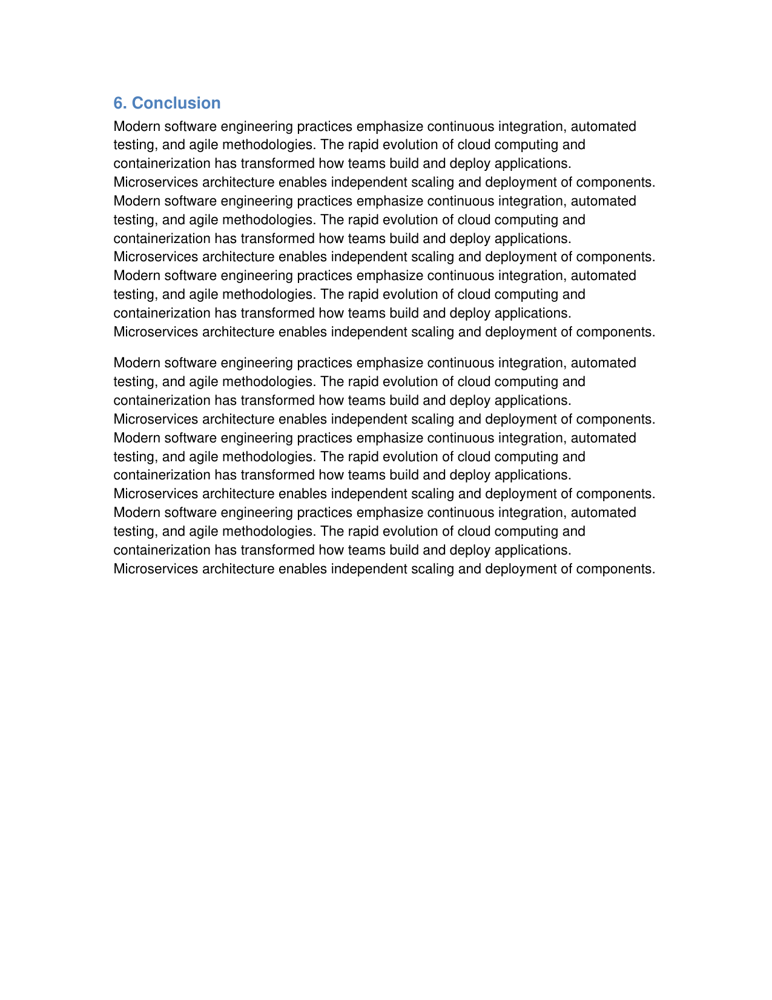

# MiniPdf vs Reference PDF Comparison Report

Generated: 2026-03-21T16:34:33.227436

## Summary

| # | Test Case | Text Sim | Visual Avg | Pages (M/R) | Overall |
|---|-----------|----------|------------|-------------|--------|
| 1 | 🟢 docx_classic01_single_paragraph | 1.0 | 0.9943 | 1/1 | **0.9977** |
| 2 | 🟢 docx_classic02_multiple_paragraphs | 1.0 | 0.982 | 1/1 | **0.9928** |
| 3 | 🟢 docx_classic03_headings | 1.0 | 0.9888 | 1/1 | **0.9955** |
| 4 | 🟢 docx_classic04_bold_italic | 1.0 | 0.9973 | 1/1 | **0.9989** |
| 5 | 🟢 docx_classic05_font_sizes | 1.0 | 0.9875 | 1/1 | **0.995** |
| 6 | 🟢 docx_classic06_font_colors | 1.0 | 0.9984 | 1/1 | **0.9994** |
| 7 | 🟢 docx_classic07_alignment | 1.0 | 0.9847 | 1/1 | **0.9939** |
| 8 | 🟢 docx_classic08_bullet_list | 0.918 | 0.9948 | 1/1 | **0.9651** |
| 9 | 🟢 docx_classic09_numbered_list | 1.0 | 0.9913 | 1/1 | **0.9965** |
| 10 | 🟢 docx_classic10_simple_table | 1.0 | 0.9889 | 1/1 | **0.9956** |
| 11 | 🟢 docx_classic11_table_with_shading | 1.0 | 0.9634 | 1/1 | **0.9854** |
| 12 | 🟢 docx_classic12_merged_cells_table | 1.0 | 0.9908 | 1/1 | **0.9963** |
| 13 | 🟢 docx_classic13_long_document | 1.0 | 0.9162 | 4/4 | **0.9665** |
| 14 | 🟢 docx_classic14_mixed_content | 0.9929 | 0.97 | 1/1 | **0.9852** |
| 15 | 🟢 docx_classic15_indentation | 1.0 | 0.9845 | 1/1 | **0.9938** |
| 16 | 🟢 docx_classic16_line_spacing | 1.0 | 0.983 | 1/1 | **0.9932** |
| 17 | 🟢 docx_classic17_page_break | 1.0 | 0.9962 | 3/3 | **0.9985** |
| 18 | 🟢 docx_classic18_embedded_image | 1.0 | 0.99 | 1/1 | **0.996** |
| 19 | 🟢 docx_classic19_multiple_images | 1.0 | 0.9889 | 1/1 | **0.9956** |
| 20 | 🟢 docx_classic20_table_with_many_rows | 1.0 | 0.9623 | 1/1 | **0.9849** |
| 21 | 🟢 docx_classic21_nested_lists | 0.9371 | 0.991 | 1/1 | **0.9712** |
| 22 | 🟢 docx_classic22_horizontal_rule | 1.0 | 0.9908 | 1/1 | **0.9963** |
| 23 | 🟢 docx_classic23_mixed_formatting_runs | 1.0 | 0.9947 | 1/1 | **0.9979** |
| 24 | 🟢 docx_classic24_two_column_table_layout | 0.9789 | 0.9906 | 1/1 | **0.9878** |
| 25 | 🟢 docx_classic25_title_and_subtitle | 1.0 | 0.9935 | 2/2 | **0.9974** |
| 26 | 🟢 docx_classic26_table_alignment | 1.0 | 0.9906 | 1/1 | **0.9962** |
| 27 | 🟢 docx_classic27_long_paragraph_wrapping | 1.0 | 0.9232 | 1/1 | **0.9693** |
| 28 | 🟢 docx_classic28_special_characters | 1.0 | 0.9912 | 1/1 | **0.9965** |
| 29 | 🟢 docx_classic29_table_with_image | 1.0 | 0.9861 | 1/1 | **0.9944** |
| 30 | 🟢 docx_classic30_comprehensive_report | 0.9955 | 0.7789 | 3/3 | **0.9098** |
| 31 | 🟢 docx_classic31_product_card_with_image | 1.0 | 0.9555 | 1/1 | **0.9822** |
| 32 | 🟢 docx_classic31_strikethrough_text | 1.0 | 0.9926 | 1/1 | **0.997** |
| 33 | 🟢 docx_classic32_company_logo_header | 1.0 | 0.9423 | 1/1 | **0.9769** |
| 34 | 🟢 docx_classic32_superscript_subscript | 0.9262 | 0.9932 | 1/1 | **0.9678** |
| 35 | 🟢 docx_classic33_highlighted_text | 1.0 | 0.9802 | 1/1 | **0.9921** |
| 36 | 🟢 docx_classic33_two_products_side_by_side | 1.0 | 0.968 | 1/1 | **0.9872** |
| 37 | 🟢 docx_classic34_employee_directory_with_photo | 1.0 | 0.9865 | 2/2 | **0.9946** |
| 38 | 🟢 docx_classic34_paragraph_borders | 1.0 | 0.9792 | 1/1 | **0.9917** |
| 39 | 🟢 docx_classic35_inventory_with_product_photos | 1.0 | 0.9687 | 2/2 | **0.9875** |
| 40 | 🟡 docx_classic35_tab_stops | 0.64 | 0.9913 | 1/1 | **0.8525** |
| 41 | 🟢 docx_classic36_invoice_with_logo | 1.0 | 0.9717 | 1/1 | **0.9887** |
| 42 | 🟢 docx_classic36_wide_table | 1.0 | 0.9796 | 1/1 | **0.9918** |
| 43 | 🟢 docx_classic37_nested_table | 1.0 | 0.9898 | 1/1 | **0.9959** |
| 44 | 🟢 docx_classic37_real_estate_listing | 1.0 | 0.9384 | 1/1 | **0.9754** |
| 45 | 🟢 docx_classic38_restaurant_menu_with_photos | 1.0 | 0.9745 | 2/2 | **0.9898** |
| 46 | 🟢 docx_classic38_table_column_widths | 0.8485 | 0.9805 | 1/1 | **0.9316** |
| 47 | 🟢 docx_classic39_cover_page_with_image | 1.0 | 0.9723 | 2/2 | **0.9889** |
| 48 | 🟢 docx_classic39_financial_report | 1.0 | 0.9717 | 1/1 | **0.9887** |
| 49 | 🟢 docx_classic40_product_catalog_with_images | 1.0 | 0.9691 | 1/1 | **0.9876** |
| 50 | 🟢 docx_classic40_resume | 0.9935 | 0.9634 | 1/1 | **0.9828** |
| 51 | 🟢 docx_classic41_business_letter | 1.0 | 0.9821 | 1/1 | **0.9928** |
| 52 | 🟢 docx_classic41_newsletter_with_hero_image | 0.9859 | 0.9149 | 1/1 | **0.9603** |
| 53 | 🟢 docx_classic42_chart_image_with_data | 1.0 | 0.96 | 1/1 | **0.984** |
| 54 | 🟢 docx_classic42_meeting_minutes | 0.9903 | 0.958 | 1/1 | **0.9793** |
| 55 | 🟢 docx_classic43_event_flyer_with_banner | 1.0 | 0.916 | 1/1 | **0.9664** |
| 56 | 🟢 docx_classic43_invoice_document | 1.0 | 0.9505 | 1/1 | **0.9802** |
| 57 | 🟢 docx_classic44_dashboard_with_kpi_image | 1.0 | 0.9649 | 1/1 | **0.986** |
| 58 | 🟢 docx_classic44_memo | 0.9785 | 0.9711 | 1/1 | **0.9798** |
| 59 | 🟢 docx_classic45_certificate_with_seal | 1.0 | 0.9173 | 1/1 | **0.9669** |
| 60 | 🟢 docx_classic45_project_plan | 0.9835 | 0.9399 | 1/1 | **0.9694** |
| 61 | 🟢 docx_classic46_comparison_table | 1.0 | 0.9345 | 1/1 | **0.9738** |
| 62 | 🟢 docx_classic46_product_image_grid | 1.0 | 0.9518 | 1/1 | **0.9807** |
| 63 | 🟢 docx_classic47_data_dictionary | 1.0 | 0.9396 | 1/1 | **0.9758** |
| 64 | 🟢 docx_classic47_news_article_with_hero_image | 1.0 | 0.9196 | 1/1 | **0.9678** |
| 65 | 🟢 docx_classic48_multi_level_headings | 1.0 | 0.9662 | 3/3 | **0.9865** |
| 66 | 🟢 docx_classic48_task_list_with_status_icons | 1.0 | 0.9321 | 1/1 | **0.9728** |
| 67 | 🟢 docx_classic49_cjk_document | 0.9849 | 0.9663 | 1/1 | **0.9805** |
| 68 | 🟢 docx_classic49_wide_panoramic_banner | 1.0 | 0.9043 | 1/1 | **0.9617** |
| 69 | 🟡 docx_classic50_long_table_with_formatting | 0.7327 | 0.6071 | 2/2 | **0.7359** |
| 70 | 🟢 docx_classic50_portrait_tall_image | 0.97 | 0.9678 | 1/1 | **0.9751** |
| 71 | 🟢 docx_classic51_step_by_step_with_images | 1.0 | 0.9446 | 1/1 | **0.9778** |
| 72 | 🟢 docx_classic51_underline_styles | 1.0 | 0.9937 | 1/1 | **0.9975** |
| 73 | 🟢 docx_classic52_before_after_comparison | 1.0 | 0.9625 | 1/1 | **0.985** |
| 74 | 🟢 docx_classic52_spacing_before_after | 1.0 | 0.9731 | 1/1 | **0.9892** |
| 75 | 🟢 docx_classic53_color_swatch_palette | 1.0 | 0.9523 | 1/1 | **0.9809** |
| 76 | 🟢 docx_classic53_table_merged_complex | 1.0 | 0.9392 | 1/1 | **0.9757** |
| 77 | 🟢 docx_classic54_multi_font_family | 1.0 | 0.9874 | 1/1 | **0.995** |
| 78 | 🟢 docx_classic54_travel_destination_cards | 1.0 | 0.9705 | 1/1 | **0.9882** |
| 79 | 🟢 docx_classic55_background_shading_paragraph | 1.0 | 0.9398 | 1/1 | **0.9759** |
| 80 | 🟢 docx_classic55_lab_results_with_image | 1.0 | 0.9353 | 1/1 | **0.9741** |
| 81 | 🟢 docx_classic56_images_and_tables_mixed | 1.0 | 0.9439 | 1/1 | **0.9776** |
| 82 | 🟢 docx_classic56_software_screenshot_features | 1.0 | 0.9406 | 1/1 | **0.9762** |
| 83 | 🟢 docx_classic57_right_to_left_text | 0.9328 | 0.9912 | 1/1 | **0.9696** |
| 84 | 🟢 docx_classic57_sports_results_with_logos | 1.0 | 0.9406 | 1/1 | **0.9762** |
| 85 | 🟢 docx_classic58_dense_paragraph_document | 1.0 | 0.9129 | 7/7 | **0.9652** |
| 86 | 🟢 docx_classic58_report_with_footer_image | 1.0 | 0.9683 | 1/1 | **0.9873** |
| 87 | 🟢 docx_classic59_numbered_and_bullet_mixed | 0.9823 | 0.9761 | 1/1 | **0.9834** |
| 88 | 🟢 docx_classic59_nutrition_label_with_image | 1.0 | 0.954 | 1/1 | **0.9816** |
| 89 | 🟢 docx_classic60_comprehensive_styled_report | 0.9941 | 0.9476 | 3/3 | **0.9767** |
| 90 | 🟢 docx_classic60_project_status_with_milestones | 0.9605 | 0.948 | 2/2 | **0.9634** |
| 91 | 🟢 docx_classic61_header_and_footer | 1.0 | 0.9534 | 1/1 | **0.9814** |
| 92 | 🟢 docx_classic62_footnote_references | 0.9863 | 0.9723 | 1/1 | **0.9834** |
| 93 | 🟢 docx_classic63_toc_style_headings | 1.0 | 0.9793 | 1/1 | **0.9917** |
| 94 | 🟢 docx_classic64_multi_column_layout | 0.8837 | 0.9552 | 1/1 | **0.9356** |
| 95 | 🟢 docx_classic65_code_block_styling | 1.0 | 0.8461 | 1/1 | **0.9384** |
| 96 | 🟢 docx_classic66_colored_title_page | 1.0 | 0.8726 | 1/1 | **0.949** |
| 97 | 🟢 docx_classic67_alternating_row_table | 1.0 | 0.8899 | 1/1 | **0.956** |
| 98 | 🟢 docx_classic68_sidebar_layout | 0.8485 | 0.9245 | 1/1 | **0.9092** |
| 99 | 🟢 docx_classic69_blockquote_styling | 1.0 | 0.9701 | 1/1 | **0.988** |
| 100 | 🟢 docx_classic70_academic_paper | 0.9924 | 0.9259 | 1/1 | **0.9673** |
| 101 | 🔴 docx_classic71_legal_document | 1.0 | 0.4728 | 2/1 | **0.6891** |
| 102 | 🟢 docx_classic72_technical_specification | 0.9953 | 0.9413 | 1/1 | **0.9746** |
| 103 | 🟢 docx_classic73_calendar_layout | 1.0 | 0.9548 | 1/1 | **0.9819** |
| 104 | 🟢 docx_classic74_org_chart | 1.0 | 0.9334 | 1/1 | **0.9734** |
| 105 | 🟢 docx_classic75_newsletter_layout | 0.9859 | 0.97 | 1/1 | **0.9824** |
| 106 | 🟢 docx_classic76_recipe_card | 0.9888 | 0.9685 | 1/1 | **0.9829** |
| 107 | 🟢 docx_classic77_timeline_layout | 1.0 | 0.9016 | 1/1 | **0.9606** |
| 108 | 🟢 docx_classic78_faq_document | 1.0 | 0.9562 | 2/2 | **0.9825** |
| 109 | 🟢 docx_classic79_glossary | 1.0 | 0.966 | 1/1 | **0.9864** |
| 110 | 🟢 docx_classic80_matrix_grid | 1.0 | 0.9023 | 1/1 | **0.9609** |
| 111 | 🟢 docx_classic81_budget_table | 1.0 | 0.8943 | 1/1 | **0.9577** |
| 112 | 🟢 docx_classic82_survey_questionnaire | 0.9766 | 0.9093 | 2/2 | **0.9544** |
| 113 | 🟢 docx_classic83_medical_form | 1.0 | 0.936 | 1/1 | **0.9744** |
| 114 | 🟢 docx_classic84_shipping_label | 0.9714 | 0.9135 | 1/1 | **0.954** |
| 115 | 🟢 docx_classic85_report_card | 1.0 | 0.9404 | 1/1 | **0.9762** |
| 116 | 🟢 docx_classic86_checklist_document | 1.0 | 0.9677 | 1/1 | **0.9871** |
| 117 | 🟢 docx_classic87_bibliography | 1.0 | 0.9692 | 1/1 | **0.9877** |
| 118 | 🟢 docx_classic88_presentation_handout | 1.0 | 0.8167 | 2/2 | **0.9267** |
| 119 | 🟢 docx_classic89_multi_image_gallery | 1.0 | 0.9117 | 1/1 | **0.9647** |
| 120 | 🟢 docx_classic90_comprehensive_annual_report | 0.9908 | 0.9225 | 4/4 | **0.9653** |
| 121 | 🟢 docx_classic91_landscape_page | 1.0 | 0.9644 | 1/1 | **0.9858** |
| 122 | 🟢 docx_classic92_first_line_indent | 0.9868 | 0.9517 | 1/1 | **0.9754** |
| 123 | 🟢 docx_classic93_hanging_indent | 1.0 | 0.9509 | 1/1 | **0.9804** |
| 124 | 🟢 docx_classic94_custom_bullet_characters | 0.9932 | 0.9769 | 1/1 | **0.988** |
| 125 | 🟢 docx_classic95_contract_template | 1.0 | 0.9693 | 1/1 | **0.9877** |
| 126 | 🟢 docx_classic96_dense_data_table | 1.0 | 0.8681 | 1/1 | **0.9472** |
| 127 | 🟢 docx_classic97_product_catalog | 1.0 | 0.9446 | 1/1 | **0.9778** |
| 128 | 🔴 docx_classic98_training_manual | 1.0 | 0.4787 | 2/1 | **0.6915** |
| 129 | 🟢 docx_classic99_policy_document | 1.0 | 0.9344 | 1/1 | **0.9738** |
| 130 | 🟢 docx_classic100_multi_page_table | 0.9658 | 0.8377 | 2/2 | **0.9214** |
| 131 | 🟢 docx_classic101_warranty_document | 0.9919 | 0.9564 | 1/1 | **0.9793** |
| 132 | 🟢 docx_classic102_curriculum_syllabus | 1.0 | 0.9061 | 1/1 | **0.9624** |
| 133 | 🟢 docx_classic103_event_program | 0.9917 | 0.9246 | 2/2 | **0.9665** |
| 134 | 🟢 docx_classic104_sop_document | 0.9798 | 0.975 | 2/2 | **0.9819** |
| 135 | 🟢 docx_classic105_certificate | 1.0 | 0.9638 | 1/1 | **0.9855** |
| 136 | 🟢 docx_classic106_multi_section_orientation | 0.9933 | 0.9711 | 3/3 | **0.9858** |
| 137 | 🟢 docx_classic107_order_form | 1.0 | 0.9431 | 1/1 | **0.9772** |
| 138 | 🟢 docx_classic108_comparison_matrix | 0.9753 | 0.9262 | 1/1 | **0.9606** |
| 139 | 🟢 docx_classic109_release_notes | 0.978 | 0.9699 | 1/1 | **0.9792** |
| 140 | 🟢 docx_classic110_troubleshooting_guide | 1.0 | 0.9693 | 1/1 | **0.9877** |
| 141 | 🟢 docx_classic111_meeting_agenda | 1.0 | 0.9548 | 1/1 | **0.9819** |
| 142 | 🟢 docx_classic112_project_status_report | 1.0 | 0.9425 | 1/1 | **0.977** |
| 143 | 🟢 docx_classic113_address_labels | 1.0 | 0.9759 | 1/1 | **0.9904** |
| 144 | 🟢 docx_classic114_test_report | 1.0 | 0.9356 | 1/1 | **0.9742** |
| 145 | 🟢 docx_classic115_price_list | 1.0 | 0.863 | 1/1 | **0.9452** |
| 146 | 🟢 docx_classic116_risk_assessment | 1.0 | 0.9413 | 1/1 | **0.9765** |
| 147 | 🔴 docx_classic117_employee_handbook_excerpt | 0.9912 | 0.4723 | 2/1 | **0.6854** |
| 148 | 🟢 docx_classic118_data_report_with_summary | 1.0 | 0.9122 | 1/1 | **0.9649** |
| 149 | 🟢 docx_classic119_multi_language_document | 0.9982 | 0.9624 | 1/1 | **0.9842** |
| 150 | 🟡 docx_classic120_comprehensive_business_proposal | 0.9917 | 0.6925 | 4/3 | **0.7737** |
| 151 | 🟢 docx_classic121_thin_border_table | 1.0 | 0.9809 | 1/1 | **0.9924** |
| 152 | 🟢 docx_classic122_thick_outer_border_table | 1.0 | 0.9856 | 1/1 | **0.9942** |
| 153 | 🟢 docx_classic123_dashed_border_table | 1.0 | 0.983 | 1/1 | **0.9932** |
| 154 | 🟢 docx_classic124_colored_border_table | 1.0 | 0.9765 | 1/1 | **0.9906** |
| 155 | 🟢 docx_classic125_solid_cell_fills | 1.0 | 0.9667 | 1/1 | **0.9867** |
| 156 | 🟢 docx_classic126_dark_header_table | 1.0 | 0.9398 | 1/1 | **0.9759** |
| 157 | 🟢 docx_classic127_font_styles_showcase | 1.0 | 0.9769 | 1/1 | **0.9908** |
| 158 | 🟢 docx_classic128_font_sizes_showcase | 1.0 | 0.9561 | 1/1 | **0.9824** |
| 159 | 🟢 docx_classic129_alignment_combinations | 1.0 | 0.9801 | 1/1 | **0.992** |
| 160 | 🟢 docx_classic130_wrap_and_indent | 1.0 | 0.972 | 1/1 | **0.9888** |
| 161 | 🟢 docx_classic131_number_format_table | 1.0 | 0.9735 | 1/1 | **0.9894** |
| 162 | 🟢 docx_classic132_striped_table | 1.0 | 0.9146 | 1/1 | **0.9658** |
| 163 | 🟢 docx_classic133_gradient_rows_table | 1.0 | 0.9603 | 1/1 | **0.9841** |
| 164 | 🟢 docx_classic134_heatmap_table | 1.0 | 0.9617 | 1/1 | **0.9847** |
| 165 | 🟢 docx_classic135_bottom_border_paragraphs | 1.0 | 0.9764 | 1/1 | **0.9906** |
| 166 | 🟢 docx_classic136_financial_statement | 1.0 | 0.93 | 1/1 | **0.972** |
| 167 | 🟢 docx_classic137_checkerboard_table | 1.0 | 0.9324 | 1/1 | **0.973** |
| 168 | 🟢 docx_classic138_color_grid_table | 1.0 | 0.9404 | 1/1 | **0.9762** |
| 169 | 🟢 docx_classic139_paragraph_shading_patterns | 1.0 | 0.8329 | 1/1 | **0.9332** |
| 170 | 🟢 docx_classic140_rotated_text_table | 0.8158 | 0.9712 | 1/1 | **0.9148** |
| 171 | 🟢 docx_classic141_mixed_border_styles | 1.0 | 0.9829 | 1/1 | **0.9932** |
| 172 | 🟢 docx_classic142_styled_invoice_document | 1.0 | 0.9 | 1/1 | **0.96** |
| 173 | 🟢 docx_classic143_multi_section_document | 1.0 | 0.9183 | 1/1 | **0.9673** |
| 174 | 🟢 docx_classic144_note_style_paragraphs | 1.0 | 0.9785 | 1/1 | **0.9914** |
| 175 | 🟢 docx_classic145_status_badge_table | 1.0 | 0.9332 | 1/1 | **0.9733** |
| 176 | 🟢 docx_classic146_double_border_table | 1.0 | 0.9303 | 1/1 | **0.9721** |
| 177 | 🟢 docx_classic147_multi_section_styled_report | 1.0 | 0.9346 | 1/1 | **0.9738** |
| 178 | 🟢 docx_classic148_data_grid_document | 1.0 | 0.857 | 1/1 | **0.9428** |
| 179 | 🟢 docx_classic149_merged_section_report | 1.0 | 0.935 | 1/1 | **0.974** |
| 180 | 🟢 docx_classic150_kitchen_sink_styles | 1.0 | 0.9242 | 2/2 | **0.9697** |

**Average Overall Score: 0.9696**

## Visual Comparison

<table>
<tr><th>MiniPdf</th><th>LibreOffice (Reference)</th></tr>
<tr>
  <td><b>docx_classic01_single_paragraph</b></td>
  <td colspan="1">docx_classic01_single_paragraph <span style="color:#3fb950">⬤</span> 99.8%</td>
</tr>
<tr>
  <td></td>
  <td></td>
</tr>
<tr>
  <td><b>docx_classic02_multiple_paragraphs</b></td>
  <td colspan="1">docx_classic02_multiple_paragraphs <span style="color:#3fb950">⬤</span> 99.3%</td>
</tr>
<tr>
  <td></td>
  <td></td>
</tr>
<tr>
  <td><b>docx_classic03_headings</b></td>
  <td colspan="1">docx_classic03_headings <span style="color:#3fb950">⬤</span> 99.6%</td>
</tr>
<tr>
  <td></td>
  <td></td>
</tr>
<tr>
  <td><b>docx_classic04_bold_italic</b></td>
  <td colspan="1">docx_classic04_bold_italic <span style="color:#3fb950">⬤</span> 99.9%</td>
</tr>
<tr>
  <td></td>
  <td></td>
</tr>
<tr>
  <td><b>docx_classic05_font_sizes</b></td>
  <td colspan="1">docx_classic05_font_sizes <span style="color:#3fb950">⬤</span> 99.5%</td>
</tr>
<tr>
  <td></td>
  <td></td>
</tr>
<tr>
  <td><b>docx_classic06_font_colors</b></td>
  <td colspan="1">docx_classic06_font_colors <span style="color:#3fb950">⬤</span> 99.9%</td>
</tr>
<tr>
  <td></td>
  <td></td>
</tr>
<tr>
  <td><b>docx_classic07_alignment</b></td>
  <td colspan="1">docx_classic07_alignment <span style="color:#3fb950">⬤</span> 99.4%</td>
</tr>
<tr>
  <td></td>
  <td></td>
</tr>
<tr>
  <td><b>docx_classic08_bullet_list</b></td>
  <td colspan="1">docx_classic08_bullet_list <span style="color:#3fb950">⬤</span> 96.5%</td>
</tr>
<tr>
  <td></td>
  <td></td>
</tr>
<tr>
  <td><b>docx_classic09_numbered_list</b></td>
  <td colspan="1">docx_classic09_numbered_list <span style="color:#3fb950">⬤</span> 99.7%</td>
</tr>
<tr>
  <td></td>
  <td></td>
</tr>
<tr>
  <td><b>docx_classic10_simple_table</b></td>
  <td colspan="1">docx_classic10_simple_table <span style="color:#3fb950">⬤</span> 99.6%</td>
</tr>
<tr>
  <td></td>
  <td></td>
</tr>
<tr>
  <td><b>docx_classic11_table_with_shading</b></td>
  <td colspan="1">docx_classic11_table_with_shading <span style="color:#3fb950">⬤</span> 98.5%</td>
</tr>
<tr>
  <td></td>
  <td></td>
</tr>
<tr>
  <td><b>docx_classic12_merged_cells_table</b></td>
  <td colspan="1">docx_classic12_merged_cells_table <span style="color:#3fb950">⬤</span> 99.6%</td>
</tr>
<tr>
  <td></td>
  <td></td>
</tr>
<tr>
  <td><b>docx_classic13_long_document</b></td>
  <td colspan="1">docx_classic13_long_document <span style="color:#3fb950">⬤</span> 96.7%</td>
</tr>
<tr>
  <td></td>
  <td></td>
</tr>
<tr>
  <td></td>
  <td></td>
</tr>
<tr>
  <td></td>
  <td></td>
</tr>
<tr>
  <td></td>
  <td></td>
</tr>
<tr>
  <td><b>docx_classic14_mixed_content</b></td>
  <td colspan="1">docx_classic14_mixed_content <span style="color:#3fb950">⬤</span> 98.5%</td>
</tr>
<tr>
  <td></td>
  <td></td>
</tr>
<tr>
  <td><b>docx_classic15_indentation</b></td>
  <td colspan="1">docx_classic15_indentation <span style="color:#3fb950">⬤</span> 99.4%</td>
</tr>
<tr>
  <td></td>
  <td></td>
</tr>
<tr>
  <td><b>docx_classic16_line_spacing</b></td>
  <td colspan="1">docx_classic16_line_spacing <span style="color:#3fb950">⬤</span> 99.3%</td>
</tr>
<tr>
  <td></td>
  <td></td>
</tr>
<tr>
  <td><b>docx_classic17_page_break</b></td>
  <td colspan="1">docx_classic17_page_break <span style="color:#3fb950">⬤</span> 99.9%</td>
</tr>
<tr>
  <td></td>
  <td></td>
</tr>
<tr>
  <td></td>
  <td></td>
</tr>
<tr>
  <td></td>
  <td></td>
</tr>
<tr>
  <td><b>docx_classic18_embedded_image</b></td>
  <td colspan="1">docx_classic18_embedded_image <span style="color:#3fb950">⬤</span> 99.6%</td>
</tr>
<tr>
  <td></td>
  <td></td>
</tr>
<tr>
  <td><b>docx_classic19_multiple_images</b></td>
  <td colspan="1">docx_classic19_multiple_images <span style="color:#3fb950">⬤</span> 99.6%</td>
</tr>
<tr>
  <td></td>
  <td></td>
</tr>
<tr>
  <td><b>docx_classic20_table_with_many_rows</b></td>
  <td colspan="1">docx_classic20_table_with_many_rows <span style="color:#3fb950">⬤</span> 98.5%</td>
</tr>
<tr>
  <td></td>
  <td></td>
</tr>
<tr>
  <td><b>docx_classic21_nested_lists</b></td>
  <td colspan="1">docx_classic21_nested_lists <span style="color:#3fb950">⬤</span> 97.1%</td>
</tr>
<tr>
  <td></td>
  <td></td>
</tr>
<tr>
  <td><b>docx_classic22_horizontal_rule</b></td>
  <td colspan="1">docx_classic22_horizontal_rule <span style="color:#3fb950">⬤</span> 99.6%</td>
</tr>
<tr>
  <td></td>
  <td></td>
</tr>
<tr>
  <td><b>docx_classic23_mixed_formatting_runs</b></td>
  <td colspan="1">docx_classic23_mixed_formatting_runs <span style="color:#3fb950">⬤</span> 99.8%</td>
</tr>
<tr>
  <td></td>
  <td></td>
</tr>
<tr>
  <td><b>docx_classic24_two_column_table_layout</b></td>
  <td colspan="1">docx_classic24_two_column_table_layout <span style="color:#3fb950">⬤</span> 98.8%</td>
</tr>
<tr>
  <td></td>
  <td></td>
</tr>
<tr>
  <td><b>docx_classic25_title_and_subtitle</b></td>
  <td colspan="1">docx_classic25_title_and_subtitle <span style="color:#3fb950">⬤</span> 99.7%</td>
</tr>
<tr>
  <td></td>
  <td></td>
</tr>
<tr>
  <td></td>
  <td></td>
</tr>
<tr>
  <td><b>docx_classic26_table_alignment</b></td>
  <td colspan="1">docx_classic26_table_alignment <span style="color:#3fb950">⬤</span> 99.6%</td>
</tr>
<tr>
  <td></td>
  <td></td>
</tr>
<tr>
  <td><b>docx_classic27_long_paragraph_wrapping</b></td>
  <td colspan="1">docx_classic27_long_paragraph_wrapping <span style="color:#3fb950">⬤</span> 96.9%</td>
</tr>
<tr>
  <td></td>
  <td></td>
</tr>
<tr>
  <td><b>docx_classic28_special_characters</b></td>
  <td colspan="1">docx_classic28_special_characters <span style="color:#3fb950">⬤</span> 99.7%</td>
</tr>
<tr>
  <td></td>
  <td></td>
</tr>
<tr>
  <td><b>docx_classic29_table_with_image</b></td>
  <td colspan="1">docx_classic29_table_with_image <span style="color:#3fb950">⬤</span> 99.4%</td>
</tr>
<tr>
  <td></td>
  <td></td>
</tr>
<tr>
  <td><b>docx_classic30_comprehensive_report</b></td>
  <td colspan="1">docx_classic30_comprehensive_report <span style="color:#3fb950">⬤</span> 91.0%</td>
</tr>
<tr>
  <td></td>
  <td></td>
</tr>
<tr>
  <td></td>
  <td></td>
</tr>
<tr>
  <td></td>
  <td></td>
</tr>
<tr>
  <td><b>docx_classic31_product_card_with_image</b></td>
  <td colspan="1">docx_classic31_product_card_with_image <span style="color:#3fb950">⬤</span> 98.2%</td>
</tr>
<tr>
  <td></td>
  <td></td>
</tr>
<tr>
  <td><b>docx_classic31_strikethrough_text</b></td>
  <td colspan="1">docx_classic31_strikethrough_text <span style="color:#3fb950">⬤</span> 99.7%</td>
</tr>
<tr>
  <td></td>
  <td></td>
</tr>
<tr>
  <td><b>docx_classic32_company_logo_header</b></td>
  <td colspan="1">docx_classic32_company_logo_header <span style="color:#3fb950">⬤</span> 97.7%</td>
</tr>
<tr>
  <td></td>
  <td></td>
</tr>
<tr>
  <td><b>docx_classic32_superscript_subscript</b></td>
  <td colspan="1">docx_classic32_superscript_subscript <span style="color:#3fb950">⬤</span> 96.8%</td>
</tr>
<tr>
  <td></td>
  <td></td>
</tr>
<tr>
  <td><b>docx_classic33_highlighted_text</b></td>
  <td colspan="1">docx_classic33_highlighted_text <span style="color:#3fb950">⬤</span> 99.2%</td>
</tr>
<tr>
  <td></td>
  <td></td>
</tr>
<tr>
  <td><b>docx_classic33_two_products_side_by_side</b></td>
  <td colspan="1">docx_classic33_two_products_side_by_side <span style="color:#3fb950">⬤</span> 98.7%</td>
</tr>
<tr>
  <td></td>
  <td></td>
</tr>
<tr>
  <td><b>docx_classic34_employee_directory_with_photo</b></td>
  <td colspan="1">docx_classic34_employee_directory_with_photo <span style="color:#3fb950">⬤</span> 99.5%</td>
</tr>
<tr>
  <td></td>
  <td></td>
</tr>
<tr>
  <td></td>
  <td></td>
</tr>
<tr>
  <td><b>docx_classic34_paragraph_borders</b></td>
  <td colspan="1">docx_classic34_paragraph_borders <span style="color:#3fb950">⬤</span> 99.2%</td>
</tr>
<tr>
  <td></td>
  <td></td>
</tr>
<tr>
  <td><b>docx_classic35_inventory_with_product_photos</b></td>
  <td colspan="1">docx_classic35_inventory_with_product_photos <span style="color:#3fb950">⬤</span> 98.8%</td>
</tr>
<tr>
  <td></td>
  <td></td>
</tr>
<tr>
  <td></td>
  <td></td>
</tr>
<tr>
  <td><b>docx_classic35_tab_stops</b></td>
  <td colspan="1">docx_classic35_tab_stops <span style="color:#d29922">⬤</span> 85.2%</td>
</tr>
<tr>
  <td></td>
  <td></td>
</tr>
<tr>
  <td><b>docx_classic36_invoice_with_logo</b></td>
  <td colspan="1">docx_classic36_invoice_with_logo <span style="color:#3fb950">⬤</span> 98.9%</td>
</tr>
<tr>
  <td></td>
  <td></td>
</tr>
<tr>
  <td><b>docx_classic36_wide_table</b></td>
  <td colspan="1">docx_classic36_wide_table <span style="color:#3fb950">⬤</span> 99.2%</td>
</tr>
<tr>
  <td></td>
  <td></td>
</tr>
<tr>
  <td><b>docx_classic37_nested_table</b></td>
  <td colspan="1">docx_classic37_nested_table <span style="color:#3fb950">⬤</span> 99.6%</td>
</tr>
<tr>
  <td></td>
  <td></td>
</tr>
<tr>
  <td><b>docx_classic37_real_estate_listing</b></td>
  <td colspan="1">docx_classic37_real_estate_listing <span style="color:#3fb950">⬤</span> 97.5%</td>
</tr>
<tr>
  <td></td>
  <td></td>
</tr>
<tr>
  <td><b>docx_classic38_restaurant_menu_with_photos</b></td>
  <td colspan="1">docx_classic38_restaurant_menu_with_photos <span style="color:#3fb950">⬤</span> 99.0%</td>
</tr>
<tr>
  <td></td>
  <td></td>
</tr>
<tr>
  <td></td>
  <td></td>
</tr>
<tr>
  <td><b>docx_classic38_table_column_widths</b></td>
  <td colspan="1">docx_classic38_table_column_widths <span style="color:#3fb950">⬤</span> 93.2%</td>
</tr>
<tr>
  <td></td>
  <td></td>
</tr>
<tr>
  <td><b>docx_classic39_cover_page_with_image</b></td>
  <td colspan="1">docx_classic39_cover_page_with_image <span style="color:#3fb950">⬤</span> 98.9%</td>
</tr>
<tr>
  <td></td>
  <td></td>
</tr>
<tr>
  <td></td>
  <td></td>
</tr>
<tr>
  <td><b>docx_classic39_financial_report</b></td>
  <td colspan="1">docx_classic39_financial_report <span style="color:#3fb950">⬤</span> 98.9%</td>
</tr>
<tr>
  <td></td>
  <td></td>
</tr>
<tr>
  <td><b>docx_classic40_product_catalog_with_images</b></td>
  <td colspan="1">docx_classic40_product_catalog_with_images <span style="color:#3fb950">⬤</span> 98.8%</td>
</tr>
<tr>
  <td></td>
  <td></td>
</tr>
<tr>
  <td><b>docx_classic40_resume</b></td>
  <td colspan="1">docx_classic40_resume <span style="color:#3fb950">⬤</span> 98.3%</td>
</tr>
<tr>
  <td></td>
  <td></td>
</tr>
<tr>
  <td><b>docx_classic41_business_letter</b></td>
  <td colspan="1">docx_classic41_business_letter <span style="color:#3fb950">⬤</span> 99.3%</td>
</tr>
<tr>
  <td></td>
  <td></td>
</tr>
<tr>
  <td><b>docx_classic41_newsletter_with_hero_image</b></td>
  <td colspan="1">docx_classic41_newsletter_with_hero_image <span style="color:#3fb950">⬤</span> 96.0%</td>
</tr>
<tr>
  <td></td>
  <td></td>
</tr>
<tr>
  <td><b>docx_classic42_chart_image_with_data</b></td>
  <td colspan="1">docx_classic42_chart_image_with_data <span style="color:#3fb950">⬤</span> 98.4%</td>
</tr>
<tr>
  <td></td>
  <td></td>
</tr>
<tr>
  <td><b>docx_classic42_meeting_minutes</b></td>
  <td colspan="1">docx_classic42_meeting_minutes <span style="color:#3fb950">⬤</span> 97.9%</td>
</tr>
<tr>
  <td></td>
  <td></td>
</tr>
<tr>
  <td><b>docx_classic43_event_flyer_with_banner</b></td>
  <td colspan="1">docx_classic43_event_flyer_with_banner <span style="color:#3fb950">⬤</span> 96.6%</td>
</tr>
<tr>
  <td></td>
  <td></td>
</tr>
<tr>
  <td><b>docx_classic43_invoice_document</b></td>
  <td colspan="1">docx_classic43_invoice_document <span style="color:#3fb950">⬤</span> 98.0%</td>
</tr>
<tr>
  <td></td>
  <td></td>
</tr>
<tr>
  <td><b>docx_classic44_dashboard_with_kpi_image</b></td>
  <td colspan="1">docx_classic44_dashboard_with_kpi_image <span style="color:#3fb950">⬤</span> 98.6%</td>
</tr>
<tr>
  <td></td>
  <td></td>
</tr>
<tr>
  <td><b>docx_classic44_memo</b></td>
  <td colspan="1">docx_classic44_memo <span style="color:#3fb950">⬤</span> 98.0%</td>
</tr>
<tr>
  <td></td>
  <td></td>
</tr>
<tr>
  <td><b>docx_classic45_certificate_with_seal</b></td>
  <td colspan="1">docx_classic45_certificate_with_seal <span style="color:#3fb950">⬤</span> 96.7%</td>
</tr>
<tr>
  <td></td>
  <td></td>
</tr>
<tr>
  <td><b>docx_classic45_project_plan</b></td>
  <td colspan="1">docx_classic45_project_plan <span style="color:#3fb950">⬤</span> 96.9%</td>
</tr>
<tr>
  <td></td>
  <td></td>
</tr>
<tr>
  <td><b>docx_classic46_comparison_table</b></td>
  <td colspan="1">docx_classic46_comparison_table <span style="color:#3fb950">⬤</span> 97.4%</td>
</tr>
<tr>
  <td></td>
  <td></td>
</tr>
<tr>
  <td><b>docx_classic46_product_image_grid</b></td>
  <td colspan="1">docx_classic46_product_image_grid <span style="color:#3fb950">⬤</span> 98.1%</td>
</tr>
<tr>
  <td></td>
  <td></td>
</tr>
<tr>
  <td><b>docx_classic47_data_dictionary</b></td>
  <td colspan="1">docx_classic47_data_dictionary <span style="color:#3fb950">⬤</span> 97.6%</td>
</tr>
<tr>
  <td></td>
  <td></td>
</tr>
<tr>
  <td><b>docx_classic47_news_article_with_hero_image</b></td>
  <td colspan="1">docx_classic47_news_article_with_hero_image <span style="color:#3fb950">⬤</span> 96.8%</td>
</tr>
<tr>
  <td></td>
  <td></td>
</tr>
<tr>
  <td><b>docx_classic48_multi_level_headings</b></td>
  <td colspan="1">docx_classic48_multi_level_headings <span style="color:#3fb950">⬤</span> 98.7%</td>
</tr>
<tr>
  <td></td>
  <td></td>
</tr>
<tr>
  <td></td>
  <td></td>
</tr>
<tr>
  <td></td>
  <td></td>
</tr>
<tr>
  <td><b>docx_classic48_task_list_with_status_icons</b></td>
  <td colspan="1">docx_classic48_task_list_with_status_icons <span style="color:#3fb950">⬤</span> 97.3%</td>
</tr>
<tr>
  <td></td>
  <td></td>
</tr>
<tr>
  <td><b>docx_classic49_cjk_document</b></td>
  <td colspan="1">docx_classic49_cjk_document <span style="color:#3fb950">⬤</span> 98.0%</td>
</tr>
<tr>
  <td></td>
  <td></td>
</tr>
<tr>
  <td><b>docx_classic49_wide_panoramic_banner</b></td>
  <td colspan="1">docx_classic49_wide_panoramic_banner <span style="color:#3fb950">⬤</span> 96.2%</td>
</tr>
<tr>
  <td></td>
  <td></td>
</tr>
<tr>
  <td><b>docx_classic50_long_table_with_formatting</b></td>
  <td colspan="1">docx_classic50_long_table_with_formatting <span style="color:#d29922">⬤</span> 73.6%</td>
</tr>
<tr>
  <td></td>
  <td></td>
</tr>
<tr>
  <td></td>
  <td></td>
</tr>
<tr>
  <td><b>docx_classic50_portrait_tall_image</b></td>
  <td colspan="1">docx_classic50_portrait_tall_image <span style="color:#3fb950">⬤</span> 97.5%</td>
</tr>
<tr>
  <td></td>
  <td></td>
</tr>
<tr>
  <td><b>docx_classic51_step_by_step_with_images</b></td>
  <td colspan="1">docx_classic51_step_by_step_with_images <span style="color:#3fb950">⬤</span> 97.8%</td>
</tr>
<tr>
  <td></td>
  <td></td>
</tr>
<tr>
  <td><b>docx_classic51_underline_styles</b></td>
  <td colspan="1">docx_classic51_underline_styles <span style="color:#3fb950">⬤</span> 99.8%</td>
</tr>
<tr>
  <td></td>
  <td></td>
</tr>
<tr>
  <td><b>docx_classic52_before_after_comparison</b></td>
  <td colspan="1">docx_classic52_before_after_comparison <span style="color:#3fb950">⬤</span> 98.5%</td>
</tr>
<tr>
  <td></td>
  <td></td>
</tr>
<tr>
  <td><b>docx_classic52_spacing_before_after</b></td>
  <td colspan="1">docx_classic52_spacing_before_after <span style="color:#3fb950">⬤</span> 98.9%</td>
</tr>
<tr>
  <td></td>
  <td></td>
</tr>
<tr>
  <td><b>docx_classic53_color_swatch_palette</b></td>
  <td colspan="1">docx_classic53_color_swatch_palette <span style="color:#3fb950">⬤</span> 98.1%</td>
</tr>
<tr>
  <td></td>
  <td></td>
</tr>
<tr>
  <td><b>docx_classic53_table_merged_complex</b></td>
  <td colspan="1">docx_classic53_table_merged_complex <span style="color:#3fb950">⬤</span> 97.6%</td>
</tr>
<tr>
  <td></td>
  <td></td>
</tr>
<tr>
  <td><b>docx_classic54_multi_font_family</b></td>
  <td colspan="1">docx_classic54_multi_font_family <span style="color:#3fb950">⬤</span> 99.5%</td>
</tr>
<tr>
  <td></td>
  <td></td>
</tr>
<tr>
  <td><b>docx_classic54_travel_destination_cards</b></td>
  <td colspan="1">docx_classic54_travel_destination_cards <span style="color:#3fb950">⬤</span> 98.8%</td>
</tr>
<tr>
  <td></td>
  <td></td>
</tr>
<tr>
  <td><b>docx_classic55_background_shading_paragraph</b></td>
  <td colspan="1">docx_classic55_background_shading_paragraph <span style="color:#3fb950">⬤</span> 97.6%</td>
</tr>
<tr>
  <td></td>
  <td></td>
</tr>
<tr>
  <td><b>docx_classic55_lab_results_with_image</b></td>
  <td colspan="1">docx_classic55_lab_results_with_image <span style="color:#3fb950">⬤</span> 97.4%</td>
</tr>
<tr>
  <td></td>
  <td></td>
</tr>
<tr>
  <td><b>docx_classic56_images_and_tables_mixed</b></td>
  <td colspan="1">docx_classic56_images_and_tables_mixed <span style="color:#3fb950">⬤</span> 97.8%</td>
</tr>
<tr>
  <td></td>
  <td></td>
</tr>
<tr>
  <td><b>docx_classic56_software_screenshot_features</b></td>
  <td colspan="1">docx_classic56_software_screenshot_features <span style="color:#3fb950">⬤</span> 97.6%</td>
</tr>
<tr>
  <td></td>
  <td></td>
</tr>
<tr>
  <td><b>docx_classic57_right_to_left_text</b></td>
  <td colspan="1">docx_classic57_right_to_left_text <span style="color:#3fb950">⬤</span> 97.0%</td>
</tr>
<tr>
  <td></td>
  <td></td>
</tr>
<tr>
  <td><b>docx_classic57_sports_results_with_logos</b></td>
  <td colspan="1">docx_classic57_sports_results_with_logos <span style="color:#3fb950">⬤</span> 97.6%</td>
</tr>
<tr>
  <td></td>
  <td></td>
</tr>
<tr>
  <td><b>docx_classic58_dense_paragraph_document</b></td>
  <td colspan="1">docx_classic58_dense_paragraph_document <span style="color:#3fb950">⬤</span> 96.5%</td>
</tr>
<tr>
  <td></td>
  <td></td>
</tr>
<tr>
  <td></td>
  <td></td>
</tr>
<tr>
  <td></td>
  <td></td>
</tr>
<tr>
  <td></td>
  <td></td>
</tr>
<tr>
  <td></td>
  <td></td>
</tr>
<tr>
  <td></td>
  <td></td>
</tr>
<tr>
  <td></td>
  <td></td>
</tr>
<tr>
  <td><b>docx_classic58_report_with_footer_image</b></td>
  <td colspan="1">docx_classic58_report_with_footer_image <span style="color:#3fb950">⬤</span> 98.7%</td>
</tr>
<tr>
  <td></td>
  <td></td>
</tr>
<tr>
  <td><b>docx_classic59_numbered_and_bullet_mixed</b></td>
  <td colspan="1">docx_classic59_numbered_and_bullet_mixed <span style="color:#3fb950">⬤</span> 98.3%</td>
</tr>
<tr>
  <td></td>
  <td></td>
</tr>
<tr>
  <td><b>docx_classic59_nutrition_label_with_image</b></td>
  <td colspan="1">docx_classic59_nutrition_label_with_image <span style="color:#3fb950">⬤</span> 98.2%</td>
</tr>
<tr>
  <td></td>
  <td></td>
</tr>
<tr>
  <td><b>docx_classic60_comprehensive_styled_report</b></td>
  <td colspan="1">docx_classic60_comprehensive_styled_report <span style="color:#3fb950">⬤</span> 97.7%</td>
</tr>
<tr>
  <td></td>
  <td></td>
</tr>
<tr>
  <td></td>
  <td></td>
</tr>
<tr>
  <td></td>
  <td></td>
</tr>
<tr>
  <td><b>docx_classic60_project_status_with_milestones</b></td>
  <td colspan="1">docx_classic60_project_status_with_milestones <span style="color:#3fb950">⬤</span> 96.3%</td>
</tr>
<tr>
  <td></td>
  <td></td>
</tr>
<tr>
  <td></td>
  <td></td>
</tr>
<tr>
  <td><b>docx_classic61_header_and_footer</b></td>
  <td colspan="1">docx_classic61_header_and_footer <span style="color:#3fb950">⬤</span> 98.1%</td>
</tr>
<tr>
  <td></td>
  <td></td>
</tr>
<tr>
  <td><b>docx_classic62_footnote_references</b></td>
  <td colspan="1">docx_classic62_footnote_references <span style="color:#3fb950">⬤</span> 98.3%</td>
</tr>
<tr>
  <td></td>
  <td></td>
</tr>
<tr>
  <td><b>docx_classic63_toc_style_headings</b></td>
  <td colspan="1">docx_classic63_toc_style_headings <span style="color:#3fb950">⬤</span> 99.2%</td>
</tr>
<tr>
  <td></td>
  <td></td>
</tr>
<tr>
  <td><b>docx_classic64_multi_column_layout</b></td>
  <td colspan="1">docx_classic64_multi_column_layout <span style="color:#3fb950">⬤</span> 93.6%</td>
</tr>
<tr>
  <td></td>
  <td></td>
</tr>
<tr>
  <td><b>docx_classic65_code_block_styling</b></td>
  <td colspan="1">docx_classic65_code_block_styling <span style="color:#3fb950">⬤</span> 93.8%</td>
</tr>
<tr>
  <td></td>
  <td></td>
</tr>
<tr>
  <td><b>docx_classic66_colored_title_page</b></td>
  <td colspan="1">docx_classic66_colored_title_page <span style="color:#3fb950">⬤</span> 94.9%</td>
</tr>
<tr>
  <td></td>
  <td></td>
</tr>
<tr>
  <td><b>docx_classic67_alternating_row_table</b></td>
  <td colspan="1">docx_classic67_alternating_row_table <span style="color:#3fb950">⬤</span> 95.6%</td>
</tr>
<tr>
  <td></td>
  <td></td>
</tr>
<tr>
  <td><b>docx_classic68_sidebar_layout</b></td>
  <td colspan="1">docx_classic68_sidebar_layout <span style="color:#3fb950">⬤</span> 90.9%</td>
</tr>
<tr>
  <td></td>
  <td></td>
</tr>
<tr>
  <td><b>docx_classic69_blockquote_styling</b></td>
  <td colspan="1">docx_classic69_blockquote_styling <span style="color:#3fb950">⬤</span> 98.8%</td>
</tr>
<tr>
  <td></td>
  <td></td>
</tr>
<tr>
  <td><b>docx_classic70_academic_paper</b></td>
  <td colspan="1">docx_classic70_academic_paper <span style="color:#3fb950">⬤</span> 96.7%</td>
</tr>
<tr>
  <td></td>
  <td></td>
</tr>
<tr>
  <td><b>docx_classic71_legal_document</b></td>
  <td colspan="1">docx_classic71_legal_document <span style="color:#f85149">⬤</span> 68.9%</td>
</tr>
<tr>
  <td></td>
  <td></td>
</tr>
<tr>
  <td></td>
  <td><i>missing</i></td>
</tr>
<tr>
  <td><b>docx_classic72_technical_specification</b></td>
  <td colspan="1">docx_classic72_technical_specification <span style="color:#3fb950">⬤</span> 97.5%</td>
</tr>
<tr>
  <td></td>
  <td></td>
</tr>
<tr>
  <td><b>docx_classic73_calendar_layout</b></td>
  <td colspan="1">docx_classic73_calendar_layout <span style="color:#3fb950">⬤</span> 98.2%</td>
</tr>
<tr>
  <td></td>
  <td></td>
</tr>
<tr>
  <td><b>docx_classic74_org_chart</b></td>
  <td colspan="1">docx_classic74_org_chart <span style="color:#3fb950">⬤</span> 97.3%</td>
</tr>
<tr>
  <td></td>
  <td></td>
</tr>
<tr>
  <td><b>docx_classic75_newsletter_layout</b></td>
  <td colspan="1">docx_classic75_newsletter_layout <span style="color:#3fb950">⬤</span> 98.2%</td>
</tr>
<tr>
  <td></td>
  <td></td>
</tr>
<tr>
  <td><b>docx_classic76_recipe_card</b></td>
  <td colspan="1">docx_classic76_recipe_card <span style="color:#3fb950">⬤</span> 98.3%</td>
</tr>
<tr>
  <td></td>
  <td></td>
</tr>
<tr>
  <td><b>docx_classic77_timeline_layout</b></td>
  <td colspan="1">docx_classic77_timeline_layout <span style="color:#3fb950">⬤</span> 96.1%</td>
</tr>
<tr>
  <td></td>
  <td></td>
</tr>
<tr>
  <td><b>docx_classic78_faq_document</b></td>
  <td colspan="1">docx_classic78_faq_document <span style="color:#3fb950">⬤</span> 98.2%</td>
</tr>
<tr>
  <td></td>
  <td></td>
</tr>
<tr>
  <td></td>
  <td></td>
</tr>
<tr>
  <td><b>docx_classic79_glossary</b></td>
  <td colspan="1">docx_classic79_glossary <span style="color:#3fb950">⬤</span> 98.6%</td>
</tr>
<tr>
  <td></td>
  <td></td>
</tr>
<tr>
  <td><b>docx_classic80_matrix_grid</b></td>
  <td colspan="1">docx_classic80_matrix_grid <span style="color:#3fb950">⬤</span> 96.1%</td>
</tr>
<tr>
  <td></td>
  <td></td>
</tr>
<tr>
  <td><b>docx_classic81_budget_table</b></td>
  <td colspan="1">docx_classic81_budget_table <span style="color:#3fb950">⬤</span> 95.8%</td>
</tr>
<tr>
  <td></td>
  <td></td>
</tr>
<tr>
  <td><b>docx_classic82_survey_questionnaire</b></td>
  <td colspan="1">docx_classic82_survey_questionnaire <span style="color:#3fb950">⬤</span> 95.4%</td>
</tr>
<tr>
  <td></td>
  <td></td>
</tr>
<tr>
  <td></td>
  <td></td>
</tr>
<tr>
  <td><b>docx_classic83_medical_form</b></td>
  <td colspan="1">docx_classic83_medical_form <span style="color:#3fb950">⬤</span> 97.4%</td>
</tr>
<tr>
  <td></td>
  <td></td>
</tr>
<tr>
  <td><b>docx_classic84_shipping_label</b></td>
  <td colspan="1">docx_classic84_shipping_label <span style="color:#3fb950">⬤</span> 95.4%</td>
</tr>
<tr>
  <td></td>
  <td></td>
</tr>
<tr>
  <td><b>docx_classic85_report_card</b></td>
  <td colspan="1">docx_classic85_report_card <span style="color:#3fb950">⬤</span> 97.6%</td>
</tr>
<tr>
  <td></td>
  <td></td>
</tr>
<tr>
  <td><b>docx_classic86_checklist_document</b></td>
  <td colspan="1">docx_classic86_checklist_document <span style="color:#3fb950">⬤</span> 98.7%</td>
</tr>
<tr>
  <td></td>
  <td></td>
</tr>
<tr>
  <td><b>docx_classic87_bibliography</b></td>
  <td colspan="1">docx_classic87_bibliography <span style="color:#3fb950">⬤</span> 98.8%</td>
</tr>
<tr>
  <td></td>
  <td></td>
</tr>
<tr>
  <td><b>docx_classic88_presentation_handout</b></td>
  <td colspan="1">docx_classic88_presentation_handout <span style="color:#3fb950">⬤</span> 92.7%</td>
</tr>
<tr>
  <td></td>
  <td></td>
</tr>
<tr>
  <td></td>
  <td></td>
</tr>
<tr>
  <td><b>docx_classic89_multi_image_gallery</b></td>
  <td colspan="1">docx_classic89_multi_image_gallery <span style="color:#3fb950">⬤</span> 96.5%</td>
</tr>
<tr>
  <td></td>
  <td></td>
</tr>
<tr>
  <td><b>docx_classic90_comprehensive_annual_report</b></td>
  <td colspan="1">docx_classic90_comprehensive_annual_report <span style="color:#3fb950">⬤</span> 96.5%</td>
</tr>
<tr>
  <td></td>
  <td></td>
</tr>
<tr>
  <td></td>
  <td></td>
</tr>
<tr>
  <td></td>
  <td></td>
</tr>
<tr>
  <td></td>
  <td></td>
</tr>
<tr>
  <td><b>docx_classic91_landscape_page</b></td>
  <td colspan="1">docx_classic91_landscape_page <span style="color:#3fb950">⬤</span> 98.6%</td>
</tr>
<tr>
  <td></td>
  <td></td>
</tr>
<tr>
  <td><b>docx_classic92_first_line_indent</b></td>
  <td colspan="1">docx_classic92_first_line_indent <span style="color:#3fb950">⬤</span> 97.5%</td>
</tr>
<tr>
  <td></td>
  <td></td>
</tr>
<tr>
  <td><b>docx_classic93_hanging_indent</b></td>
  <td colspan="1">docx_classic93_hanging_indent <span style="color:#3fb950">⬤</span> 98.0%</td>
</tr>
<tr>
  <td></td>
  <td></td>
</tr>
<tr>
  <td><b>docx_classic94_custom_bullet_characters</b></td>
  <td colspan="1">docx_classic94_custom_bullet_characters <span style="color:#3fb950">⬤</span> 98.8%</td>
</tr>
<tr>
  <td></td>
  <td></td>
</tr>
<tr>
  <td><b>docx_classic95_contract_template</b></td>
  <td colspan="1">docx_classic95_contract_template <span style="color:#3fb950">⬤</span> 98.8%</td>
</tr>
<tr>
  <td></td>
  <td></td>
</tr>
<tr>
  <td><b>docx_classic96_dense_data_table</b></td>
  <td colspan="1">docx_classic96_dense_data_table <span style="color:#3fb950">⬤</span> 94.7%</td>
</tr>
<tr>
  <td></td>
  <td></td>
</tr>
<tr>
  <td><b>docx_classic97_product_catalog</b></td>
  <td colspan="1">docx_classic97_product_catalog <span style="color:#3fb950">⬤</span> 97.8%</td>
</tr>
<tr>
  <td></td>
  <td></td>
</tr>
<tr>
  <td><b>docx_classic98_training_manual</b></td>
  <td colspan="1">docx_classic98_training_manual <span style="color:#f85149">⬤</span> 69.2%</td>
</tr>
<tr>
  <td></td>
  <td></td>
</tr>
<tr>
  <td></td>
  <td><i>missing</i></td>
</tr>
<tr>
  <td><b>docx_classic99_policy_document</b></td>
  <td colspan="1">docx_classic99_policy_document <span style="color:#3fb950">⬤</span> 97.4%</td>
</tr>
<tr>
  <td></td>
  <td></td>
</tr>
<tr>
  <td><b>docx_classic100_multi_page_table</b></td>
  <td colspan="1">docx_classic100_multi_page_table <span style="color:#3fb950">⬤</span> 92.1%</td>
</tr>
<tr>
  <td></td>
  <td></td>
</tr>
<tr>
  <td></td>
  <td></td>
</tr>
<tr>
  <td><b>docx_classic101_warranty_document</b></td>
  <td colspan="1">docx_classic101_warranty_document <span style="color:#3fb950">⬤</span> 97.9%</td>
</tr>
<tr>
  <td></td>
  <td></td>
</tr>
<tr>
  <td><b>docx_classic102_curriculum_syllabus</b></td>
  <td colspan="1">docx_classic102_curriculum_syllabus <span style="color:#3fb950">⬤</span> 96.2%</td>
</tr>
<tr>
  <td></td>
  <td></td>
</tr>
<tr>
  <td><b>docx_classic103_event_program</b></td>
  <td colspan="1">docx_classic103_event_program <span style="color:#3fb950">⬤</span> 96.7%</td>
</tr>
<tr>
  <td></td>
  <td></td>
</tr>
<tr>
  <td></td>
  <td></td>
</tr>
<tr>
  <td><b>docx_classic104_sop_document</b></td>
  <td colspan="1">docx_classic104_sop_document <span style="color:#3fb950">⬤</span> 98.2%</td>
</tr>
<tr>
  <td></td>
  <td></td>
</tr>
<tr>
  <td></td>
  <td></td>
</tr>
<tr>
  <td><b>docx_classic105_certificate</b></td>
  <td colspan="1">docx_classic105_certificate <span style="color:#3fb950">⬤</span> 98.6%</td>
</tr>
<tr>
  <td></td>
  <td></td>
</tr>
<tr>
  <td><b>docx_classic106_multi_section_orientation</b></td>
  <td colspan="1">docx_classic106_multi_section_orientation <span style="color:#3fb950">⬤</span> 98.6%</td>
</tr>
<tr>
  <td></td>
  <td></td>
</tr>
<tr>
  <td></td>
  <td></td>
</tr>
<tr>
  <td></td>
  <td></td>
</tr>
<tr>
  <td><b>docx_classic107_order_form</b></td>
  <td colspan="1">docx_classic107_order_form <span style="color:#3fb950">⬤</span> 97.7%</td>
</tr>
<tr>
  <td></td>
  <td></td>
</tr>
<tr>
  <td><b>docx_classic108_comparison_matrix</b></td>
  <td colspan="1">docx_classic108_comparison_matrix <span style="color:#3fb950">⬤</span> 96.1%</td>
</tr>
<tr>
  <td></td>
  <td></td>
</tr>
<tr>
  <td><b>docx_classic109_release_notes</b></td>
  <td colspan="1">docx_classic109_release_notes <span style="color:#3fb950">⬤</span> 97.9%</td>
</tr>
<tr>
  <td></td>
  <td></td>
</tr>
<tr>
  <td><b>docx_classic110_troubleshooting_guide</b></td>
  <td colspan="1">docx_classic110_troubleshooting_guide <span style="color:#3fb950">⬤</span> 98.8%</td>
</tr>
<tr>
  <td></td>
  <td></td>
</tr>
<tr>
  <td><b>docx_classic111_meeting_agenda</b></td>
  <td colspan="1">docx_classic111_meeting_agenda <span style="color:#3fb950">⬤</span> 98.2%</td>
</tr>
<tr>
  <td></td>
  <td></td>
</tr>
<tr>
  <td><b>docx_classic112_project_status_report</b></td>
  <td colspan="1">docx_classic112_project_status_report <span style="color:#3fb950">⬤</span> 97.7%</td>
</tr>
<tr>
  <td></td>
  <td></td>
</tr>
<tr>
  <td><b>docx_classic113_address_labels</b></td>
  <td colspan="1">docx_classic113_address_labels <span style="color:#3fb950">⬤</span> 99.0%</td>
</tr>
<tr>
  <td></td>
  <td></td>
</tr>
<tr>
  <td><b>docx_classic114_test_report</b></td>
  <td colspan="1">docx_classic114_test_report <span style="color:#3fb950">⬤</span> 97.4%</td>
</tr>
<tr>
  <td></td>
  <td></td>
</tr>
<tr>
  <td><b>docx_classic115_price_list</b></td>
  <td colspan="1">docx_classic115_price_list <span style="color:#3fb950">⬤</span> 94.5%</td>
</tr>
<tr>
  <td></td>
  <td></td>
</tr>
<tr>
  <td><b>docx_classic116_risk_assessment</b></td>
  <td colspan="1">docx_classic116_risk_assessment <span style="color:#3fb950">⬤</span> 97.7%</td>
</tr>
<tr>
  <td></td>
  <td></td>
</tr>
<tr>
  <td><b>docx_classic117_employee_handbook_excerpt</b></td>
  <td colspan="1">docx_classic117_employee_handbook_excerpt <span style="color:#f85149">⬤</span> 68.5%</td>
</tr>
<tr>
  <td></td>
  <td></td>
</tr>
<tr>
  <td></td>
  <td><i>missing</i></td>
</tr>
<tr>
  <td><b>docx_classic118_data_report_with_summary</b></td>
  <td colspan="1">docx_classic118_data_report_with_summary <span style="color:#3fb950">⬤</span> 96.5%</td>
</tr>
<tr>
  <td></td>
  <td></td>
</tr>
<tr>
  <td><b>docx_classic119_multi_language_document</b></td>
  <td colspan="1">docx_classic119_multi_language_document <span style="color:#3fb950">⬤</span> 98.4%</td>
</tr>
<tr>
  <td></td>
  <td></td>
</tr>
<tr>
  <td><b>docx_classic120_comprehensive_business_proposal</b></td>
  <td colspan="1">docx_classic120_comprehensive_business_proposal <span style="color:#d29922">⬤</span> 77.4%</td>
</tr>
<tr>
  <td></td>
  <td></td>
</tr>
<tr>
  <td></td>
  <td></td>
</tr>
<tr>
  <td></td>
  <td></td>
</tr>
<tr>
  <td></td>
  <td><i>missing</i></td>
</tr>
<tr>
  <td><b>docx_classic121_thin_border_table</b></td>
  <td colspan="1">docx_classic121_thin_border_table <span style="color:#3fb950">⬤</span> 99.2%</td>
</tr>
<tr>
  <td></td>
  <td></td>
</tr>
<tr>
  <td><b>docx_classic122_thick_outer_border_table</b></td>
  <td colspan="1">docx_classic122_thick_outer_border_table <span style="color:#3fb950">⬤</span> 99.4%</td>
</tr>
<tr>
  <td></td>
  <td></td>
</tr>
<tr>
  <td><b>docx_classic123_dashed_border_table</b></td>
  <td colspan="1">docx_classic123_dashed_border_table <span style="color:#3fb950">⬤</span> 99.3%</td>
</tr>
<tr>
  <td></td>
  <td></td>
</tr>
<tr>
  <td><b>docx_classic124_colored_border_table</b></td>
  <td colspan="1">docx_classic124_colored_border_table <span style="color:#3fb950">⬤</span> 99.1%</td>
</tr>
<tr>
  <td></td>
  <td></td>
</tr>
<tr>
  <td><b>docx_classic125_solid_cell_fills</b></td>
  <td colspan="1">docx_classic125_solid_cell_fills <span style="color:#3fb950">⬤</span> 98.7%</td>
</tr>
<tr>
  <td></td>
  <td></td>
</tr>
<tr>
  <td><b>docx_classic126_dark_header_table</b></td>
  <td colspan="1">docx_classic126_dark_header_table <span style="color:#3fb950">⬤</span> 97.6%</td>
</tr>
<tr>
  <td></td>
  <td></td>
</tr>
<tr>
  <td><b>docx_classic127_font_styles_showcase</b></td>
  <td colspan="1">docx_classic127_font_styles_showcase <span style="color:#3fb950">⬤</span> 99.1%</td>
</tr>
<tr>
  <td></td>
  <td></td>
</tr>
<tr>
  <td><b>docx_classic128_font_sizes_showcase</b></td>
  <td colspan="1">docx_classic128_font_sizes_showcase <span style="color:#3fb950">⬤</span> 98.2%</td>
</tr>
<tr>
  <td></td>
  <td></td>
</tr>
<tr>
  <td><b>docx_classic129_alignment_combinations</b></td>
  <td colspan="1">docx_classic129_alignment_combinations <span style="color:#3fb950">⬤</span> 99.2%</td>
</tr>
<tr>
  <td></td>
  <td></td>
</tr>
<tr>
  <td><b>docx_classic130_wrap_and_indent</b></td>
  <td colspan="1">docx_classic130_wrap_and_indent <span style="color:#3fb950">⬤</span> 98.9%</td>
</tr>
<tr>
  <td></td>
  <td></td>
</tr>
<tr>
  <td><b>docx_classic131_number_format_table</b></td>
  <td colspan="1">docx_classic131_number_format_table <span style="color:#3fb950">⬤</span> 98.9%</td>
</tr>
<tr>
  <td></td>
  <td></td>
</tr>
<tr>
  <td><b>docx_classic132_striped_table</b></td>
  <td colspan="1">docx_classic132_striped_table <span style="color:#3fb950">⬤</span> 96.6%</td>
</tr>
<tr>
  <td></td>
  <td></td>
</tr>
<tr>
  <td><b>docx_classic133_gradient_rows_table</b></td>
  <td colspan="1">docx_classic133_gradient_rows_table <span style="color:#3fb950">⬤</span> 98.4%</td>
</tr>
<tr>
  <td></td>
  <td></td>
</tr>
<tr>
  <td><b>docx_classic134_heatmap_table</b></td>
  <td colspan="1">docx_classic134_heatmap_table <span style="color:#3fb950">⬤</span> 98.5%</td>
</tr>
<tr>
  <td></td>
  <td></td>
</tr>
<tr>
  <td><b>docx_classic135_bottom_border_paragraphs</b></td>
  <td colspan="1">docx_classic135_bottom_border_paragraphs <span style="color:#3fb950">⬤</span> 99.1%</td>
</tr>
<tr>
  <td></td>
  <td></td>
</tr>
<tr>
  <td><b>docx_classic136_financial_statement</b></td>
  <td colspan="1">docx_classic136_financial_statement <span style="color:#3fb950">⬤</span> 97.2%</td>
</tr>
<tr>
  <td></td>
  <td></td>
</tr>
<tr>
  <td><b>docx_classic137_checkerboard_table</b></td>
  <td colspan="1">docx_classic137_checkerboard_table <span style="color:#3fb950">⬤</span> 97.3%</td>
</tr>
<tr>
  <td></td>
  <td></td>
</tr>
<tr>
  <td><b>docx_classic138_color_grid_table</b></td>
  <td colspan="1">docx_classic138_color_grid_table <span style="color:#3fb950">⬤</span> 97.6%</td>
</tr>
<tr>
  <td></td>
  <td></td>
</tr>
<tr>
  <td><b>docx_classic139_paragraph_shading_patterns</b></td>
  <td colspan="1">docx_classic139_paragraph_shading_patterns <span style="color:#3fb950">⬤</span> 93.3%</td>
</tr>
<tr>
  <td></td>
  <td></td>
</tr>
<tr>
  <td><b>docx_classic140_rotated_text_table</b></td>
  <td colspan="1">docx_classic140_rotated_text_table <span style="color:#3fb950">⬤</span> 91.5%</td>
</tr>
<tr>
  <td></td>
  <td></td>
</tr>
<tr>
  <td><b>docx_classic141_mixed_border_styles</b></td>
  <td colspan="1">docx_classic141_mixed_border_styles <span style="color:#3fb950">⬤</span> 99.3%</td>
</tr>
<tr>
  <td></td>
  <td></td>
</tr>
<tr>
  <td><b>docx_classic142_styled_invoice_document</b></td>
  <td colspan="1">docx_classic142_styled_invoice_document <span style="color:#3fb950">⬤</span> 96.0%</td>
</tr>
<tr>
  <td></td>
  <td></td>
</tr>
<tr>
  <td><b>docx_classic143_multi_section_document</b></td>
  <td colspan="1">docx_classic143_multi_section_document <span style="color:#3fb950">⬤</span> 96.7%</td>
</tr>
<tr>
  <td></td>
  <td></td>
</tr>
<tr>
  <td><b>docx_classic144_note_style_paragraphs</b></td>
  <td colspan="1">docx_classic144_note_style_paragraphs <span style="color:#3fb950">⬤</span> 99.1%</td>
</tr>
<tr>
  <td></td>
  <td></td>
</tr>
<tr>
  <td><b>docx_classic145_status_badge_table</b></td>
  <td colspan="1">docx_classic145_status_badge_table <span style="color:#3fb950">⬤</span> 97.3%</td>
</tr>
<tr>
  <td></td>
  <td></td>
</tr>
<tr>
  <td><b>docx_classic146_double_border_table</b></td>
  <td colspan="1">docx_classic146_double_border_table <span style="color:#3fb950">⬤</span> 97.2%</td>
</tr>
<tr>
  <td></td>
  <td></td>
</tr>
<tr>
  <td><b>docx_classic147_multi_section_styled_report</b></td>
  <td colspan="1">docx_classic147_multi_section_styled_report <span style="color:#3fb950">⬤</span> 97.4%</td>
</tr>
<tr>
  <td></td>
  <td></td>
</tr>
<tr>
  <td><b>docx_classic148_data_grid_document</b></td>
  <td colspan="1">docx_classic148_data_grid_document <span style="color:#3fb950">⬤</span> 94.3%</td>
</tr>
<tr>
  <td></td>
  <td></td>
</tr>
<tr>
  <td><b>docx_classic149_merged_section_report</b></td>
  <td colspan="1">docx_classic149_merged_section_report <span style="color:#3fb950">⬤</span> 97.4%</td>
</tr>
<tr>
  <td></td>
  <td></td>
</tr>
<tr>
  <td><b>docx_classic150_kitchen_sink_styles</b></td>
  <td colspan="1">docx_classic150_kitchen_sink_styles <span style="color:#3fb950">⬤</span> 97.0%</td>
</tr>
<tr>
  <td></td>
  <td></td>
</tr>
<tr>
  <td></td>
  <td></td>
</tr>
</table>

## Detailed Results

### docx_classic01_single_paragraph

- **Text Similarity:** 1.0
- **Visual Average:** 0.9943
- **Overall Score:** 0.9977
- **Pages:** MiniPdf=1, Reference=1
- **File Size:** MiniPdf=914 bytes, Reference=48037 bytes

<details><summary>Text Diff</summary>

```diff
--- minipdf/docx_classic01_single_paragraph.pdf
+++ reference/docx_classic01_single_paragraph.pdf
@@ -1,2 +1,2 @@
-Hello, World! This is a simple single paragraph document created for benchmarking

-MiniPdf DOCX-to-PDF conversion.
+Hello, World! This is a simple single paragraph document created for benchmarking MiniPdf

+DOCX-to-PDF conversion.
```
</details>

### docx_classic02_multiple_paragraphs

- **Text Similarity:** 1.0
- **Visual Average:** 0.982
- **Overall Score:** 0.9928
- **Pages:** MiniPdf=1, Reference=1
- **File Size:** MiniPdf=1826 bytes, Reference=48946 bytes

Text content: ✅ Identical

### docx_classic03_headings

- **Text Similarity:** 1.0
- **Visual Average:** 0.9888
- **Overall Score:** 0.9955
- **Pages:** MiniPdf=1, Reference=1
- **File Size:** MiniPdf=1291 bytes, Reference=95865 bytes

Text content: ✅ Identical

### docx_classic04_bold_italic

- **Text Similarity:** 1.0
- **Visual Average:** 0.9973
- **Overall Score:** 0.9989
- **Pages:** MiniPdf=1, Reference=1
- **File Size:** MiniPdf=966 bytes, Reference=94134 bytes

Text content: ✅ Identical

### docx_classic05_font_sizes

- **Text Similarity:** 1.0
- **Visual Average:** 0.9875
- **Overall Score:** 0.995
- **Pages:** MiniPdf=1, Reference=1
- **File Size:** MiniPdf=1159 bytes, Reference=43230 bytes

Text content: ✅ Identical

### docx_classic06_font_colors

- **Text Similarity:** 1.0
- **Visual Average:** 0.9984
- **Overall Score:** 0.9994
- **Pages:** MiniPdf=1, Reference=1
- **File Size:** MiniPdf=1051 bytes, Reference=41050 bytes

Text content: ✅ Identical

### docx_classic07_alignment

- **Text Similarity:** 1.0
- **Visual Average:** 0.9847
- **Overall Score:** 0.9939
- **Pages:** MiniPdf=1, Reference=1
- **File Size:** MiniPdf=1604 bytes, Reference=43210 bytes

<details><summary>Text Diff</summary>

```diff
--- minipdf/docx_classic07_alignment.pdf
+++ reference/docx_classic07_alignment.pdf
@@ -1,8 +1,8 @@
-Lorem ipsum dolor sit amet, consectetur adipiscing elit. Sed do eiusmod tempor

-incididunt ut labore et dolore magna aliqua.

-Lorem ipsum dolor sit amet, consectetur adipiscing elit. Sed do eiusmod tempor

-incididunt ut labore et dolore magna aliqua.

-Lorem ipsum dolor sit amet, consectetur adipiscing elit. Sed do eiusmod tempor

-incididunt ut labore et dolore magna aliqua.

-Lorem ipsum dolor sit amet, consectetur adipiscing elit. Sed do eiusmod tempor

-incididunt ut labore et dolore magna aliqua.
+Lorem ipsum dolor sit amet, consectetur adipiscing elit. Sed do eiusmod tempor incididunt

+ut labore et dolore magna aliqua.

+Lorem ipsum dolor sit amet, consectetur adipiscing elit. Sed do eiusmod tempor incididunt

+ut labore et dolore magna aliqua.

+Lorem ipsum dolor sit amet, consectetur adipiscing elit. Sed do eiusmod tempor incididunt

+ut labore et dolore magna aliqua.

+Lorem ipsum dolor sit amet, consectetur adipiscing elit. Sed do eiusmod tempor incididunt

+ut labore et dolore magna aliqua.
```
</details>

### docx_classic08_bullet_list

- **Text Similarity:** 0.918
- **Visual Average:** 0.9948
- **Overall Score:** 0.9651
- **Pages:** MiniPdf=1, Reference=1
- **File Size:** MiniPdf=1323 bytes, Reference=92213 bytes

<details><summary>Text Diff</summary>

```diff
--- minipdf/docx_classic08_bullet_list.pdf
+++ reference/docx_classic08_bullet_list.pdf
@@ -1,6 +1,6 @@
 Shopping List

-Apples

-Bananas

-Cherries

-Dates

-Elderberries
+• Apples

+• Bananas

+• Cherries

+• Dates

+• Elderberries
```
</details>

### docx_classic09_numbered_list

- **Text Similarity:** 1.0
- **Visual Average:** 0.9913
- **Overall Score:** 0.9965
- **Pages:** MiniPdf=1, Reference=1
- **File Size:** MiniPdf=1341 bytes, Reference=91983 bytes

Text content: ✅ Identical

### docx_classic10_simple_table

- **Text Similarity:** 1.0
- **Visual Average:** 0.9889
- **Overall Score:** 0.9956
- **Pages:** MiniPdf=1, Reference=1
- **File Size:** MiniPdf=2904 bytes, Reference=73744 bytes

Text content: ✅ Identical

### docx_classic11_table_with_shading

- **Text Similarity:** 1.0
- **Visual Average:** 0.9634
- **Overall Score:** 0.9854
- **Pages:** MiniPdf=1, Reference=1
- **File Size:** MiniPdf=4707 bytes, Reference=91111 bytes

Text content: ✅ Identical

### docx_classic12_merged_cells_table

- **Text Similarity:** 1.0
- **Visual Average:** 0.9908
- **Overall Score:** 0.9963
- **Pages:** MiniPdf=1, Reference=1
- **File Size:** MiniPdf=2816 bytes, Reference=71750 bytes

Text content: ✅ Identical

### docx_classic13_long_document

- **Text Similarity:** 1.0
- **Visual Average:** 0.9162
- **Overall Score:** 0.9665
- **Pages:** MiniPdf=4, Reference=4
- **File Size:** MiniPdf=15962 bytes, Reference=102517 bytes

<details><summary>Text Diff</summary>

```diff
--- minipdf/docx_classic13_long_document.pdf
+++ reference/docx_classic13_long_document.pdf
@@ -1,125 +1,125 @@
 Project Report

 This document is designed to span multiple pages to test pagination in MiniPdf.

 Section 1

-This is section 1 of the report. It contains detailed analysis of the topic at hand. The

+This is section 1 of the report. It contains detailed analysis of the topic at hand. The quick

+brown fox jumps over the lazy dog. Pack my box with five dozen liquor jugs. How vexingly

+quick daft zebras jump. The five boxing wizards jump quickly. Sphinx of black quartz, judge

+my vow.This is section 1 of the report. It contains detailed analysis of the topic at hand. The

 quick brown fox jumps over the lazy dog. Pack my box with five dozen liquor jugs. How

 vexingly quick daft zebras jump. The five boxing wizards jump quickly. Sphinx of black

-quartz, judge my vow.This is section 1 of the report. It contains detailed analysis of the

-topic at hand. The quick brown fox jumps over the lazy dog. Pack my box with five dozen

-liquor jugs. How vexingly quick daft zebras jump. The five boxing wizards jump quickly.

-Sphinx of black quartz, judge my vow.

+quartz, judge my vow.

 Section 2

-This is section 2 of the report. It contains detailed analysis of the topic at hand. The

+This is section 2 of the report. It contains detailed analysis of the topic at hand. The quick

+brown fox jumps over the lazy dog. Pack my box with five dozen liquor jugs. How vexingly

+quick daft zebras jump. The five boxing wizards jump quickly. Sphinx of black quartz, judge

+my vow.This is section 2 of the report. It contains detailed analysis of the topic at hand. The

 quick brown fox jumps over the lazy dog. Pack my box with five dozen liquor jugs. How

 vexingly quick daft zebras jump. The five boxing wizards jump quickly. Sphinx of black

-quartz, judge my vow.This is section 2 of the report. It contains detailed analysis of the

-topic at hand. The quick brown fox jumps over the lazy dog. Pack my box with five dozen

-liquor jugs. How vexingly quick daft zebras jump. The five boxing wizards jump quickly.

-Sphinx of black quartz, judge my vow.

+quartz, judge my vow.

 Section 3

-This is section 3 of the report. It contains detailed analysis of the topic at hand. The

+This is section 3 of the report. It contains detailed analysis of the topic at hand. The quick

+brown fox jumps over the lazy dog. Pack my box with five dozen liquor jugs. How vexingly

+quick daft zebras jump. The five boxing wizards jump quickly. Sphinx of black quartz, judge

+my vow.This is section 3 of the report. It contains detailed analysis of the topic at hand. The

 quick brown fox jumps over the lazy dog. Pack my box with five dozen liquor jugs. How

 vexingly quick daft zebras jump. The five boxing wizards jump quickly. Sphinx of black

-quartz, judge my vow.This is section 3 of the report. It contains detailed analysis of the

-topic at hand. The quick brown fox jumps 
... (12785 more characters)

```
</details>

### docx_classic14_mixed_content

- **Text Similarity:** 0.9929
- **Visual Average:** 0.97
- **Overall Score:** 0.9852
- **Pages:** MiniPdf=1, Reference=1
- **File Size:** MiniPdf=3311 bytes, Reference=115112 bytes

<details><summary>Text Diff</summary>

```diff
--- minipdf/docx_classic14_mixed_content.pdf
+++ reference/docx_classic14_mixed_content.pdf
@@ -9,6 +9,6 @@
 Product sales increased by 15% compared to the previous quarter.

 Service revenue remained stable with a slight upward trend.

 Action Items

-Expand marketing campaign

-Hire two additional engineers

-Launch new subscription tier
+• Expand marketing campaign

+• Hire two additional engineers

+• Launch new subscription tier
```
</details>

### docx_classic15_indentation

- **Text Similarity:** 1.0
- **Visual Average:** 0.9845
- **Overall Score:** 0.9938
- **Pages:** MiniPdf=1, Reference=1
- **File Size:** MiniPdf=1578 bytes, Reference=74243 bytes

Text content: ✅ Identical

### docx_classic16_line_spacing

- **Text Similarity:** 1.0
- **Visual Average:** 0.983
- **Overall Score:** 0.9932
- **Pages:** MiniPdf=1, Reference=1
- **File Size:** MiniPdf=1618 bytes, Reference=78004 bytes

<details><summary>Text Diff</summary>

```diff
--- minipdf/docx_classic16_line_spacing.pdf
+++ reference/docx_classic16_line_spacing.pdf
@@ -1,10 +1,10 @@
 Line Spacing Test

 Single spacing:

-The quick brown fox jumps over the lazy dog. Pack my box with five dozen liquor jugs.

-How vexingly quick daft zebras jump.

+The quick brown fox jumps over the lazy dog. Pack my box with five dozen liquor jugs. How

+vexingly quick daft zebras jump.

 1.5 Lines spacing:

-The quick brown fox jumps over the lazy dog. Pack my box with five dozen liquor jugs.

-How vexingly quick daft zebras jump.

+The quick brown fox jumps over the lazy dog. Pack my box with five dozen liquor jugs. How

+vexingly quick daft zebras jump.

 Double spacing:

-The quick brown fox jumps over the lazy dog. Pack my box with five dozen liquor jugs.

-How vexingly quick daft zebras jump.
+The quick brown fox jumps over the lazy dog. Pack my box with five dozen liquor jugs. How

+vexingly quick daft zebras jump.
```
</details>

### docx_classic17_page_break

- **Text Similarity:** 1.0
- **Visual Average:** 0.9962
- **Overall Score:** 0.9985
- **Pages:** MiniPdf=3, Reference=3
- **File Size:** MiniPdf=1612 bytes, Reference=69855 bytes

Text content: ✅ Identical

### docx_classic18_embedded_image

- **Text Similarity:** 1.0
- **Visual Average:** 0.99
- **Overall Score:** 0.996
- **Pages:** MiniPdf=1, Reference=1
- **File Size:** MiniPdf=1503 bytes, Reference=67381 bytes

Text content: ✅ Identical

### docx_classic19_multiple_images

- **Text Similarity:** 1.0
- **Visual Average:** 0.9889
- **Overall Score:** 0.9956
- **Pages:** MiniPdf=1, Reference=1
- **File Size:** MiniPdf=2300 bytes, Reference=66233 bytes

Text content: ✅ Identical

### docx_classic20_table_with_many_rows

- **Text Similarity:** 1.0
- **Visual Average:** 0.9623
- **Overall Score:** 0.9849
- **Pages:** MiniPdf=1, Reference=1
- **File Size:** MiniPdf=13864 bytes, Reference=95029 bytes

Text content: ✅ Identical

### docx_classic21_nested_lists

- **Text Similarity:** 0.9371
- **Visual Average:** 0.991
- **Overall Score:** 0.9712
- **Pages:** MiniPdf=1, Reference=1
- **File Size:** MiniPdf=1917 bytes, Reference=98694 bytes

<details><summary>Text Diff</summary>

```diff
--- minipdf/docx_classic21_nested_lists.pdf
+++ reference/docx_classic21_nested_lists.pdf
@@ -1,11 +1,11 @@
 Project Structure

-src/

-MiniPdf/

-MiniPdf.cs

-PdfDocument.cs

-PdfWriter.cs

-MiniPdf.Tests/

-DocxToPdfConverterTests.cs

-scripts/

-Run-Benchmark.ps1

-README.md
+• src/

+• MiniPdf/

+• MiniPdf.cs

+• PdfDocument.cs

+• PdfWriter.cs

+• MiniPdf.Tests/

+• DocxToPdfConverterTests.cs

+• scripts/

+• Run-Benchmark.ps1

+• README.md
```
</details>

### docx_classic22_horizontal_rule

- **Text Similarity:** 1.0
- **Visual Average:** 0.9908
- **Overall Score:** 0.9963
- **Pages:** MiniPdf=1, Reference=1
- **File Size:** MiniPdf=1205 bytes, Reference=70951 bytes

Text content: ✅ Identical

### docx_classic23_mixed_formatting_runs

- **Text Similarity:** 1.0
- **Visual Average:** 0.9947
- **Overall Score:** 0.9979
- **Pages:** MiniPdf=1, Reference=1
- **File Size:** MiniPdf=1271 bytes, Reference=100389 bytes

Text content: ✅ Identical

### docx_classic24_two_column_table_layout

- **Text Similarity:** 0.9789
- **Visual Average:** 0.9906
- **Overall Score:** 0.9878
- **Pages:** MiniPdf=1, Reference=1
- **File Size:** MiniPdf=1366 bytes, Reference=72170 bytes

<details><summary>Text Diff</summary>

```diff
--- minipdf/docx_classic24_two_column_table_layout.pdf
+++ reference/docx_classic24_two_column_table_layout.pdf
@@ -1,5 +1,5 @@
 Two-Column Layout

 Left column content. This is the first Right column content. This is the second

-column of a two-column layout. It column. Both columns should render

-demonstrates how tables can be used for side-by-side in the PDF output.

+column of a two-column layout. It column. Both columns should render side-

+demonstrates how tables can be used for by-side in the PDF output.

 text layout purposes.
```
</details>

### docx_classic25_title_and_subtitle

- **Text Similarity:** 1.0
- **Visual Average:** 0.9935
- **Overall Score:** 0.9974
- **Pages:** MiniPdf=2, Reference=2
- **File Size:** MiniPdf=1457 bytes, Reference=134268 bytes

Text content: ✅ Identical

### docx_classic26_table_alignment

- **Text Similarity:** 1.0
- **Visual Average:** 0.9906
- **Overall Score:** 0.9962
- **Pages:** MiniPdf=1, Reference=1
- **File Size:** MiniPdf=2883 bytes, Reference=94051 bytes

Text content: ✅ Identical

### docx_classic27_long_paragraph_wrapping

- **Text Similarity:** 1.0
- **Visual Average:** 0.9232
- **Overall Score:** 0.9693
- **Pages:** MiniPdf=1, Reference=1
- **File Size:** MiniPdf=3902 bytes, Reference=72456 bytes

<details><summary>Text Diff</summary>

```diff
--- minipdf/docx_classic27_long_paragraph_wrapping.pdf
+++ reference/docx_classic27_long_paragraph_wrapping.pdf
@@ -1,25 +1,25 @@
 Word Wrapping Test

-This is a very long paragraph designed to test how MiniPdf handles word wrapping

-across line boundaries. The text should flow naturally from one line to the next without

-any awkward breaks or overflow. This is a very long paragraph designed to test how

-MiniPdf handles word wrapping across line boundaries. The text should flow naturally

-from one line to the next without any awkward breaks or overflow. This is a very long

-paragraph designed to test how MiniPdf handles word wrapping across line boundaries.

-The text should flow naturally from one line to the next without any awkward breaks or

-overflow. This is a very long paragraph designed to test how MiniPdf handles word

-wrapping across line boundaries. The text should flow naturally from one line to the next

-without any awkward breaks or overflow. This is a very long paragraph designed to test

-how MiniPdf handles word wrapping across line boundaries. The text should flow

-naturally from one line to the next without any awkward breaks or overflow. This is a very

-long paragraph designed to test how MiniPdf handles word wrapping across line

-boundaries. The text should flow naturally from one line to the next without any awkward

-breaks or overflow. This is a very long paragraph designed to test how MiniPdf handles

-word wrapping across line boundaries. The text should flow naturally from one line to the

-next without any awkward breaks or overflow. This is a very long paragraph designed to

-test how MiniPdf handles word wrapping across line boundaries. The text should flow

-naturally from one line to the next without any awkward breaks or overflow. This is a very

-long paragraph designed to test how MiniPdf handles word wrapping across line

-boundaries. The text should flow naturally from one line to the next without any awkward

-breaks or overflow. This is a very long paragraph designed to test how MiniPdf handles

-word wrapping across line boundaries. The text should flow naturally from one line to the

-next without any awkward breaks or overflow.
+This is a very long paragraph designed to test how MiniPdf handles word wrapping across

+line boundaries. The text should flow naturally from one line to the next without any

+awkward breaks or overflow. This is a very long paragraph designed to test how MiniPdf

+handles word wrapping across line boundaries. The text should flow naturally from one line

+to the next without any awkward breaks or overflow. This is a very long paragraph

+designed to test how MiniPdf handles word wrapping across line boundaries. The text

+should flow naturally from one line to the next without any awkward breaks or overflow.

+This is a very long paragraph designed to test how MiniPdf handles word wrapping across

+line boundaries. The text should flow naturally from one line to the ne
... (1284 more characters)

```
</details>

### docx_classic28_special_characters

- **Text Similarity:** 1.0
- **Visual Average:** 0.9912
- **Overall Score:** 0.9965
- **Pages:** MiniPdf=1, Reference=1
- **File Size:** MiniPdf=3759782 bytes, Reference=80991 bytes

Text content: ✅ Identical

### docx_classic29_table_with_image

- **Text Similarity:** 1.0
- **Visual Average:** 0.9861
- **Overall Score:** 0.9944
- **Pages:** MiniPdf=1, Reference=1
- **File Size:** MiniPdf=2107 bytes, Reference=70208 bytes

Text content: ✅ Identical

### docx_classic30_comprehensive_report

- **Text Similarity:** 0.9955
- **Visual Average:** 0.7789
- **Overall Score:** 0.9098
- **Pages:** MiniPdf=3, Reference=3
- **File Size:** MiniPdf=7638 bytes, Reference=220886 bytes

<details><summary>Text Diff</summary>

```diff
--- minipdf/docx_classic30_comprehensive_report.pdf
+++ reference/docx_classic30_comprehensive_report.pdf
@@ -20,11 +20,11 @@
 IoT 16% +8%

 3. Technology Trends

 Key trends identified:

-Generative AI integration in enterprise software

-Edge computing for real-time processing

-Green technology and sustainable computing

-Zero-trust security architectures

-Low-code/no-code platform expansion

+• Generative AI integration in enterprise software

+• Edge computing for real-time processing

+• Green technology and sustainable computing

+• Zero-trust security architectures

+• Low-code/no-code platform expansion

 4. Visual Summary

 Growth indicator chart (placeholder):

 ---PAGE---

```
</details>

### docx_classic31_product_card_with_image

- **Text Similarity:** 1.0
- **Visual Average:** 0.9555
- **Overall Score:** 0.9822
- **Pages:** MiniPdf=1, Reference=1
- **File Size:** MiniPdf=3593 bytes, Reference=108260 bytes

<details><summary>Text Diff</summary>

```diff
--- minipdf/docx_classic31_product_card_with_image.pdf
+++ reference/docx_classic31_product_card_with_image.pdf
@@ -1,8 +1,8 @@
 Product Card

 Wireless Bluetooth Speaker

 SKU: WBS-2026-PRO | Price: $49.99

-High-fidelity wireless speaker with 12-hour battery life, IPX7 waterproof rating, and

-built-in microphone for hands-free calls.

+High-fidelity wireless speaker with 12-hour battery life, IPX7 waterproof rating, and built-in

+microphone for hands-free calls.

 Battery 12 hours

 Weight 350g

 Connectivity Bluetooth 5.3

```
</details>

### docx_classic31_strikethrough_text

- **Text Similarity:** 1.0
- **Visual Average:** 0.9926
- **Overall Score:** 0.997
- **Pages:** MiniPdf=1, Reference=1
- **File Size:** MiniPdf=1264 bytes, Reference=73919 bytes

Text content: ✅ Identical

### docx_classic32_company_logo_header

- **Text Similarity:** 1.0
- **Visual Average:** 0.9423
- **Overall Score:** 0.9769
- **Pages:** MiniPdf=1, Reference=1
- **File Size:** MiniPdf=4381 bytes, Reference=112769 bytes

Text content: ✅ Identical

### docx_classic32_superscript_subscript

- **Text Similarity:** 0.9262
- **Visual Average:** 0.9932
- **Overall Score:** 0.9678
- **Pages:** MiniPdf=1, Reference=1
- **File Size:** MiniPdf=1114 bytes, Reference=73303 bytes

<details><summary>Text Diff</summary>

```diff
--- minipdf/docx_classic32_superscript_subscript.pdf
+++ reference/docx_classic32_superscript_subscript.pdf
@@ -1,6 +1,9 @@
 Superscript and Subscript

-Einstein's equation: E = mc2

-Water: H2O

-Carbon dioxide: CO2

-Footnote reference1

-xn + yn = zn
+2

+Einstein's equation: E = mc

+Water: H 2 O

+Carbon dioxide: CO 2

+1

+Footnote reference

+n n n

+x + y = z
```
</details>

### docx_classic33_highlighted_text

- **Text Similarity:** 1.0
- **Visual Average:** 0.9802
- **Overall Score:** 0.9921
- **Pages:** MiniPdf=1, Reference=1
- **File Size:** MiniPdf=1154 bytes, Reference=67420 bytes

Text content: ✅ Identical

### docx_classic33_two_products_side_by_side

- **Text Similarity:** 1.0
- **Visual Average:** 0.968
- **Overall Score:** 0.9872
- **Pages:** MiniPdf=1, Reference=1
- **File Size:** MiniPdf=5328 bytes, Reference=107718 bytes

Text content: ✅ Identical

### docx_classic34_employee_directory_with_photo

- **Text Similarity:** 1.0
- **Visual Average:** 0.9865
- **Overall Score:** 0.9946
- **Pages:** MiniPdf=2, Reference=2
- **File Size:** MiniPdf=3091 bytes, Reference=99625 bytes

<details><summary>Text Diff</summary>

```diff
--- minipdf/docx_classic34_employee_directory_with_photo.pdf
+++ reference/docx_classic34_employee_directory_with_photo.pdf
@@ -9,6 +9,6 @@
 Department: Engineering

 Carol Williams

 UX Designer

+Email: carol@company.com

 ---PAGE---

-Email: carol@company.com

 Department: Design
```
</details>

### docx_classic34_paragraph_borders

- **Text Similarity:** 1.0
- **Visual Average:** 0.9792
- **Overall Score:** 0.9917
- **Pages:** MiniPdf=1, Reference=1
- **File Size:** MiniPdf=1896 bytes, Reference=69819 bytes

Text content: ✅ Identical

### docx_classic35_inventory_with_product_photos

- **Text Similarity:** 1.0
- **Visual Average:** 0.9687
- **Overall Score:** 0.9875
- **Pages:** MiniPdf=2, Reference=2
- **File Size:** MiniPdf=5995 bytes, Reference=84431 bytes

Text content: ✅ Identical

### docx_classic35_tab_stops

- **Text Similarity:** 0.64
- **Visual Average:** 0.9913
- **Overall Score:** 0.8525
- **Pages:** MiniPdf=1, Reference=1
- **File Size:** MiniPdf=1944 bytes, Reference=76285 bytes

<details><summary>Text Diff</summary>

```diff
--- minipdf/docx_classic35_tab_stops.pdf
+++ reference/docx_classic35_tab_stops.pdf
@@ -1,6 +1,6 @@
 Tab Stop Alignment

-Chapter 1: Introduction.............................................................................................................................................................1

-Chapter 2: Getting Started......................................................................................................................................................5

-Chapter 3: Advanced Topics..............................................................................................................................................15

-Chapter 4: Best Practices.....................................................................................................................................................28

-Chapter 5: Conclusion............................................................................................................................................................35
+Chapter 1: Introduction ......................................................................................................................................................... 1

+Chapter 2: Getting Started..................................................................................................................................................... 5

+Chapter 3: Advanced Topics.............................................................................................................................................. 15

+Chapter 4: Best Practices .................................................................................................................................................... 28

+Chapter 5: Conclusion .......................................................................................................................................................... 35
```
</details>

### docx_classic36_invoice_with_logo

- **Text Similarity:** 1.0
- **Visual Average:** 0.9717
- **Overall Score:** 0.9887
- **Pages:** MiniPdf=1, Reference=1
- **File Size:** MiniPdf=5035 bytes, Reference=86303 bytes

Text content: ✅ Identical

### docx_classic36_wide_table

- **Text Similarity:** 1.0
- **Visual Average:** 0.9796
- **Overall Score:** 0.9918
- **Pages:** MiniPdf=1, Reference=1
- **File Size:** MiniPdf=7986 bytes, Reference=100125 bytes

Text content: ✅ Identical

### docx_classic37_nested_table

- **Text Similarity:** 1.0
- **Visual Average:** 0.9898
- **Overall Score:** 0.9959
- **Pages:** MiniPdf=1, Reference=1
- **File Size:** MiniPdf=1900 bytes, Reference=76696 bytes

Text content: ✅ Identical

### docx_classic37_real_estate_listing

- **Text Similarity:** 1.0
- **Visual Average:** 0.9384
- **Overall Score:** 0.9754
- **Pages:** MiniPdf=1, Reference=1
- **File Size:** MiniPdf=4365 bytes, Reference=106313 bytes

Text content: ✅ Identical

### docx_classic38_restaurant_menu_with_photos

- **Text Similarity:** 1.0
- **Visual Average:** 0.9745
- **Overall Score:** 0.9898
- **Pages:** MiniPdf=2, Reference=2
- **File Size:** MiniPdf=4484 bytes, Reference=104667 bytes

Text content: ✅ Identical

### docx_classic38_table_column_widths

- **Text Similarity:** 0.8485
- **Visual Average:** 0.9805
- **Overall Score:** 0.9316
- **Pages:** MiniPdf=1, Reference=1
- **File Size:** MiniPdf=4205 bytes, Reference=102328 bytes

<details><summary>Text Diff</summary>

```diff
--- minipdf/docx_classic38_table_column_widths.pdf
+++ reference/docx_classic38_table_column_widths.pdf
@@ -1,10 +1,6 @@
 Custom Column Widths

 # Description Category Amount

-1 Office supplies and Operations $245.00

-stationery

-2 Cloud hosting Technology $1,200.00

-monthly fee

-3 Team lunch and Meals $380.00

-catering

-4 Conference Travel $599.00

-registration
+1 Office supplies and stationery Operations $245.00

+2 Cloud hosting monthly fee Technology $1,200.00

+3 Team lunch and catering Meals $380.00

+4 Conference registration Travel $599.00
```
</details>

### docx_classic39_cover_page_with_image

- **Text Similarity:** 1.0
- **Visual Average:** 0.9723
- **Overall Score:** 0.9889
- **Pages:** MiniPdf=2, Reference=2
- **File Size:** MiniPdf=3333 bytes, Reference=120726 bytes

Text content: ✅ Identical

### docx_classic39_financial_report

- **Text Similarity:** 1.0
- **Visual Average:** 0.9717
- **Overall Score:** 0.9887
- **Pages:** MiniPdf=1, Reference=1
- **File Size:** MiniPdf=5715 bytes, Reference=111342 bytes

Text content: ✅ Identical

### docx_classic40_product_catalog_with_images

- **Text Similarity:** 1.0
- **Visual Average:** 0.9691
- **Overall Score:** 0.9876
- **Pages:** MiniPdf=1, Reference=1
- **File Size:** MiniPdf=4386 bytes, Reference=117045 bytes

Text content: ✅ Identical

### docx_classic40_resume

- **Text Similarity:** 0.9935
- **Visual Average:** 0.9634
- **Overall Score:** 0.9828
- **Pages:** MiniPdf=1, Reference=1
- **File Size:** MiniPdf=2842 bytes, Reference=197726 bytes

<details><summary>Text Diff</summary>

```diff
--- minipdf/docx_classic40_resume.pdf
+++ reference/docx_classic40_resume.pdf
@@ -6,13 +6,13 @@
 Experience

 Senior Software Engineer - Tech Corp Inc.

 January 2020 - Present

-Led team of 5 engineers on microservices migration

-Reduced API latency by 40% through caching optimization

-Implemented CI/CD pipeline using GitHub Actions

+• Led team of 5 engineers on microservices migration

+• Reduced API latency by 40% through caching optimization

+• Implemented CI/CD pipeline using GitHub Actions

 Software Engineer - StartupXYZ

 June 2016 - December 2019

-Built RESTful APIs serving 1M+ daily requests

-Developed real-time notification system using WebSockets

+• Built RESTful APIs serving 1M+ daily requests

+• Developed real-time notification system using WebSockets

 Education

 B.S. Computer Science - State University, 2016

 Skills

```
</details>

### docx_classic41_business_letter

- **Text Similarity:** 1.0
- **Visual Average:** 0.9821
- **Overall Score:** 0.9928
- **Pages:** MiniPdf=1, Reference=1
- **File Size:** MiniPdf=2298 bytes, Reference=80009 bytes

<details><summary>Text Diff</summary>

```diff
--- minipdf/docx_classic41_business_letter.pdf
+++ reference/docx_classic41_business_letter.pdf
@@ -10,8 +10,8 @@
 Thank you for your interest in our products. We are pleased to inform you that your order

 #ORD-2026-0315 has been processed and is scheduled for delivery by March 15, 2026.

 Please find enclosed the detailed invoice and shipping confirmation. If you have any

-questions regarding your order, please do not hesitate to contact our customer service

-team at support@acme.com or call us at +1-555-0200.

+questions regarding your order, please do not hesitate to contact our customer service team

+at support@acme.com or call us at +1-555-0200.

 We value your business and look forward to a continued partnership.

 Sincerely,

 Sarah Johnson

```
</details>

### docx_classic41_newsletter_with_hero_image

- **Text Similarity:** 0.9859
- **Visual Average:** 0.9149
- **Overall Score:** 0.9603
- **Pages:** MiniPdf=1, Reference=1
- **File Size:** MiniPdf=3713 bytes, Reference=132792 bytes

<details><summary>Text Diff</summary>

```diff
--- minipdf/docx_classic41_newsletter_with_hero_image.pdf
+++ reference/docx_classic41_newsletter_with_hero_image.pdf
@@ -1,14 +1,13 @@
 TECH WEEKLY

 Issue #42 | March 2026

 AI-Powered Code Review Tools

-New AI-powered code review tools are transforming how development teams

-collaborate. Early adopters report 30% faster review cycles and 25% fewer bugs

-reaching production.

+New AI-powered code review tools are transforming how development teams collaborate.

+Early adopters report 30% faster review cycles and 25% fewer bugs reaching production.

 Cloud Migration Best Practices

 As organizations accelerate cloud adoption, a structured migration approach becomes

 critical. We explore five proven strategies for seamless transitions.

-Assess workload compatibility

-Plan data migration carefully

-Implement security from day one

-Train your team early

-Monitor costs continuously
+• Assess workload compatibility

+• Plan data migration carefully

+• Implement security from day one

+• Train your team early

+• Monitor costs continuously
```
</details>

### docx_classic42_chart_image_with_data

- **Text Similarity:** 1.0
- **Visual Average:** 0.96
- **Overall Score:** 0.984
- **Pages:** MiniPdf=1, Reference=1
- **File Size:** MiniPdf=6900 bytes, Reference=112851 bytes

Text content: ✅ Identical

### docx_classic42_meeting_minutes

- **Text Similarity:** 0.9903
- **Visual Average:** 0.958
- **Overall Score:** 0.9793
- **Pages:** MiniPdf=1, Reference=1
- **File Size:** MiniPdf=6302 bytes, Reference=112714 bytes

<details><summary>Text Diff</summary>

```diff
--- minipdf/docx_classic42_meeting_minutes.pdf
+++ reference/docx_classic42_meeting_minutes.pdf
@@ -9,9 +9,9 @@
 3. New Hire Onboarding

 4. Action Items

 Discussion Summary

-Alice presented the Q4 results showing a 15% revenue increase. Bob proposed

-reallocating 10% of the marketing budget to R&D. Carol reported that three new

-engineering positions have been approved.

+Alice presented the Q4 results showing a 15% revenue increase. Bob proposed reallocating

+10% of the marketing budget to R&D. Carol reported that three new engineering positions

+have been approved.

 Action Items

 Owner Action Due Date

 Bob Submit revised budget March 10

@@ -20,5 +20,4 @@
 engineering roles

 David Prepare onboarding March 14

 materials

-Eve Schedule follow-up March 5

-meeting
+Eve Schedule follow-up meeting March 5
```
</details>

### docx_classic43_event_flyer_with_banner

- **Text Similarity:** 1.0
- **Visual Average:** 0.916
- **Overall Score:** 0.9664
- **Pages:** MiniPdf=1, Reference=1
- **File Size:** MiniPdf=5449 bytes, Reference=109856 bytes

Text content: ✅ Identical

### docx_classic43_invoice_document

- **Text Similarity:** 1.0
- **Visual Average:** 0.9505
- **Overall Score:** 0.9802
- **Pages:** MiniPdf=1, Reference=1
- **File Size:** MiniPdf=7475 bytes, Reference=99728 bytes

Text content: ✅ Identical

### docx_classic44_dashboard_with_kpi_image

- **Text Similarity:** 1.0
- **Visual Average:** 0.9649
- **Overall Score:** 0.986
- **Pages:** MiniPdf=1, Reference=1
- **File Size:** MiniPdf=6627 bytes, Reference=116297 bytes

Text content: ✅ Identical

### docx_classic44_memo

- **Text Similarity:** 0.9785
- **Visual Average:** 0.9711
- **Overall Score:** 0.9798
- **Pages:** MiniPdf=1, Reference=1
- **File Size:** MiniPdf=2744 bytes, Reference=129775 bytes

<details><summary>Text Diff</summary>

```diff
--- minipdf/docx_classic44_memo.pdf
+++ reference/docx_classic44_memo.pdf
@@ -3,14 +3,14 @@
 FROM: Maria Garcia, CEO

 DATE: March 3, 2026

 RE: Quarterly Performance Review Process Changes

-Effective immediately, we are implementing several changes to our quarterly

-performance review process. These changes are designed to streamline evaluation

-procedures and provide more actionable feedback to team members.

+Effective immediately, we are implementing several changes to our quarterly performance

+review process. These changes are designed to streamline evaluation procedures and

+provide more actionable feedback to team members.

 Key Changes

-Reviews will now be conducted bi-monthly instead of quarterly

-Self-assessment forms must be submitted 5 business days before the review

-360-degree feedback will be incorporated for all managerial positions

-New rating scale: 1-5 (replacing the current A-F system)

-All reviews must be completed within a 2-week window

+• Reviews will now be conducted bi-monthly instead of quarterly

+• Self-assessment forms must be submitted 5 business days before the review

+• 360-degree feedback will be incorporated for all managerial positions

+• New rating scale: 1-5 (replacing the current A-F system)

+• All reviews must be completed within a 2-week window

 Please share this information with your teams and direct any questions to the HR

 department at hr@company.com.
```
</details>

### docx_classic45_certificate_with_seal

- **Text Similarity:** 1.0
- **Visual Average:** 0.9173
- **Overall Score:** 0.9669
- **Pages:** MiniPdf=1, Reference=1
- **File Size:** MiniPdf=1693 bytes, Reference=71997 bytes

Text content: ✅ Identical

### docx_classic45_project_plan

- **Text Similarity:** 0.9835
- **Visual Average:** 0.9399
- **Overall Score:** 0.9694
- **Pages:** MiniPdf=1, Reference=1
- **File Size:** MiniPdf=10157 bytes, Reference=128979 bytes

<details><summary>Text Diff</summary>

```diff
--- minipdf/docx_classic45_project_plan.pdf
+++ reference/docx_classic45_project_plan.pdf
@@ -1,17 +1,16 @@
 Project Plan: Website Redesign

 Project Manager: Sarah Chen | Start Date: March 2026

 Project Overview

-This project aims to redesign the company website to improve user experience,

-modernize the visual design, and optimize for mobile devices.

+This project aims to redesign the company website to improve user experience, modernize

+the visual design, and optimize for mobile devices.

 Timeline

 Phase Task Owner Start End

-Discovery User research UX Team Mar 1 Mar 14

-& interviews

+Discovery User research & UX Team Mar 1 Mar 14

+interviews

 Discovery Competitive Marketing Mar 1 Mar 7

 analysis

 Design Wireframes Design Team Mar 15 Mar 28

-Design Visual Design Team Mar 29 Apr 11

-mockups

+Design Visual mockups Design Team Mar 29 Apr 11

 Development Frontend build Dev Team Apr 12 May 9

 Development Backend Dev Team Apr 19 May 16

 integration

```
</details>

### docx_classic46_comparison_table

- **Text Similarity:** 1.0
- **Visual Average:** 0.9345
- **Overall Score:** 0.9738
- **Pages:** MiniPdf=1, Reference=1
- **File Size:** MiniPdf=6794 bytes, Reference=107695 bytes

Text content: ✅ Identical

### docx_classic46_product_image_grid

- **Text Similarity:** 1.0
- **Visual Average:** 0.9518
- **Overall Score:** 0.9807
- **Pages:** MiniPdf=1, Reference=1
- **File Size:** MiniPdf=2775 bytes, Reference=83076 bytes

Text content: ✅ Identical

### docx_classic47_data_dictionary

- **Text Similarity:** 1.0
- **Visual Average:** 0.9396
- **Overall Score:** 0.9758
- **Pages:** MiniPdf=1, Reference=1
- **File Size:** MiniPdf=9529 bytes, Reference=114030 bytes

Text content: ✅ Identical

### docx_classic47_news_article_with_hero_image

- **Text Similarity:** 1.0
- **Visual Average:** 0.9196
- **Overall Score:** 0.9678
- **Pages:** MiniPdf=1, Reference=1
- **File Size:** MiniPdf=3199 bytes, Reference=131080 bytes

<details><summary>Text Diff</summary>

```diff
--- minipdf/docx_classic47_news_article_with_hero_image.pdf
+++ reference/docx_classic47_news_article_with_hero_image.pdf
@@ -1,10 +1,10 @@
 Open Source Software Adoption Hits Record High

 By Sarah Mitchell | March 6, 2026 | Technology

-A new survey shows that 92% of enterprise organizations now use open source software

-in their technology stacks, up from 78% in 2024. The trend is driven by cost savings,

+A new survey shows that 92% of enterprise organizations now use open source software in

+their technology stacks, up from 78% in 2024. The trend is driven by cost savings,

 community innovation, and increased security transparency.

 Key findings include a 45% increase in open source contributions from corporate

 developers, and growing adoption of open source AI frameworks across industries.

 Industry Reactions

-"Open source has become the backbone of modern software development," said CTO

-James Walker. "Organizations that embrace it gain a competitive advantage."
+"Open source has become the backbone of modern software development," said CTO James

+Walker. "Organizations that embrace it gain a competitive advantage."
```
</details>

### docx_classic48_multi_level_headings

- **Text Similarity:** 1.0
- **Visual Average:** 0.9662
- **Overall Score:** 0.9865
- **Pages:** MiniPdf=3, Reference=3
- **File Size:** MiniPdf=7235 bytes, Reference=118651 bytes

<details><summary>Text Diff</summary>

```diff
--- minipdf/docx_classic48_multi_level_headings.pdf
+++ reference/docx_classic48_multi_level_headings.pdf
@@ -22,10 +22,10 @@
 1.2.2.1 Implementation Notes

 Implementation uses factory pattern with dependency injection.

 2. Module 2

----PAGE---

 Module 2 provides core functionality for the system.

 2.1 Component 1

 Component 2.1 handles specific operations within Module 2.

+---PAGE---

 2.1.1 Sub-component

 Detailed description of sub-component 2.1.1.

 2.1.1.1 Implementation Notes

@@ -48,7 +48,6 @@
 Module 3 provides core functionality for the system.

 3.1 Component 1

 Component 3.1 handles specific operations within Module 3.

----PAGE---

 3.1.1 Sub-component

 Detailed description of sub-component 3.1.1.

 3.1.1.1 Implementation Notes

@@ -57,6 +56,7 @@
 Detailed description of sub-component 3.1.2.

 3.1.2.1 Implementation Notes

 Implementation uses factory pattern with dependency injection.

+---PAGE---

 3.2 Component 2

 Component 3.2 handles specific operations within Module 3.

 3.2.1 Sub-component

```
</details>

### docx_classic48_task_list_with_status_icons

- **Text Similarity:** 1.0
- **Visual Average:** 0.9321
- **Overall Score:** 0.9728
- **Pages:** MiniPdf=1, Reference=1
- **File Size:** MiniPdf=5800 bytes, Reference=106209 bytes

Text content: ✅ Identical

### docx_classic49_cjk_document

- **Text Similarity:** 0.9849
- **Visual Average:** 0.9663
- **Overall Score:** 0.9805
- **Pages:** MiniPdf=1, Reference=1
- **File Size:** MiniPdf=3730592 bytes, Reference=141092 bytes

<details><summary>Text Diff</summary>

```diff
--- minipdf/docx_classic49_cjk_document.pdf
+++ reference/docx_classic49_cjk_document.pdf
@@ -1,16 +1,18 @@
 CJK Text Sample

 Chinese (Simplified)

-MiniPdf 是一个轻量级的 .NET 库，用于将 Office 文档转换为 PDF 格式。

-它不依赖 Microsoft Office，可以在任何平台上运行。

+MiniPdf 是一个 轻 量 级 的 .NET 库 ，用于将 Office 文档 转换为 PDF 格式。

+它不依 赖 Microsoft Office ，可以在任何平台上运行。

 Chinese (Traditional)

 MiniPdf 是一個輕量級的 .NET 庫，用於將 Office 文檔轉換為 PDF 格式。

 Japanese

-MiniPdf は軽量な .NET ライブラリで、Office ドキュメントを PDF に変換します。

+MiniPdf は軽量な .NET ライブラリで、 Office ドキュメントを PDF に変換します。

 Korean

 MiniPdf 는 Office 문서를 PDF 로 변환하는 경량 .NET 라이브러리입니다 .

 Mixed CJK Table

 Language Hello Thank You

-Chinese 你好 谢谢

+Chinese 你好

+谢谢

 Japanese こんにちは ありがとう

-Korean 안녕하세요 감사합니다

+Korean

+안녕하세요 감사합니다

 English Hello Thank you
```
</details>

### docx_classic49_wide_panoramic_banner

- **Text Similarity:** 1.0
- **Visual Average:** 0.9043
- **Overall Score:** 0.9617
- **Pages:** MiniPdf=1, Reference=1
- **File Size:** MiniPdf=5619 bytes, Reference=108687 bytes

Text content: ✅ Identical

### docx_classic50_long_table_with_formatting

- **Text Similarity:** 0.7327
- **Visual Average:** 0.6071
- **Overall Score:** 0.7359
- **Pages:** MiniPdf=2, Reference=2
- **File Size:** MiniPdf=30755 bytes, Reference=122324 bytes

<details><summary>Text Diff</summary>

```diff
--- minipdf/docx_classic50_long_table_with_formatting.pdf
+++ reference/docx_classic50_long_table_with_formatting.pdf
@@ -1,45 +1,63 @@
 Server Inventory Report

 Server ID Hostname IP Address OS Status

-SRV-001 server-001.local 10.0.0.1 Ubuntu 22.04 Online

-SRV-002 server-002.local 10.0.0.2 Windows Online

-Server 2022

-SRV-003 server-003.local 10.0.0.3 RHEL 9 Online

-SRV-004 server-004.local 10.0.0.4 Debian 12 Maintenance

-SRV-005 server-005.local 10.0.0.5 CentOS Online

-Stream 9

-SRV-006 server-006.local 10.0.0.6 Ubuntu 22.04 Online

-SRV-007 server-007.local 10.0.0.7 Windows Offline

-Server 2022

-SRV-008 server-008.local 10.0.0.8 RHEL 9 Online

-SRV-009 server-009.local 10.0.0.9 Debian 12 Online

-SRV-010 server-010.local 10.0.0.10 CentOS Online

-Stream 9

-SRV-011 server-011.local 10.0.0.11 Ubuntu 22.04 Online

-SRV-012 server-012.local 10.0.0.12 Windows Online

-Server 2022

-SRV-013 server-013.local 10.0.0.13 RHEL 9 Online

-SRV-014 server-014.local 10.0.0.14 Debian 12 Maintenance

-SRV-015 server-015.local 10.0.0.15 CentOS Online

-Stream 9

-SRV-016 server-016.local 10.0.0.16 Ubuntu 22.04 Online

-SRV-017 server-017.local 10.0.0.17 Windows Offline

-Server 2022

-SRV-018 server-018.local 10.0.0.18 RHEL 9 Online

-SRV-019 server-019.local 10.0.0.19 Debian 12 Online

-SRV-020 server-020.local 10.0.0.20 CentOS Online

-Stream 9

-SRV-021 server-021.local 10.0.0.21 Ubuntu 22.04 Online

-SRV-022 server-022.local 10.0.0.22 Windows Online

-Server 2022

-SRV-023 server-023.local 10.0.0.23 RHEL 9 Online

-SRV-024 server-024.local 10.0.0.24 Debian 12 Maintenance

-SRV-025 server-025.local 10.0.0.25 CentOS Online

-Stream 9

-SRV-026 server-026.local 10.0.0.26 Ubuntu 22.04 Online

-SRV-027 server-027.local 10.0.0.27 Windows Offline

-Server 2022

-SRV-028 server-028.local 10.0.0.28 RHEL 9 Online

-SRV-029 server-029.local 10.0.0.29 Debian 12 Online

+SRV-001 server- 10.0.0.1 Ubuntu 22.04 Online

+001.local

+SRV-002 server- 10.0.0.2 Windows Online

+002.local Server 2022

+SRV-003 server- 10.0.0.3 RHEL 9 Online

+003.local

+SRV-004 server- 10.0.0.4 Debian 12 Maintenance

+004.local

+SRV-005 server- 10.0.0.5 CentOS Stream Online

+005.local 9

+SRV-006 server- 10.0.0.6 Ubuntu 22.04 Online

+006.local

+SRV-007 server- 10.0.0.7 Windows Offline

+007.local Server 2022

+SRV-008 server- 10.0.0.8 RHEL 9 Online

+008.local

+SRV-009 server- 10.0.0.9 Debian 12 Online

+009.local

+SRV-010 server- 10.0.0.10 CentOS Stream Online

+010.local 9

+SRV-011 server- 10.0.0.11 Ubuntu 22.04 Online

+011.local

+SRV-012 server- 10.0.0.12 Windows Online

+012.local Server 2022

+SRV-013 server- 10.0.0.13 RHEL 9 Online

+013.local

+SRV-014 server- 10.0.0.14 Debian 12 Maintenance

+014.local

+SRV-015 server- 10.0.0.15 CentOS Stream Online

+015.local 9

+SRV-016 server- 10.0.0.16 Ubuntu 22.04 Online

+016.local

+SRV-017 server- 10.0.0.17 Windows Offline

+017.local Server 2022

+SRV-018 server- 10.0.0.18 RHEL 9 Online

+018.local

+SRV-019 server- 10.0.
... (778 more characters)

```
</details>

### docx_classic50_portrait_tall_image

- **Text Similarity:** 0.97
- **Visual Average:** 0.9678
- **Overall Score:** 0.9751
- **Pages:** MiniPdf=1, Reference=1
- **File Size:** MiniPdf=2494 bytes, Reference=156207 bytes

<details><summary>Text Diff</summary>

```diff
--- minipdf/docx_classic50_portrait_tall_image.pdf
+++ reference/docx_classic50_portrait_tall_image.pdf
@@ -2,11 +2,11 @@
 Dr. Emily Zhang

 Chief Technology Officer, NovaTech Inc.

 Biography

-Dr. Zhang is a recognized leader in distributed systems with over 15 years of experience

-in building large-scale cloud platforms. She holds a Ph.D. in Computer Science from MIT

-and has published 30+ papers on scalable architectures.

+Dr. Zhang is a recognized leader in distributed systems with over 15 years of experience in

+building large-scale cloud platforms. She holds a Ph.D. in Computer Science from MIT and

+has published 30+ papers on scalable architectures.

 Speaking Topics

-Microservices at Scale

-AI-Driven Infrastructure

-Building Resilient Systems

-Cloud Cost Optimization
+• Microservices at Scale

+• AI-Driven Infrastructure

+• Building Resilient Systems

+• Cloud Cost Optimization
```
</details>

### docx_classic51_step_by_step_with_images

- **Text Similarity:** 1.0
- **Visual Average:** 0.9446
- **Overall Score:** 0.9778
- **Pages:** MiniPdf=1, Reference=1
- **File Size:** MiniPdf=2970 bytes, Reference=86405 bytes

Text content: ✅ Identical

### docx_classic51_underline_styles

- **Text Similarity:** 1.0
- **Visual Average:** 0.9937
- **Overall Score:** 0.9975
- **Pages:** MiniPdf=1, Reference=1
- **File Size:** MiniPdf=1551 bytes, Reference=68896 bytes

Text content: ✅ Identical

### docx_classic52_before_after_comparison

- **Text Similarity:** 1.0
- **Visual Average:** 0.9625
- **Overall Score:** 0.985
- **Pages:** MiniPdf=1, Reference=1
- **File Size:** MiniPdf=2908 bytes, Reference=71180 bytes

Text content: ✅ Identical

### docx_classic52_spacing_before_after

- **Text Similarity:** 1.0
- **Visual Average:** 0.9731
- **Overall Score:** 0.9892
- **Pages:** MiniPdf=1, Reference=1
- **File Size:** MiniPdf=1551 bytes, Reference=76163 bytes

Text content: ✅ Identical

### docx_classic53_color_swatch_palette

- **Text Similarity:** 1.0
- **Visual Average:** 0.9523
- **Overall Score:** 0.9809
- **Pages:** MiniPdf=1, Reference=1
- **File Size:** MiniPdf=3754 bytes, Reference=105872 bytes

Text content: ✅ Identical

### docx_classic53_table_merged_complex

- **Text Similarity:** 1.0
- **Visual Average:** 0.9392
- **Overall Score:** 0.9757
- **Pages:** MiniPdf=1, Reference=1
- **File Size:** MiniPdf=5906 bytes, Reference=93385 bytes

Text content: ✅ Identical

### docx_classic54_multi_font_family

- **Text Similarity:** 1.0
- **Visual Average:** 0.9874
- **Overall Score:** 0.995
- **Pages:** MiniPdf=1, Reference=1
- **File Size:** MiniPdf=1396 bytes, Reference=250187 bytes

Text content: ✅ Identical

### docx_classic54_travel_destination_cards

- **Text Similarity:** 1.0
- **Visual Average:** 0.9705
- **Overall Score:** 0.9882
- **Pages:** MiniPdf=1, Reference=1
- **File Size:** MiniPdf=3852 bytes, Reference=105061 bytes

Text content: ✅ Identical

### docx_classic55_background_shading_paragraph

- **Text Similarity:** 1.0
- **Visual Average:** 0.9398
- **Overall Score:** 0.9759
- **Pages:** MiniPdf=1, Reference=1
- **File Size:** MiniPdf=1621 bytes, Reference=67663 bytes

Text content: ✅ Identical

### docx_classic55_lab_results_with_image

- **Text Similarity:** 1.0
- **Visual Average:** 0.9353
- **Overall Score:** 0.9741
- **Pages:** MiniPdf=1, Reference=1
- **File Size:** MiniPdf=7512 bytes, Reference=118015 bytes

Text content: ✅ Identical

### docx_classic56_images_and_tables_mixed

- **Text Similarity:** 1.0
- **Visual Average:** 0.9439
- **Overall Score:** 0.9776
- **Pages:** MiniPdf=1, Reference=1
- **File Size:** MiniPdf=6181 bytes, Reference=84307 bytes

Text content: ✅ Identical

### docx_classic56_software_screenshot_features

- **Text Similarity:** 1.0
- **Visual Average:** 0.9406
- **Overall Score:** 0.9762
- **Pages:** MiniPdf=1, Reference=1
- **File Size:** MiniPdf=5003 bytes, Reference=118476 bytes

<details><summary>Text Diff</summary>

```diff
--- minipdf/docx_classic56_software_screenshot_features.pdf
+++ reference/docx_classic56_software_screenshot_features.pdf
@@ -11,5 +11,4 @@
 Conversion Speed < 2 sec Average for 10-page

 document

 Memory Usage < 50 MB Peak during conversion

-Accuracy Score 97.8% Visual similarity

-benchmark
+Accuracy Score 97.8% Visual similarity benchmark
```
</details>

### docx_classic57_right_to_left_text

- **Text Similarity:** 0.9328
- **Visual Average:** 0.9912
- **Overall Score:** 0.9696
- **Pages:** MiniPdf=1, Reference=1
- **File Size:** MiniPdf=3665737 bytes, Reference=97228 bytes

<details><summary>Text Diff</summary>

```diff
--- minipdf/docx_classic57_right_to_left_text.pdf
+++ reference/docx_classic57_right_to_left_text.pdf
@@ -4,6 +4,6 @@
 Right-aligned text (simulating RTL):

 This text is right-aligned to simulate right-to-left layout.

 Hebrew sample (RTL):

-םולש םלוע

+עולם שלום

 Arabic sample (RTL):

-ﺎﺒﺣﺮﻣ ﻢﻟﺎﻌﻟﺎﺑ
+بالعالم مرحبا
```
</details>

### docx_classic57_sports_results_with_logos

- **Text Similarity:** 1.0
- **Visual Average:** 0.9406
- **Overall Score:** 0.9762
- **Pages:** MiniPdf=1, Reference=1
- **File Size:** MiniPdf=8771 bytes, Reference=112026 bytes

Text content: ✅ Identical

### docx_classic58_dense_paragraph_document

- **Text Similarity:** 1.0
- **Visual Average:** 0.9129
- **Overall Score:** 0.9652
- **Pages:** MiniPdf=7, Reference=7
- **File Size:** MiniPdf=34383 bytes, Reference=107116 bytes

<details><summary>Text Diff</summary>

```diff
--- minipdf/docx_classic58_dense_paragraph_document.pdf
+++ reference/docx_classic58_dense_paragraph_document.pdf
@@ -3,265 +3,265 @@
 Abstract

 Modern software engineering practices emphasize continuous integration, automated

 testing, and agile methodologies. The rapid evolution of cloud computing and

-containerization has transformed how teams build and deploy applications.

-Microservices architecture enables independent scaling and deployment of components.

-Modern software engineering practices emphasize continuous integration, automated

-testing, and agile methodologies. The rapid evolution of cloud computing and

-containerization has transformed how teams build and deploy applications.

-Microservices architecture enables independent scaling and deployment of components.

-Modern software engineering practices emphasize continuous integration, automated

-testing, and agile methodologies. The rapid evolution of cloud computing and

-containerization has transformed how teams build and deploy applications.

-Microservices architecture enables independent scaling and deployment of components.

-Modern software engineering practices emphasize continuous integration, automated

-testing, and agile methodologies. The rapid evolution of cloud computing and

-containerization has transformed how teams build and deploy applications.

-Microservices architecture enables independent scaling and deployment of components.

-Modern software engineering practices emphasize continuous integration, automated

-testing, and agile methodologies. The rapid evolution of cloud computing and

-containerization has transformed how teams build and deploy applications.

-Microservices architecture enables independent scaling and deployment of components.

-Modern software engineering practices emphasize continuous integration, automated

-testing, and agile methodologies. The rapid evolution of cloud computing and

-containerization has transformed how teams build and deploy applications.

-Microservices architecture enables independent scaling and deployment of components.

+containerization has transformed how teams build and deploy applications. Microservices

+architecture enables independent scaling and deployment of components. Modern software

+engineering practices emphasize continuous integration, automated testing, and agile

+methodologies. The rapid evolution of cloud computing and containerization has

+transformed how teams build and deploy applications. Microservices architecture enables

+independent scaling and deployment of components. Modern software engineering

+practices emphasize continuous integration, automated testing, and agile methodologies.

+The rapid evolution of cloud computing and containerization has transformed how teams

+build and deploy applications. Microservices architecture enables independent scaling and

+deployment of components.

+Modern software engineering practices emphasize continuous integration, automated


... (37336 more characters)

```
</details>

### docx_classic58_report_with_footer_image

- **Text Similarity:** 1.0
- **Visual Average:** 0.9683
- **Overall Score:** 0.9873
- **Pages:** MiniPdf=1, Reference=1
- **File Size:** MiniPdf=6215 bytes, Reference=136402 bytes

Text content: ✅ Identical

### docx_classic59_numbered_and_bullet_mixed

- **Text Similarity:** 0.9823
- **Visual Average:** 0.9761
- **Overall Score:** 0.9834
- **Pages:** MiniPdf=1, Reference=1
- **File Size:** MiniPdf=2999 bytes, Reference=119386 bytes

<details><summary>Text Diff</summary>

```diff
--- minipdf/docx_classic59_numbered_and_bullet_mixed.pdf
+++ reference/docx_classic59_numbered_and_bullet_mixed.pdf
@@ -1,9 +1,9 @@
 Installation Guide

 Prerequisites

-.NET 8.0 SDK or later

-Visual Studio Code

-Git

-Python 3.10+

+• .NET 8.0 SDK or later

+• Visual Studio Code

+• Git

+• Python 3.10+

 Installation Steps

 1. Clone the repository from GitHub

 2. Open the project in Visual Studio Code

@@ -11,10 +11,10 @@
 4. Build the solution

 5. Run the test suite

 Configuration Options

-Set output directory in appsettings.json

-Configure font embedding preferences

-Enable or disable image compression

+• Set output directory in appsettings.json

+• Configure font embedding preferences

+• Enable or disable image compression

 Troubleshooting

-1. Verify .NET SDK installation with dotnet --version

-2. Clear NuGet cache if packages fail to restore

-3. Check file permissions on output directory
+6. Verify .NET SDK installation with dotnet --version

+7. Clear NuGet cache if packages fail to restore

+8. Check file permissions on output directory
```
</details>

### docx_classic59_nutrition_label_with_image

- **Text Similarity:** 1.0
- **Visual Average:** 0.954
- **Overall Score:** 0.9816
- **Pages:** MiniPdf=1, Reference=1
- **File Size:** MiniPdf=5504 bytes, Reference=109697 bytes

Text content: ✅ Identical

### docx_classic60_comprehensive_styled_report

- **Text Similarity:** 0.9941
- **Visual Average:** 0.9476
- **Overall Score:** 0.9767
- **Pages:** MiniPdf=3, Reference=3
- **File Size:** MiniPdf=9533 bytes, Reference=244937 bytes

<details><summary>Text Diff</summary>

```diff
--- minipdf/docx_classic60_comprehensive_styled_report.pdf
+++ reference/docx_classic60_comprehensive_styled_report.pdf
@@ -15,20 +15,20 @@
 Blockchain $12B $11B -8.3%

 Key Trends

 Artificial Intelligence

-Large Language Models becoming mainstream

-AI-assisted coding tools adoption growing

-Regulation frameworks being established

+• Large Language Models becoming mainstream

+• AI-assisted coding tools adoption growing

+• Regulation frameworks being established

 Cloud & Infrastructure

-Multi-cloud strategies dominating

-Serverless architecture expanding

-Edge computing gaining traction

+• Multi-cloud strategies dominating

+• Serverless architecture expanding

+• Edge computing gaining traction

 Visual Summary

 Growth indicator (placeholder):

----PAGE---

 Recommendations

 1. Accelerate AI integration strategy

 2. Diversify cloud vendor dependencies

 3. Invest in employee upskilling programs

+---PAGE---

 4. Strengthen data governance frameworks

 5. Evaluate emerging quantum computing capabilities

 --- End of Report ---
```
</details>

### docx_classic60_project_status_with_milestones

- **Text Similarity:** 0.9605
- **Visual Average:** 0.948
- **Overall Score:** 0.9634
- **Pages:** MiniPdf=2, Reference=2
- **File Size:** MiniPdf=8672 bytes, Reference=141002 bytes

<details><summary>Text Diff</summary>

```diff
--- minipdf/docx_classic60_project_status_with_milestones.pdf
+++ reference/docx_classic60_project_status_with_milestones.pdf
@@ -4,17 +4,15 @@
 Cloud Migration Team - Engineering Division

 Milestone Timeline

 Milestone Target Actual Status

-Architecture Jan 15 Jan 12 Complete

-Review

+Architecture Review Jan 15 Jan 12 Complete

 Data Migration Feb 1 Feb 3 Complete

-Service Feb 28 Mar 1 Complete

-Deployment

+Service Deployment Feb 28 Mar 1 Complete

 Integration Testing Mar 15 - In Progress

 Load Testing Mar 28 - Planned

 Go Live Apr 15 - Planned

 Key Risks

-Database migration downtime exceeding 4-hour window

-Third-party API compatibility issues

-Team capacity constraints during March

+• Database migration downtime exceeding 4-hour window

+• Third-party API compatibility issues

+• Team capacity constraints during March

 ---PAGE---

 Figure: Sprint velocity chart
```
</details>

### docx_classic61_header_and_footer

- **Text Similarity:** 1.0
- **Visual Average:** 0.9534
- **Overall Score:** 0.9814
- **Pages:** MiniPdf=1, Reference=1
- **File Size:** MiniPdf=2128 bytes, Reference=76328 bytes

Text content: ✅ Identical

### docx_classic62_footnote_references

- **Text Similarity:** 0.9863
- **Visual Average:** 0.9723
- **Overall Score:** 0.9834
- **Pages:** MiniPdf=1, Reference=1
- **File Size:** MiniPdf=1787 bytes, Reference=83417 bytes

<details><summary>Text Diff</summary>

```diff
--- minipdf/docx_classic62_footnote_references.pdf
+++ reference/docx_classic62_footnote_references.pdf
@@ -1,7 +1,10 @@
 Research with Footnotes

-The theory of relativity 1 fundamentally changed our understanding of space and time.

-Quantum mechanics 2 describes the behavior of particles at the atomic level.

-The Standard Model 3 classifies all known elementary particles.

+1

+The theory of relativity fundamentally changed our understanding of space and time.

+2

+Quantum mechanics describes the behavior of particles at the atomic level.

+3

+The Standard Model classifies all known elementary particles.

 1. Einstein, A. (1905). On the Electrodynamics of Moving Bodies.

 2. Planck, M. (1900). On the Law of Distribution of Energy.

 3. Glashow, S. (1961). Partial-symmetries of Weak Interactions.
```
</details>

### docx_classic63_toc_style_headings

- **Text Similarity:** 1.0
- **Visual Average:** 0.9793
- **Overall Score:** 0.9917
- **Pages:** MiniPdf=1, Reference=1
- **File Size:** MiniPdf=2632 bytes, Reference=116889 bytes

<details><summary>Text Diff</summary>

```diff
--- minipdf/docx_classic63_toc_style_headings.pdf
+++ reference/docx_classic63_toc_style_headings.pdf
@@ -1,17 +1,22 @@
 Table of Contents

 Chapter 1: Introduction 1

-1.1 Background 3

-1.2 Objectives 5

+1.1 Background

+3

+1.2 Objectives

+5

 Chapter 2: Literature Review 7

 2.1 Historical Context 8

-2.2 Current Research 12

+2.2 Current Research

+12

 2.2.1 Methodology

 13

 2.2.2 Findings

 15

 Chapter 3: Methodology 18

-3.1 Data Collection 19

-3.2 Analysis Framework 22

+3.1 Data Collection

+19

+3.2 Analysis Framework

+22

 Chapter 4: Results 25

 Chapter 5: Discussion 30

 Chapter 6: Conclusion 35

```
</details>

### docx_classic64_multi_column_layout

- **Text Similarity:** 0.8837
- **Visual Average:** 0.9552
- **Overall Score:** 0.9356
- **Pages:** MiniPdf=1, Reference=1
- **File Size:** MiniPdf=2880 bytes, Reference=84036 bytes

<details><summary>Text Diff</summary>

```diff
--- minipdf/docx_classic64_multi_column_layout.pdf
+++ reference/docx_classic64_multi_column_layout.pdf
@@ -1,13 +1,12 @@
 Newsletter - March 2026

-Artificial intelligence continues to reshape Cloud computing has become the

-the technology landscape. New advances backbone of modern enterprise IT.

-in large language models enable more Multi-cloud strategies allow organizations

-natural human-computer interaction. to leverage the best features of different

-Companies worldwide are investing providers while avoiding vendor lock-in.

-heavily in AI research and development, Edge computing supplements cloud by

-anticipating transformative impacts across processing data closer to its source,

-industries from healthcare to reducing latency for critical applications.

-manufacturing.

+Artificial intelligence continues to reshape Cloud computing has become the backbone

+the technology landscape. New advances in of modern enterprise IT. Multi-cloud

+large language models enable more natural strategies allow organizations to leverage

+human-computer interaction. Companies the best features of different providers

+worldwide are investing heavily in AI while avoiding vendor lock-in. Edge

+research and development, anticipating computing supplements cloud by

+transformative impacts across industries processing data closer to its source,

+from healthcare to manufacturing. reducing latency for critical applications.

 Featured Article

 Open source software has become the foundation of modern software development.

 Projects like Linux, Kubernetes, and .NET have demonstrated how community-driven

```
</details>

### docx_classic65_code_block_styling

- **Text Similarity:** 1.0
- **Visual Average:** 0.8461
- **Overall Score:** 0.9384
- **Pages:** MiniPdf=1, Reference=1
- **File Size:** MiniPdf=2249 bytes, Reference=91759 bytes

Text content: ✅ Identical

### docx_classic66_colored_title_page

- **Text Similarity:** 1.0
- **Visual Average:** 0.8726
- **Overall Score:** 0.949
- **Pages:** MiniPdf=1, Reference=1
- **File Size:** MiniPdf=2385 bytes, Reference=89358 bytes

Text content: ✅ Identical

### docx_classic67_alternating_row_table

- **Text Similarity:** 1.0
- **Visual Average:** 0.8899
- **Overall Score:** 0.956
- **Pages:** MiniPdf=1, Reference=1
- **File Size:** MiniPdf=13240 bytes, Reference=115887 bytes

Text content: ✅ Identical

### docx_classic68_sidebar_layout

- **Text Similarity:** 0.8485
- **Visual Average:** 0.9245
- **Overall Score:** 0.9092
- **Pages:** MiniPdf=1, Reference=1
- **File Size:** MiniPdf=2450 bytes, Reference=129996 bytes

<details><summary>Text Diff</summary>

```diff
--- minipdf/docx_classic68_sidebar_layout.pdf
+++ reference/docx_classic68_sidebar_layout.pdf
@@ -2,18 +2,17 @@
 Navigation

 Overview

 Overview

-MiniPdf is a lightweight .NET library for

+MiniPdf is a lightweight .NET library for converting Word and

 Installation

-converting Word and Excel documents to

+Excel documents to PDF format without requiring Microsoft

 Configuration

-PDF format without requiring Microsoft

+Office.

 API Reference

-Office.

+Key Features

 FAQ

-Key Features

+• DOCX to PDF conversion

 Changelog

-DOCX to PDF conversion

-XLSX to PDF conversion

-CJK font support

-Image embedding

-Table formatting
+• XLSX to PDF conversion

+• CJK font support

+• Image embedding

+• Table formatting
```
</details>

### docx_classic69_blockquote_styling

- **Text Similarity:** 1.0
- **Visual Average:** 0.9701
- **Overall Score:** 0.988
- **Pages:** MiniPdf=1, Reference=1
- **File Size:** MiniPdf=1995 bytes, Reference=110121 bytes

Text content: ✅ Identical

### docx_classic70_academic_paper

- **Text Similarity:** 0.9924
- **Visual Average:** 0.9259
- **Overall Score:** 0.9673
- **Pages:** MiniPdf=1, Reference=1
- **File Size:** MiniPdf=5973 bytes, Reference=158286 bytes

<details><summary>Text Diff</summary>

```diff
--- minipdf/docx_classic70_academic_paper.pdf
+++ reference/docx_classic70_academic_paper.pdf
@@ -2,18 +2,18 @@
 John Smith, Jane Doe, Robert Johnson

 Department of Computer Science, University of Technology

 Abstract

-This paper surveys modern techniques for generating PDF documents

-from structured office formats. We evaluate the quality and performance

-of conversion tools across a benchmark suite of 90 test documents

-covering diverse formatting features.

+This paper surveys modern techniques for generating PDF documents from

+structured office formats. We evaluate the quality and performance of

+conversion tools across a benchmark suite of 90 test documents covering

+diverse formatting features.

 1. Introduction

 PDF (Portable Document Format) remains the standard for sharing documents with

-consistent visual fidelity. Converting from editable office formats such as DOCX and

-XLSX to PDF requires careful handling of fonts, layouts, images, and styling attributes.

+consistent visual fidelity. Converting from editable office formats such as DOCX and XLSX to

+PDF requires careful handling of fonts, layouts, images, and styling attributes.

 2. Methodology

-Our benchmark suite consists of 90 DOCX test files and 90 XLSX test files, each

-targeting specific formatting features. We compare output from MiniPdf against

-LibreOffice-generated reference PDFs using pixel-level similarity scoring.

+Our benchmark suite consists of 90 DOCX test files and 90 XLSX test files, each targeting

+specific formatting features. We compare output from MiniPdf against LibreOffice-

+generated reference PDFs using pixel-level similarity scoring.

 3. Results

 Feature Category Avg Score Sample Size

 Basic Text 98.5% 20

```
</details>

### docx_classic71_legal_document

- **Text Similarity:** 1.0
- **Visual Average:** 0.4728
- **Overall Score:** 0.6891
- **Pages:** MiniPdf=2, Reference=1
- **File Size:** MiniPdf=3402 bytes, Reference=91798 bytes

<details><summary>Text Diff</summary>

```diff
--- minipdf/docx_classic71_legal_document.pdf
+++ reference/docx_classic71_legal_document.pdf
@@ -1,26 +1,23 @@
 SOFTWARE LICENSE AGREEMENT

-This Software License Agreement (the "Agreement") is entered into as of March 1, 2026,

-by and between MiniPdf Corporation ("Licensor") and the End User ("Licensee").

+This Software License Agreement (the "Agreement") is entered into as of March 1, 2026, by

+and between MiniPdf Corporation ("Licensor") and the End User ("Licensee").

 1. GRANT OF LICENSE

-1.1 Subject to the terms of this Agreement, Licensor grants Licensee a

-non-exclusive, non-transferable license to use the Software.

+1.1 Subject to the terms of this Agreement, Licensor grants Licensee a non-exclusive,

+non-transferable license to use the Software.

 1.2 The license granted herein is limited to use on a single computer system.

 1.3 Licensee may make one backup copy of the Software for archival purposes.

 2. RESTRICTIONS

-2.1 Licensee shall not reverse engineer, decompile, or disassemble the

-Software.

+2.1 Licensee shall not reverse engineer, decompile, or disassemble the Software.

 2.2 Licensee shall not sublicense, rent, or lease the Software to third parties.

 2.3 Licensee shall not remove any proprietary notices from the Software.

 3. INTELLECTUAL PROPERTY

 3.1 The Software is protected by copyright and other intellectual property laws.

 3.2 Licensor retains all right, title, and interest in and to the Software.

 4. WARRANTY DISCLAIMER

-4.1 THE SOFTWARE IS PROVIDED "AS IS" WITHOUT WARRANTY OF ANY

-KIND.

+4.1 THE SOFTWARE IS PROVIDED "AS IS" WITHOUT WARRANTY OF ANY KIND.

 4.2 LICENSOR DISCLAIMS ALL WARRANTIES, EXPRESS OR IMPLIED.

 5. LIMITATION OF LIABILITY

-5.1 IN NO EVENT SHALL LICENSOR BE LIABLE FOR ANY INDIRECT,

-INCIDENTAL, OR CONSEQUENTIAL DAMAGES.

-5.2 LICENSOR'S TOTAL LIABILITY SHALL NOT EXCEED THE AMOUNT PAID

----PAGE---

-BY LICENSEE.
+5.1 IN NO EVENT SHALL LICENSOR BE LIABLE FOR ANY INDIRECT, INCIDENTAL,

+OR CONSEQUENTIAL DAMAGES.

+5.2 LICENSOR'S TOTAL LIABILITY SHALL NOT EXCEED THE AMOUNT PAID BY

+LICENSEE.
```
</details>

### docx_classic72_technical_specification

- **Text Similarity:** 0.9953
- **Visual Average:** 0.9413
- **Overall Score:** 0.9746
- **Pages:** MiniPdf=1, Reference=1
- **File Size:** MiniPdf=8830 bytes, Reference=158590 bytes

<details><summary>Text Diff</summary>

```diff
--- minipdf/docx_classic72_technical_specification.pdf
+++ reference/docx_classic72_technical_specification.pdf
@@ -18,7 +18,7 @@
 SVG support Planned Low

 3. Performance Targets

 The converter shall meet the following performance criteria:

-Convert a 10-page DOCX in under 2 seconds

-Convert a 100-row XLSX in under 3 seconds

-Memory usage shall not exceed 200 MB for standard documents

-Output PDF size shall be within 2x of reference PDF size
+• Convert a 10-page DOCX in under 2 seconds

+• Convert a 100-row XLSX in under 3 seconds

+• Memory usage shall not exceed 200 MB for standard documents

+• Output PDF size shall be within 2x of reference PDF size
```
</details>

### docx_classic73_calendar_layout

- **Text Similarity:** 1.0
- **Visual Average:** 0.9548
- **Overall Score:** 0.9819
- **Pages:** MiniPdf=1, Reference=1
- **File Size:** MiniPdf=7563 bytes, Reference=68915 bytes

Text content: ✅ Identical

### docx_classic74_org_chart

- **Text Similarity:** 1.0
- **Visual Average:** 0.9334
- **Overall Score:** 0.9734
- **Pages:** MiniPdf=1, Reference=1
- **File Size:** MiniPdf=3832 bytes, Reference=102171 bytes

Text content: ✅ Identical

### docx_classic75_newsletter_layout

- **Text Similarity:** 0.9859
- **Visual Average:** 0.97
- **Overall Score:** 0.9824
- **Pages:** MiniPdf=1, Reference=1
- **File Size:** MiniPdf=2813 bytes, Reference=112463 bytes

<details><summary>Text Diff</summary>

```diff
--- minipdf/docx_classic75_newsletter_layout.pdf
+++ reference/docx_classic75_newsletter_layout.pdf
@@ -1,11 +1,11 @@
 THE TECH WEEKLY

 Issue #42 | March 6, 2026

 AI Revolution in Software Development

-The integration of large language models into development workflows is transforming

-how teams write, review, and deploy code. Industry experts predict that AI-assisted

+The integration of large language models into development workflows is transforming how

+teams write, review, and deploy code. Industry experts predict that AI-assisted

 development will become standard practice by 2027.

 Quick Updates

 Cloud Infrastructure Open Source

-Major cloud providers announce new The .NET Foundation releases new

-edge computing regions in Asia-Pacific. guidelines for community project

+Major cloud providers announce new edge The .NET Foundation releases new

+computing regions in Asia-Pacific. guidelines for community project

 governance.
```
</details>

### docx_classic76_recipe_card

- **Text Similarity:** 0.9888
- **Visual Average:** 0.9685
- **Overall Score:** 0.9829
- **Pages:** MiniPdf=1, Reference=1
- **File Size:** MiniPdf=4118 bytes, Reference=138002 bytes

<details><summary>Text Diff</summary>

```diff
--- minipdf/docx_classic76_recipe_card.pdf
+++ reference/docx_classic76_recipe_card.pdf
@@ -2,15 +2,15 @@
 Prep Time Cook Time Servings

 15 min 12 min 36 cookies

 Ingredients

-2 1/4 cups all-purpose flour

-1 tsp baking soda

-1 tsp salt

-1 cup (2 sticks) butter, softened

-3/4 cup granulated sugar

-3/4 cup packed brown sugar

-2 large eggs

-2 tsp vanilla extract

-2 cups chocolate chips

+• 2 1/4 cups all-purpose flour

+• 1 tsp baking soda

+• 1 tsp salt

+• 1 cup (2 sticks) butter, softened

+• 3/4 cup granulated sugar

+• 3/4 cup packed brown sugar

+• 2 large eggs

+• 2 tsp vanilla extract

+• 2 cups chocolate chips

 Instructions

 1. Preheat oven to 375 degrees F.

 2. Combine flour, baking soda, and salt in a small bowl.

```
</details>

### docx_classic77_timeline_layout

- **Text Similarity:** 1.0
- **Visual Average:** 0.9016
- **Overall Score:** 0.9606
- **Pages:** MiniPdf=1, Reference=1
- **File Size:** MiniPdf=5232 bytes, Reference=120673 bytes

<details><summary>Text Diff</summary>

```diff
--- minipdf/docx_classic77_timeline_layout.pdf
+++ reference/docx_classic77_timeline_layout.pdf
@@ -6,11 +6,10 @@
 conversion with chart

 support.

 Q3 2025 Benchmark Suite Created automated

-benchmark pipeline with

-60 test cases.

+benchmark pipeline with 60

+test cases.

 Q4 2025 CJK Support Added Chinese, Japanese,

-and Korean font

-embedding.

+and Korean font embedding.

 Q1 2026 DOCX Support Implemented Word-to-PDF

 conversion achieving 97%

 quality.

```
</details>

### docx_classic78_faq_document

- **Text Similarity:** 1.0
- **Visual Average:** 0.9562
- **Overall Score:** 0.9825
- **Pages:** MiniPdf=2, Reference=2
- **File Size:** MiniPdf=5212 bytes, Reference=128489 bytes

<details><summary>Text Diff</summary>

```diff
--- minipdf/docx_classic78_faq_document.pdf
+++ reference/docx_classic78_faq_document.pdf
@@ -5,36 +5,36 @@
 without requiring Microsoft Office installation. It supports both DOCX and XLSX

 formats.

 Q2: Which .NET versions are supported?

-A: .NET 8.0 and later versions are supported. The library targets .NET Standard 2.0

-for maximum compatibility across different .NET implementations.

+A: .NET 8.0 and later versions are supported. The library targets .NET Standard 2.0 for

+maximum compatibility across different .NET implementations.

 Q3: Does MiniPdf support images in documents?

-A: Yes, MiniPdf supports embedded images in both DOCX and XLSX formats.

-Images are converted and embedded in the output PDF with proper scaling.

+A: Yes, MiniPdf supports embedded images in both DOCX and XLSX formats. Images are

+converted and embedded in the output PDF with proper scaling.

 Q4: How is the conversion quality measured?

 A: Quality is measured by pixel-level comparison against LibreOffice-generated

 reference PDFs. Each test case receives a similarity score from 0% to 100%.

 Q5: Can MiniPdf handle CJK characters?

-A: Yes, MiniPdf includes CJK font embedding support for Chinese, Japanese, and

-Korean text in both DOCX and XLSX documents.

+A: Yes, MiniPdf includes CJK font embedding support for Chinese, Japanese, and Korean

+text in both DOCX and XLSX documents.

 Q6: Is MiniPdf available on NuGet?

-A: Yes, MiniPdf is published as a NuGet package and can be installed via dotnet

-add package MiniPdf.

+A: Yes, MiniPdf is published as a NuGet package and can be installed via dotnet add

+package MiniPdf.

 ---PAGE---

 Q7: What table features are supported?

 A: MiniPdf supports table borders, cell shading, merged cells, column widths, and

 alternating row colors in both DOCX and XLSX formats.

 Q8: How do I report a bug?

-A: Please open an issue on the GitHub repository with a minimal reproduction case

-and the expected vs actual output.

+A: Please open an issue on the GitHub repository with a minimal reproduction case and

+the expected vs actual output.

 Q9: Does MiniPdf support headers and footers?

-A: MiniPdf does not currently render headers and footers from DOCX files. The

-content area of each page is fully supported including text, tables, and images.

+A: MiniPdf does not currently render headers and footers from DOCX files. The content

+area of each page is fully supported including text, tables, and images.

 Q10: What is the maximum file size supported?

-A: There is no hard limit on file size. MiniPdf processes files in a streaming fashion

-and memory usage scales with document complexity rather than file size.

+A: There is no hard limit on file size. MiniPdf processes files in a streaming fashion and

+memory usage scales with document complexity rather than file size.

 Q11: Can I use MiniPdf in a web application?

 A: Yes, MiniPdf works in any .NET environment including ASP.NET Core web

 applications, Azure F
... (373 more characters)

```
</details>

### docx_classic79_glossary

- **Text Similarity:** 1.0
- **Visual Average:** 0.966
- **Overall Score:** 0.9864
- **Pages:** MiniPdf=1, Reference=1
- **File Size:** MiniPdf=2995 bytes, Reference=112625 bytes

<details><summary>Text Diff</summary>

```diff
--- minipdf/docx_classic79_glossary.pdf
+++ reference/docx_classic79_glossary.pdf
@@ -6,21 +6,18 @@
 Continuous Integration / Continuous Deployment. Practices for automating

 software delivery.

 CJK

-Chinese, Japanese, Korean. Refers to the character sets used in these

-languages.

+Chinese, Japanese, Korean. Refers to the character sets used in these languages.

 DOCX

-The XML-based file format for Microsoft Word documents, defined by

-ECMA-376.

+The XML-based file format for Microsoft Word documents, defined by ECMA-376.

 EMU

-English Metric Unit. The base unit of measurement in OOXML documents (1 inch

-= 914400 EMU).

+English Metric Unit. The base unit of measurement in OOXML documents (1 inch =

+914400 EMU).

 NuGet

 The package manager for .NET, used to distribute and consume .NET libraries.

 OOXML

 Office Open XML. The ISO-standardized format used by Microsoft Office.

 PDF

-Portable Document Format. An ISO standard for document exchange (ISO

-32000).

+Portable Document Format. An ISO standard for document exchange (ISO 32000).

 SSIM

 Structural Similarity Index Measure. A metric for predicting image quality.

 XLSX

```
</details>

### docx_classic80_matrix_grid

- **Text Similarity:** 1.0
- **Visual Average:** 0.9023
- **Overall Score:** 0.9609
- **Pages:** MiniPdf=1, Reference=1
- **File Size:** MiniPdf=12619 bytes, Reference=111032 bytes

Text content: ✅ Identical

### docx_classic81_budget_table

- **Text Similarity:** 1.0
- **Visual Average:** 0.8943
- **Overall Score:** 0.9577
- **Pages:** MiniPdf=1, Reference=1
- **File Size:** MiniPdf=10992 bytes, Reference=129792 bytes

Text content: ✅ Identical

### docx_classic82_survey_questionnaire

- **Text Similarity:** 0.9766
- **Visual Average:** 0.9093
- **Overall Score:** 0.9544
- **Pages:** MiniPdf=2, Reference=2
- **File Size:** MiniPdf=16483 bytes, Reference=123279 bytes

<details><summary>Text Diff</summary>

```diff
--- minipdf/docx_classic82_survey_questionnaire.pdf
+++ reference/docx_classic82_survey_questionnaire.pdf
@@ -6,8 +6,8 @@
 workspace

 is

 comfortable

-and

-well-equipped.

+and well-

+equipped.

 The office

 environment

 supports

@@ -34,35 +34,31 @@
 about

 company

 goals.

----PAGE---

 Career Development

 Statement 1 2 3 4 5

 I have

+---PAGE---

 opportunities

 for

 professional

 growth.

 Training

-programs

-are relevant

-and

+programs are

+relevant and

 accessible.

 There is a

-clear path

-for career

+clear path for

+career

 advancement.

 Work-Life Balance

 Statement 1 2 3 4 5

 I can

 maintain a

-healthy

-work-life

-balance.

-Flexible

-work

+healthy work-

+life balance.

+Flexible work

 arrangements

-are

-available.

+are available.

 Workload is

 reasonable

 and

```
</details>

### docx_classic83_medical_form

- **Text Similarity:** 1.0
- **Visual Average:** 0.936
- **Overall Score:** 0.9744
- **Pages:** MiniPdf=1, Reference=1
- **File Size:** MiniPdf=10418 bytes, Reference=116392 bytes

Text content: ✅ Identical

### docx_classic84_shipping_label

- **Text Similarity:** 0.9714
- **Visual Average:** 0.9135
- **Overall Score:** 0.954
- **Pages:** MiniPdf=1, Reference=1
- **File Size:** MiniPdf=5811 bytes, Reference=115136 bytes

<details><summary>Text Diff</summary>

```diff
--- minipdf/docx_classic84_shipping_label.pdf
+++ reference/docx_classic84_shipping_label.pdf
@@ -1,5 +1,6 @@
 FROM: TRACKING #:

-MiniPdf Corp 1Z999AA10123456784

+1Z999AA10123456784

+MiniPdf Corp

 123 Tech Ave

 Suite 101

 San Francisco, CA 94105

@@ -9,7 +10,8 @@
 New York, NY 10001

 PRIORITY MAIL | Weight: 2.5 lbs | Ship Date: 03/01/2026

 FROM: TRACKING #:

-MiniPdf Corp 1Z999AA20123456784

+1Z999AA20123456784

+MiniPdf Corp

 123 Tech Ave

 Suite 102

 San Francisco, CA 94105

@@ -19,7 +21,8 @@
 New York, NY 10002

 PRIORITY MAIL | Weight: 5.0 lbs | Ship Date: 03/02/2026

 FROM: TRACKING #:

-MiniPdf Corp 1Z999AA30123456784

+1Z999AA30123456784

+MiniPdf Corp

 123 Tech Ave

 Suite 103

 San Francisco, CA 94105

```
</details>

### docx_classic85_report_card

- **Text Similarity:** 1.0
- **Visual Average:** 0.9404
- **Overall Score:** 0.9762
- **Pages:** MiniPdf=1, Reference=1
- **File Size:** MiniPdf=9887 bytes, Reference=95268 bytes

Text content: ✅ Identical

### docx_classic86_checklist_document

- **Text Similarity:** 1.0
- **Visual Average:** 0.9677
- **Overall Score:** 0.9871
- **Pages:** MiniPdf=1, Reference=1
- **File Size:** MiniPdf=3639717 bytes, Reference=89619 bytes

Text content: ✅ Identical

### docx_classic87_bibliography

- **Text Similarity:** 1.0
- **Visual Average:** 0.9692
- **Overall Score:** 0.9877
- **Pages:** MiniPdf=1, Reference=1
- **File Size:** MiniPdf=2719 bytes, Reference=141475 bytes

<details><summary>Text Diff</summary>

```diff
--- minipdf/docx_classic87_bibliography.pdf
+++ reference/docx_classic87_bibliography.pdf
@@ -1,15 +1,15 @@
 Bibliography

-[1] Smith, J., & Johnson, R. (2025). Modern Document Processing: A

-Comprehensive Survey. Journal of Software Engineering, 42(3), 125-148.

-[2] Chen, L., Wang, M., & Liu, X. (2024). Benchmarking PDF Generation

-Libraries: Quality and Performance. ACM Computing Surveys, 57(1), 1-35.

-[3] Brown, A. (2025). Office Open XML: Architecture and Implementation. IEEE

-Transactions on Document Analysis, 28(4), 890-905.

-[4] ISO (2020). ISO 32000-2:2020 Document Management - Portable Document

-Format. International Organization for Standardization.

-[5] ECMA International (2016). ECMA-376: Office Open XML File Formats.

-ECMA International, 5th Edition.

-[6] Davis, K., & Martinez, S. (2024). AI-Driven Code Review: Patterns and

-Anti-Patterns. Proceedings of ICSE 2024, pp. 445-460.

-[7] Taylor, P. (2025). CJK Font Embedding in Portable Documents. International

-Journal of Digital Typography, 15(2), 78-92.
+[1] Smith, J., & Johnson, R. (2025). Modern Document Processing: A Comprehensive Survey.

+Journal of Software Engineering, 42(3), 125-148.

+[2] Chen, L., Wang, M., & Liu, X. (2024). Benchmarking PDF Generation Libraries: Quality and

+Performance. ACM Computing Surveys, 57(1), 1-35.

+[3] Brown, A. (2025). Office Open XML: Architecture and Implementation. IEEE Transactions

+on Document Analysis, 28(4), 890-905.

+[4] ISO (2020). ISO 32000-2:2020 Document Management - Portable Document Format.

+International Organization for Standardization.

+[5] ECMA International (2016). ECMA-376: Office Open XML File Formats. ECMA

+International, 5th Edition.

+[6] Davis, K., & Martinez, S. (2024). AI-Driven Code Review: Patterns and Anti-Patterns.

+Proceedings of ICSE 2024, pp. 445-460.

+[7] Taylor, P. (2025). CJK Font Embedding in Portable Documents. International Journal of

+Digital Typography, 15(2), 78-92.
```
</details>

### docx_classic88_presentation_handout

- **Text Similarity:** 1.0
- **Visual Average:** 0.8167
- **Overall Score:** 0.9267
- **Pages:** MiniPdf=2, Reference=2
- **File Size:** MiniPdf=9428 bytes, Reference=112210 bytes

<details><summary>Text Diff</summary>

```diff
--- minipdf/docx_classic88_presentation_handout.pdf
+++ reference/docx_classic88_presentation_handout.pdf
@@ -18,13 +18,13 @@
 ______________________________________________________________________

 ______________________________________________________________________

 ______________________________________________________________________

----PAGE---

 Slide 4: XLSX Support

 Excel workbook processing and chart rendering.

 Notes:

 ______________________________________________________________________

 ______________________________________________________________________

 ______________________________________________________________________

+---PAGE---

 Slide 5: Quality Assurance

 Benchmark pipeline and self-evolution cycle.

 Notes:

```
</details>

### docx_classic89_multi_image_gallery

- **Text Similarity:** 1.0
- **Visual Average:** 0.9117
- **Overall Score:** 0.9647
- **Pages:** MiniPdf=1, Reference=1
- **File Size:** MiniPdf=6343 bytes, Reference=103275 bytes

Text content: ✅ Identical

### docx_classic90_comprehensive_annual_report

- **Text Similarity:** 0.9908
- **Visual Average:** 0.9225
- **Overall Score:** 0.9653
- **Pages:** MiniPdf=4, Reference=4
- **File Size:** MiniPdf=12982 bytes, Reference=198798 bytes

<details><summary>Text Diff</summary>

```diff
--- minipdf/docx_classic90_comprehensive_annual_report.pdf
+++ reference/docx_classic90_comprehensive_annual_report.pdf
@@ -12,9 +12,8 @@
 ---PAGE---

 Executive Summary

 Dear Stakeholders, We are pleased to present the annual report for MiniPdf Corporation.

-This year marked significant milestones in our product development, including the

-launch of DOCX-to-PDF conversion and expansion of our benchmark suite to 180 test

-cases.

+This year marked significant milestones in our product development, including the launch

+of DOCX-to-PDF conversion and expansion of our benchmark suite to 180 test cases.

 Key Metrics

 Revenue Users Test Cases Quality Score

 $2.4M 12,500 180 97.2%

@@ -28,11 +27,11 @@
 Headcount 8 15 25

 Product Development

 Milestones Achieved

-XLSX-to-PDF conversion with chart support

-DOCX-to-PDF conversion achieving 97% quality score

-CJK font embedding for Chinese, Japanese, and Korean

-Automated benchmark pipeline with 180 test cases

-AI-powered code review integration

+• XLSX-to-PDF conversion with chart support

+• DOCX-to-PDF conversion achieving 97% quality score

+• CJK font embedding for Chinese, Japanese, and Korean

+• Automated benchmark pipeline with 180 test cases

+• AI-powered code review integration

 Quality Metrics

 ---PAGE---

 Outlook & Strategy

```
</details>

### docx_classic91_landscape_page

- **Text Similarity:** 1.0
- **Visual Average:** 0.9644
- **Overall Score:** 0.9858
- **Pages:** MiniPdf=1, Reference=1
- **File Size:** MiniPdf=6076 bytes, Reference=109003 bytes

Text content: ✅ Identical

### docx_classic92_first_line_indent

- **Text Similarity:** 0.9868
- **Visual Average:** 0.9517
- **Overall Score:** 0.9754
- **Pages:** MiniPdf=1, Reference=1
- **File Size:** MiniPdf=2050 bytes, Reference=77578 bytes

<details><summary>Text Diff</summary>

```diff
--- minipdf/docx_classic92_first_line_indent.pdf
+++ reference/docx_classic92_first_line_indent.pdf
@@ -1,12 +1,12 @@
 First-Line Indentation Example

-The quick brown fox jumps over the lazy dog. This paragraph demonstrates

-first-line indentation, a common typographic convention in printed books and formal

-documents to indicate the start of a new paragraph.

+The quick brown fox jumps over the lazy dog. This paragraph demonstrates first-

+line indentation, a common typographic convention in printed books and formal documents

+to indicate the start of a new paragraph.

 Lorem ipsum dolor sit amet, consectetur adipiscing elit. Sed do eiusmod tempor

 incididunt ut labore et dolore magna aliqua. Ut enim ad minim veniam, quis nostrud

 exercitation ullamco laboris.

 In traditional typography, the first paragraph after a heading is often not indented,

-while subsequent paragraphs use a first-line indent of about 0.5 inches to visually

-separate them.

-This style of formatting creates a clean, professional appearance and helps

-readers distinguish between paragraph boundaries without relying on extra spacing.
+while subsequent paragraphs use a first-line indent of about 0.5 inches to visually separate

+them.

+This style of formatting creates a clean, professional appearance and helps readers

+distinguish between paragraph boundaries without relying on extra spacing.
```
</details>

### docx_classic93_hanging_indent

- **Text Similarity:** 1.0
- **Visual Average:** 0.9509
- **Overall Score:** 0.9804
- **Pages:** MiniPdf=1, Reference=1
- **File Size:** MiniPdf=2438 bytes, Reference=93155 bytes

<details><summary>Text Diff</summary>

```diff
--- minipdf/docx_classic93_hanging_indent.pdf
+++ reference/docx_classic93_hanging_indent.pdf
@@ -1,16 +1,15 @@
 References (Hanging Indent)

-The following references use hanging indentation, a common format for bibliographies

-and reference lists.

-Smith, J. A., & Johnson, B. C. (2024). "Advanced PDF Generation Techniques

-for Modern Applications." Journal of Document Processing, 15(3), 234-251.

-Williams, D. R. (2023). "Cross-Platform Document Conversion: Challenges and

-Solutions." In Proceedings of the International Conference on Software

-Engineering, pp. 89-102.

-Chen, L., & Martinez, R. (2025). "Benchmarking Document Fidelity: A

-Comprehensive Framework for PDF Quality Assessment." ACM Computing

-Surveys, 58(1), Article 12.

-Anderson, K. M., Brown, T. P., & Davis, S. (2024). "Open-Source Approaches to

-Office Document Rendering Without Native Dependencies." Software: Practice

-and Experience, 54(7), 1120-1145.

-Taylor, E. F. (2025). "CJK Font Embedding Strategies in Cross-Platform PDF

-Generators." International Journal of Digital Typography, 8(2), 67-84.
+The following references use hanging indentation, a common format for bibliographies and

+reference lists.

+Smith, J. A., & Johnson, B. C. (2024). "Advanced PDF Generation Techniques for Modern

+Applications." Journal of Document Processing, 15(3), 234-251.

+Williams, D. R. (2023). "Cross-Platform Document Conversion: Challenges and Solutions." In

+Proceedings of the International Conference on Software Engineering, pp. 89-102.

+Chen, L., & Martinez, R. (2025). "Benchmarking Document Fidelity: A Comprehensive

+Framework for PDF Quality Assessment." ACM Computing Surveys, 58(1), Article

+12.

+Anderson, K. M., Brown, T. P., & Davis, S. (2024). "Open-Source Approaches to Office

+Document Rendering Without Native Dependencies." Software: Practice and

+Experience, 54(7), 1120-1145.

+Taylor, E. F. (2025). "CJK Font Embedding Strategies in Cross-Platform PDF Generators."

+International Journal of Digital Typography, 8(2), 67-84.
```
</details>

### docx_classic94_custom_bullet_characters

- **Text Similarity:** 0.9932
- **Visual Average:** 0.9769
- **Overall Score:** 0.988
- **Pages:** MiniPdf=1, Reference=1
- **File Size:** MiniPdf=3638595 bytes, Reference=117189 bytes

<details><summary>Text Diff</summary>

```diff
--- minipdf/docx_classic94_custom_bullet_characters.pdf
+++ reference/docx_classic94_custom_bullet_characters.pdf
@@ -1,8 +1,8 @@
 Custom Bullet Characters

 Standard Bullets

-First item with default bullet

-Second item

-Third item

+• First item with default bullet

+• Second item

+• Third item

 Arrow-Style Items

 → Navigate to the settings page

 → Click on account preferences

```
</details>

### docx_classic95_contract_template

- **Text Similarity:** 1.0
- **Visual Average:** 0.9693
- **Overall Score:** 0.9877
- **Pages:** MiniPdf=1, Reference=1
- **File Size:** MiniPdf=2486 bytes, Reference=82650 bytes

<details><summary>Text Diff</summary>

```diff
--- minipdf/docx_classic95_contract_template.pdf
+++ reference/docx_classic95_contract_template.pdf
@@ -1,14 +1,13 @@
 SERVICE AGREEMENT

-This Service Agreement ("Agreement") is entered into as of March 1, 2026, by and

-between MiniPdf Corporation ("Provider") and the undersigned client ("Client").

+This Service Agreement ("Agreement") is entered into as of March 1, 2026, by and between

+MiniPdf Corporation ("Provider") and the undersigned client ("Client").

 1. SCOPE OF SERVICES

-Provider shall deliver document conversion services including DOCX-to-PDF

-conversion.

+Provider shall deliver document conversion services including DOCX-to-PDF conversion.

 2. TERM

 This Agreement shall continue for twelve (12) months unless terminated earlier.

 3. COMPENSATION

-Client shall pay Provider a monthly fee of $5,000 USD, due on the first business day of

-each month.

+Client shall pay Provider a monthly fee of $5,000 USD, due on the first business day of each

+month.

 4. GOVERNING LAW

 This Agreement shall be governed by the laws of the State of California, USA.

 PROVIDER: CLIENT:

```
</details>

### docx_classic96_dense_data_table

- **Text Similarity:** 1.0
- **Visual Average:** 0.8681
- **Overall Score:** 0.9472
- **Pages:** MiniPdf=1, Reference=1
- **File Size:** MiniPdf=31063 bytes, Reference=126875 bytes

Text content: ✅ Identical

### docx_classic97_product_catalog

- **Text Similarity:** 1.0
- **Visual Average:** 0.9446
- **Overall Score:** 0.9778
- **Pages:** MiniPdf=1, Reference=1
- **File Size:** MiniPdf=4211 bytes, Reference=84145 bytes

Text content: ✅ Identical

### docx_classic98_training_manual

- **Text Similarity:** 1.0
- **Visual Average:** 0.4787
- **Overall Score:** 0.6915
- **Pages:** MiniPdf=2, Reference=1
- **File Size:** MiniPdf=3777 bytes, Reference=173553 bytes

<details><summary>Text Diff</summary>

```diff
--- minipdf/docx_classic98_training_manual.pdf
+++ reference/docx_classic98_training_manual.pdf
@@ -22,5 +22,4 @@
 documents.

 Batch Processing: Convert multiple files at once using the batch API.

 Custom Page Size: Set custom page dimensions for non-standard output.

----PAGE---

 Quality Metrics: Use the built-in benchmark to verify conversion quality.
```
</details>

### docx_classic99_policy_document

- **Text Similarity:** 1.0
- **Visual Average:** 0.9344
- **Overall Score:** 0.9738
- **Pages:** MiniPdf=1, Reference=1
- **File Size:** MiniPdf=5666 bytes, Reference=139982 bytes

<details><summary>Text Diff</summary>

```diff
--- minipdf/docx_classic99_policy_document.pdf
+++ reference/docx_classic99_policy_document.pdf
@@ -9,15 +9,14 @@
 This policy establishes the information security requirements for all employees,

 contractors, and third-party users of MiniPdf Corporation systems and data.

 2. SCOPE

-This policy applies to all information assets, IT systems, and personnel who access,

-process, store, or transmit company data regardless of format or location.

+This policy applies to all information assets, IT systems, and personnel who access, process,

+store, or transmit company data regardless of format or location.

 3. PASSWORD REQUIREMENTS

-All passwords must be at least 12 characters long and include uppercase letters,

-lowercase letters, numbers, and special characters. Passwords must be changed every

-90 days.

+All passwords must be at least 12 characters long and include uppercase letters, lowercase

+letters, numbers, and special characters. Passwords must be changed every 90 days.

 4. DATA CLASSIFICATION

-Data shall be classified as: Public, Internal, Confidential, or Restricted. Each

-classification level has specific handling requirements detailed in Appendix A.

+Data shall be classified as: Public, Internal, Confidential, or Restricted. Each classification

+level has specific handling requirements detailed in Appendix A.

 5. INCIDENT REPORTING

 All security incidents must be reported within 24 hours to the Information Security Team.

 Failure to report incidents may result in disciplinary action.

```
</details>

### docx_classic100_multi_page_table

- **Text Similarity:** 0.9658
- **Visual Average:** 0.8377
- **Overall Score:** 0.9214
- **Pages:** MiniPdf=2, Reference=2
- **File Size:** MiniPdf=48230 bytes, Reference=141154 bytes

<details><summary>Text Diff</summary>

```diff
--- minipdf/docx_classic100_multi_page_table.pdf
+++ reference/docx_classic100_multi_page_table.pdf
@@ -1,19 +1,16 @@
 Employee Directory

 Complete listing of all employees across all departments.

 ID Name Department Title Location

-EMP-001 Carol Davis Finance Senior Sydney

-Engineer

+EMP-001 Carol Davis Finance Senior Engineer Sydney

 EMP-002 Grace Garcia Finance Coordinator San Francisco

 EMP-003 Iris Johnson Engineering Specialist Tokyo

 EMP-004 Eva Smith Operations Specialist New York

-EMP-005 Frank Brown Sales Senior New York

-Engineer

+EMP-005 Frank Brown Sales Senior Engineer New York

 EMP-006 Carol Brown Sales Analyst Sydney

 EMP-007 Grace Brown Finance Director Berlin

 EMP-008 Eva Miller Marketing Specialist Sydney

 EMP-009 Bob Williams Engineering Coordinator Tokyo

-EMP-010 Carol Moore Marketing Senior New York

-Engineer

+EMP-010 Carol Moore Marketing Senior Engineer New York

 EMP-011 Alice Brown Finance Specialist Tokyo

 EMP-012 Carol Moore HR Manager Berlin

 EMP-013 David Moore HR Specialist London

@@ -23,8 +20,7 @@
 EMP-017 David Miller HR Director Berlin

 EMP-018 Eva Williams Engineering Specialist Berlin

 EMP-019 Frank Williams Engineering Analyst Sydney

-EMP-020 Bob Smith HR Senior London

-Engineer

+EMP-020 Bob Smith HR Senior Engineer London

 EMP-021 Iris Moore Marketing Specialist Sydney

 EMP-022 Jack Garcia Sales Director San Francisco

 EMP-023 Bob Davis Marketing Coordinator San Francisco

@@ -36,19 +32,17 @@
 EMP-029 Carol Brown Operations Manager San Francisco

 EMP-030 Eva Johnson Operations Specialist Tokyo

 EMP-031 Alice Wilson Finance Director Tokyo

-EMP-032 Frank Davis HR Senior Berlin

-Engineer

----PAGE---

-EMP-033 Jack Jones Finance Senior New York

-Engineer

+EMP-032 Frank Davis HR Senior Engineer Berlin

+EMP-033 Jack Jones Finance Senior Engineer New York

 EMP-034 Grace Johnson HR Analyst Tokyo

-EMP-035 Eva Johnson Marketing Senior San Francisco

-Engineer

+EMP-035 Eva Johnson Marketing Senior Engineer San Francisco

 EMP-036 Grace Jones Engineering Analyst London

 EMP-037 Alice Smith HR Analyst New York

 EMP-038 Grace Smith Operations Manager New York

 EMP-039 Eva Smith Engineering Coordinator London

 EMP-040 Frank Davis Engineering Specialist New York

+---PAGE---

+ID Name Department Title Location

 EMP-041 Bob Smith Operations Coordinator London

 EMP-042 Iris Williams Marketing Specialist San Francisco

 EMP-043 Alice Garcia HR Director New York

```
</details>

### docx_classic101_warranty_document

- **Text Similarity:** 0.9919
- **Visual Average:** 0.9564
- **Overall Score:** 0.9793
- **Pages:** MiniPdf=1, Reference=1
- **File Size:** MiniPdf=3172 bytes, Reference=134098 bytes

<details><summary>Text Diff</summary>

```diff
--- minipdf/docx_classic101_warranty_document.pdf
+++ reference/docx_classic101_warranty_document.pdf
@@ -5,15 +5,15 @@
 accordance with the accompanying documentation for a period of one (1) year from the

 date of purchase ("Warranty Period").

 WHAT IS COVERED

-Defects in the conversion engine that cause incorrect output

-Font rendering issues for supported font families

-Table layout errors for standard table structures

-Image embedding failures for supported image formats (PNG, JPEG)

+• Defects in the conversion engine that cause incorrect output

+• Font rendering issues for supported font families

+• Table layout errors for standard table structures

+• Image embedding failures for supported image formats (PNG, JPEG)

 WHAT IS NOT COVERED

-Issues caused by unsupported file format features

-Performance degradation due to insufficient system resources

-Third-party integration failures

-Cosmetic differences between source and output documents

+• Issues caused by unsupported file format features

+• Performance degradation due to insufficient system resources

+• Third-party integration failures

+• Cosmetic differences between source and output documents

 LIMITATION OF LIABILITY

 IN NO EVENT SHALL THE COMPANY BE LIABLE FOR ANY INDIRECT, INCIDENTAL,

 SPECIAL, CONSEQUENTIAL, OR PUNITIVE DAMAGES ARISING OUT OF OR IN

```
</details>

### docx_classic102_curriculum_syllabus

- **Text Similarity:** 1.0
- **Visual Average:** 0.9061
- **Overall Score:** 0.9624
- **Pages:** MiniPdf=1, Reference=1
- **File Size:** MiniPdf=7497 bytes, Reference=150812 bytes

<details><summary>Text Diff</summary>

```diff
--- minipdf/docx_classic102_curriculum_syllabus.pdf
+++ reference/docx_classic102_curriculum_syllabus.pdf
@@ -3,9 +3,9 @@
 Instructor

 Dr. Jane Smith | jane.smith@university.edu | Office: CS Building 312

 Course Description

-This course covers modern software engineering practices including agile

-methodologies, test-driven development, continuous integration, and software

-architecture patterns. Students will work in teams on a semester-long project.

+This course covers modern software engineering practices including agile methodologies,

+test-driven development, continuous integration, and software architecture patterns.

+Students will work in teams on a semester-long project.

 Learning Objectives

 1. Apply software design patterns to real-world problems

 2. Implement CI/CD pipelines for automated testing

```
</details>

### docx_classic103_event_program

- **Text Similarity:** 0.9917
- **Visual Average:** 0.9246
- **Overall Score:** 0.9665
- **Pages:** MiniPdf=2, Reference=2
- **File Size:** MiniPdf=8043 bytes, Reference=147081 bytes

<details><summary>Text Diff</summary>

```diff
--- minipdf/docx_classic103_event_program.pdf
+++ reference/docx_classic103_event_program.pdf
@@ -4,8 +4,7 @@
 Day 1 - March 15

 Time Session Location

 09:00 - 09:30 Registration & Coffee Lobby

-09:30 - 10:30 Keynote: The Future of Main Hall

-.NET

+09:30 - 10:30 Keynote: The Future of .NET Main Hall

 10:45 - 11:30 Building PDF Libraries in Room A

 C#

 11:45 - 12:30 AI-Powered Code Review Room B

```
</details>

### docx_classic104_sop_document

- **Text Similarity:** 0.9798
- **Visual Average:** 0.975
- **Overall Score:** 0.9819
- **Pages:** MiniPdf=2, Reference=2
- **File Size:** MiniPdf=5344 bytes, Reference=161569 bytes

<details><summary>Text Diff</summary>

```diff
--- minipdf/docx_classic104_sop_document.pdf
+++ reference/docx_classic104_sop_document.pdf
@@ -1,11 +1,11 @@
 MiniPdf Corp SOP-QA-001 Rev: 3 Page 1 of 1

-Department: QA Effective: Author: J. Smith Approved: D. Lee

-2026-03-01

+Department: QA Effective: 2026-03- Author: J. Smith Approved: D. Lee

+01

 STANDARD OPERATING PROCEDURE

 Quality Assurance Testing Procedure

 1. Purpose

-This SOP defines the standard process for running quality assurance benchmarks on

-the MiniPdf conversion engine.

+This SOP defines the standard process for running quality assurance benchmarks on the

+MiniPdf conversion engine.

 2. Scope

 Applies to all QA engineers responsible for validating DOCX-to-PDF and XLSX-to-PDF

 conversion quality.

@@ -22,11 +22,11 @@
 Review the benchmark report for any scores below 95%.

 3.6 File Issues

 Create GitHub issues for any identified regressions.

----PAGE---

 3.7 Verify Fixes

 Re-run the benchmark after code changes to confirm improvements.

+---PAGE---

 4. Acceptance Criteria

-Average quality score must be >= 97%

-No individual test case shall score below 80%

-All new test cases must have reference PDFs

-Regression tests must pass before release
+• Average quality score must be >= 97%

+• No individual test case shall score below 80%

+• All new test cases must have reference PDFs

+• Regression tests must pass before release
```
</details>

### docx_classic105_certificate

- **Text Similarity:** 1.0
- **Visual Average:** 0.9638
- **Overall Score:** 0.9855
- **Pages:** MiniPdf=1, Reference=1
- **File Size:** MiniPdf=3484984 bytes, Reference=104606 bytes

Text content: ✅ Identical

### docx_classic106_multi_section_orientation

- **Text Similarity:** 0.9933
- **Visual Average:** 0.9711
- **Overall Score:** 0.9858
- **Pages:** MiniPdf=3, Reference=3
- **File Size:** MiniPdf=8798 bytes, Reference=121828 bytes

<details><summary>Text Diff</summary>

```diff
--- minipdf/docx_classic106_multi_section_orientation.pdf
+++ reference/docx_classic106_multi_section_orientation.pdf
@@ -1,17 +1,16 @@
 Section 1: Executive Summary (Portrait)

 This document demonstrates multiple sections with different page orientations. The first

 section uses portrait layout for narrative content.

-Key finding 1: The analysis shows significant improvement in document conversion

-quality metrics across all test categories.

-Key finding 2: The analysis shows significant improvement in document conversion

-quality metrics across all test categories.

-Key finding 3: The analysis shows significant improvement in document conversion

-quality metrics across all test categories.

+Key finding 1: The analysis shows significant improvement in document conversion quality

+metrics across all test categories.

+Key finding 2: The analysis shows significant improvement in document conversion quality

+metrics across all test categories.

+Key finding 3: The analysis shows significant improvement in document conversion quality

+metrics across all test categories.

 ---PAGE---

 Section 2: Data Analysis (Landscape)

 Metric Jan Feb Mar Apr May Jun Avg

-Quality 96% 99% 92% 85% 93% 93% 93%

-Score

+Quality Score 96% 99% 92% 85% 93% 93% 93%

 Conversion 98% 92% 85% 97% 89% 97% 93%

 Time

 File Size 86% 88% 97% 92% 90% 91% 90%

@@ -19,5 +18,5 @@
 Error Rate 92% 96% 95% 89% 96% 88% 92%

 ---PAGE---

 Section 3: Conclusions (Portrait)

-Based on the data analysis presented in Section 2, we recommend continuing the

-current optimization strategy with focus on edge cases.
+Based on the data analysis presented in Section 2, we recommend continuing the current

+optimization strategy with focus on edge cases.
```
</details>

### docx_classic107_order_form

- **Text Similarity:** 1.0
- **Visual Average:** 0.9431
- **Overall Score:** 0.9772
- **Pages:** MiniPdf=1, Reference=1
- **File Size:** MiniPdf=9102 bytes, Reference=96453 bytes

Text content: ✅ Identical

### docx_classic108_comparison_matrix

- **Text Similarity:** 0.9753
- **Visual Average:** 0.9262
- **Overall Score:** 0.9606
- **Pages:** MiniPdf=1, Reference=1
- **File Size:** MiniPdf=159482 bytes, Reference=118891 bytes

<details><summary>Text Diff</summary>

```diff
--- minipdf/docx_classic108_comparison_matrix.pdf
+++ reference/docx_classic108_comparison_matrix.pdf
@@ -1,18 +1,30 @@
 PDF Library Comparison Matrix

 Feature comparison across leading PDF generation libraries.

 Feature MiniPdf LibreOffice Commercial

-XLSX to PDF ✓ ✓ ✓

-DOCX to PDF ✓ ✓ ✓

-No Office ✓ ✗ ✓

+XLSX to PDF

+✓ ✓ ✓

+DOCX to PDF

+✓ ✓ ✓

+No Office

+✓ ✗ ✓

 Dependency

-CJK Font Support ✓ ✓ ✓

-Chart Rendering ✓ ✓ ✓

-Cross-Platform ✓ ✓ Varies

-Open Source ✓ ✓ ✗

-NuGet Package ✓ ✗ ✓

-Batch Processing ✓ ✓ ✓

-Custom Page Size ✓ ✓ ✓

-Free for ✓ ✓ ✗

+CJK Font Support

+✓ ✓ ✓

+Chart Rendering

+✓ ✓ ✓

+Cross-Platform Varies

+✓ ✓

+Open Source

+✓ ✓ ✗

+NuGet Package

+✓ ✗ ✓

+Batch Processing

+✓ ✓ ✓

+Custom Page Size

+✓ ✓ ✓

+Free for

+✓ ✓ ✗

 Commercial

-Active Benchmark ✓ N/A Varies

+Active Benchmark N/A Varies

+✓

 Suite
```
</details>

### docx_classic109_release_notes

- **Text Similarity:** 0.978
- **Visual Average:** 0.9699
- **Overall Score:** 0.9792
- **Pages:** MiniPdf=1, Reference=1
- **File Size:** MiniPdf=3604 bytes, Reference=161252 bytes

<details><summary>Text Diff</summary>

```diff
--- minipdf/docx_classic109_release_notes.pdf
+++ reference/docx_classic109_release_notes.pdf
@@ -2,25 +2,25 @@
 v2.0.0 - March 2026

 Major Release

 New Features

-DOCX-to-PDF conversion engine

-CJK font auto-embedding

-Benchmark suite with 120 test cases

-AI-powered code review integration

+• DOCX-to-PDF conversion engine

+• CJK font auto-embedding

+• Benchmark suite with 120 test cases

+• AI-powered code review integration

 Improvements

-40% faster XLSX conversion

-Improved table border rendering

-Better image scaling algorithm

-Enhanced chart axis label positioning

+• 40% faster XLSX conversion

+• Improved table border rendering

+• Better image scaling algorithm

+• Enhanced chart axis label positioning

 Bug Fixes

-Fixed merged cell alignment in complex tables

-Resolved font fallback issue for special characters

-Corrected page break positioning after images

+• Fixed merged cell alignment in complex tables

+• Resolved font fallback issue for special characters

+• Corrected page break positioning after images

 v1.5.0 - January 2026

 Feature Release

 New Features

-Excel chart rendering (bar, line, pie)

-Custom page size support

-Batch conversion API

+• Excel chart rendering (bar, line, pie)

+• Custom page size support

+• Batch conversion API

 Bug Fixes

-Fixed number format handling for currency

-Resolved overflow for wide columns
+• Fixed number format handling for currency

+• Resolved overflow for wide columns
```
</details>

### docx_classic110_troubleshooting_guide

- **Text Similarity:** 1.0
- **Visual Average:** 0.9693
- **Overall Score:** 0.9877
- **Pages:** MiniPdf=1, Reference=1
- **File Size:** MiniPdf=2309 bytes, Reference=111746 bytes

Text content: ✅ Identical

### docx_classic111_meeting_agenda

- **Text Similarity:** 1.0
- **Visual Average:** 0.9548
- **Overall Score:** 0.9819
- **Pages:** MiniPdf=1, Reference=1
- **File Size:** MiniPdf=3643262 bytes, Reference=130313 bytes

Text content: ✅ Identical

### docx_classic112_project_status_report

- **Text Similarity:** 1.0
- **Visual Average:** 0.9425
- **Overall Score:** 0.977
- **Pages:** MiniPdf=1, Reference=1
- **File Size:** MiniPdf=3637871 bytes, Reference=159646 bytes

<details><summary>Text Diff</summary>

```diff
--- minipdf/docx_classic112_project_status_report.pdf
+++ reference/docx_classic112_project_status_report.pdf
@@ -5,9 +5,11 @@
 GREEN GREEN AMBER GREEN

 Key Milestones

 Milestone Target Date Status Notes

-DOCX Parser Feb 28 ✓ Done

+DOCX Parser Feb 28

+✓ Done

 Complete

-Benchmark 90 Mar 1 ✓ Done

+Benchmark 90 Mar 1

+✓ Done

 Cases

 Benchmark 120 Mar 6 In Progress On track

 Cases

```
</details>

### docx_classic113_address_labels

- **Text Similarity:** 1.0
- **Visual Average:** 0.9759
- **Overall Score:** 0.9904
- **Pages:** MiniPdf=1, Reference=1
- **File Size:** MiniPdf=4722 bytes, Reference=116233 bytes

Text content: ✅ Identical

### docx_classic114_test_report

- **Text Similarity:** 1.0
- **Visual Average:** 0.9356
- **Overall Score:** 0.9742
- **Pages:** MiniPdf=1, Reference=1
- **File Size:** MiniPdf=8040 bytes, Reference=147821 bytes

<details><summary>Text Diff</summary>

```diff
--- minipdf/docx_classic114_test_report.pdf
+++ reference/docx_classic114_test_report.pdf
@@ -5,8 +5,8 @@
 120 115 3 2 95.8%

 Test Results (Failed & Skipped)

 Test Case Category Status Notes

-classic49_cjk Font FAILED CJK fallback

-missing glyph

+classic49_cjk Font FAILED CJK fallback missing

+glyph

 classic57_rtl Layout FAILED RTL alignment

 incorrect

 classic64_columns Layout FAILED Multi-column not

```
</details>

### docx_classic115_price_list

- **Text Similarity:** 1.0
- **Visual Average:** 0.863
- **Overall Score:** 0.9452
- **Pages:** MiniPdf=1, Reference=1
- **File Size:** MiniPdf=11793 bytes, Reference=123194 bytes

<details><summary>Text Diff</summary>

```diff
--- minipdf/docx_classic115_price_list.pdf
+++ reference/docx_classic115_price_list.pdf
@@ -19,5 +19,5 @@
 Custom $200/hr $175/hr $150/hr

 Development

 Training Workshop $500/day $425/day $350/day

-Note: Volume discounts are applied automatically. Contact sales for enterprise

-agreements over 100 seats.
+Note: Volume discounts are applied automatically. Contact sales for enterprise agreements

+over 100 seats.
```
</details>

### docx_classic116_risk_assessment

- **Text Similarity:** 1.0
- **Visual Average:** 0.9413
- **Overall Score:** 0.9765
- **Pages:** MiniPdf=1, Reference=1
- **File Size:** MiniPdf=12354 bytes, Reference=120292 bytes

Text content: ✅ Identical

### docx_classic117_employee_handbook_excerpt

- **Text Similarity:** 0.9912
- **Visual Average:** 0.4723
- **Overall Score:** 0.6854
- **Pages:** MiniPdf=2, Reference=1
- **File Size:** MiniPdf=6377 bytes, Reference=179606 bytes

<details><summary>Text Diff</summary>

```diff
--- minipdf/docx_classic117_employee_handbook_excerpt.pdf
+++ reference/docx_classic117_employee_handbook_excerpt.pdf
@@ -2,8 +2,8 @@
 MiniPdf Corporation | Revised March 2026

 Chapter 5: Leave Policies

 5.1 Annual Leave

-Full-time employees are entitled to 20 days of paid annual leave per calendar year.

-Leave accrues at a rate of 1.67 days per month of service.

+Full-time employees are entitled to 20 days of paid annual leave per calendar year. Leave

+accrues at a rate of 1.67 days per month of service.

 Years of Service Annual Days Max Carry Over

 0-2 years 20 days 5 days

 3-5 years 23 days 7 days

@@ -14,18 +14,17 @@
 required for absences of three or more consecutive days.

 5.3 Parental Leave

 Primary caregivers are entitled to 16 weeks of paid parental leave. Secondary caregivers

-receive 4 weeks of paid leave. Leave must be taken within 12 months of the child's birth

-or adoption date.

+receive 4 weeks of paid leave. Leave must be taken within 12 months of the child's birth or

+adoption date.

 Chapter 6: Code of Conduct

 6.1 Professional Behavior

-Treat all colleagues with respect and dignity

-Maintain confidentiality of company information

-Report conflicts of interest promptly

-Comply with all applicable laws and regulations

-Use company resources responsibly

+• Treat all colleagues with respect and dignity

+• Maintain confidentiality of company information

+• Report conflicts of interest promptly

+• Comply with all applicable laws and regulations

+• Use company resources responsibly

 6.2 Disciplinary Process

 Step 1: Verbal warning with documented discussion

 Step 2: Written warning with improvement plan

 Step 3: Final written warning with performance review

----PAGE---

 Step 4: Termination of employment
```
</details>

### docx_classic118_data_report_with_summary

- **Text Similarity:** 1.0
- **Visual Average:** 0.9122
- **Overall Score:** 0.9649
- **Pages:** MiniPdf=1, Reference=1
- **File Size:** MiniPdf=3494824 bytes, Reference=130167 bytes

Text content: ✅ Identical

### docx_classic119_multi_language_document

- **Text Similarity:** 0.9982
- **Visual Average:** 0.9624
- **Overall Score:** 0.9842
- **Pages:** MiniPdf=1, Reference=1
- **File Size:** MiniPdf=4157282 bytes, Reference=136786 bytes

<details><summary>Text Diff</summary>

```diff
--- minipdf/docx_classic119_multi_language_document.pdf
+++ reference/docx_classic119_multi_language_document.pdf
@@ -5,7 +5,7 @@
 French: Le renard brun rapide saute par-dessus le chien paresseux.

 German: Der schnelle braune Fuchs springt über den faulen Hund.

 Spanish: El rápido zorro marrón salta sobre el perro perezoso.

-Japanese: こんにちは世界。MiniPdfはドキュメントを高品質で変換します。

+Japanese: こんにちは世界。 MiniPdf はドキュメントを高品質で変換します。

 Special Characters & Symbols

 Currency: £ € ¥ ₩ ₹ ₽

 Math: ± × ÷ ≈ ≠ ≤ ≥ ∞ √ π

```
</details>

### docx_classic120_comprehensive_business_proposal

- **Text Similarity:** 0.9917
- **Visual Average:** 0.6925
- **Overall Score:** 0.7737
- **Pages:** MiniPdf=4, Reference=3
- **File Size:** MiniPdf=10935 bytes, Reference=200095 bytes

<details><summary>Text Diff</summary>

```diff
--- minipdf/docx_classic120_comprehensive_business_proposal.pdf
+++ reference/docx_classic120_comprehensive_business_proposal.pdf
@@ -16,20 +16,19 @@
 8. Terms & Conditions..................................9

 ---PAGE---

 1. Executive Summary

-MiniPdf Corporation proposes an enterprise document processing solution that

-eliminates the dependency on Microsoft Office for PDF generation. Our solution provides

-high-fidelity conversion of XLSX and DOCX files to PDF format with an average quality

-score of 97%.

+MiniPdf Corporation proposes an enterprise document processing solution that eliminates

+the dependency on Microsoft Office for PDF generation. Our solution provides high-fidelity

+conversion of XLSX and DOCX files to PDF format with an average quality score of 97%.

 Key Benefits

 Cost Reduction Performance Quality

 60% lower licensing costs 3x faster conversion with 97%+ fidelity score verified

 compared to traditional no external dependencies by automated benchmarks

 solutions

 2. Problem Statement

-Heavy dependency on Microsoft Office installations for PDF generation

-Inconsistent output across different Office versions and platforms

-High licensing costs for enterprise-scale document processing

-Limited automation capabilities with traditional office suites

+• Heavy dependency on Microsoft Office installations for PDF generation

+• Inconsistent output across different Office versions and platforms

+• High licensing costs for enterprise-scale document processing

+• Limited automation capabilities with traditional office suites

 3. Proposed Solution

 MiniPdf is a lightweight .NET library that provides native document-to-PDF conversion

 without requiring Microsoft Office installation. Key features include:

@@ -45,5 +44,4 @@
 Premium Support $5,000 24/7 with SLA

 Custom Integration $15,000 One-time setup

 TOTAL (Year 1) $38,000

----PAGE---

 We look forward to partnering with Acme Corporation.
```
</details>

### docx_classic121_thin_border_table

- **Text Similarity:** 1.0
- **Visual Average:** 0.9809
- **Overall Score:** 0.9924
- **Pages:** MiniPdf=1, Reference=1
- **File Size:** MiniPdf=4560 bytes, Reference=93903 bytes

Text content: ✅ Identical

### docx_classic122_thick_outer_border_table

- **Text Similarity:** 1.0
- **Visual Average:** 0.9856
- **Overall Score:** 0.9942
- **Pages:** MiniPdf=1, Reference=1
- **File Size:** MiniPdf=4541 bytes, Reference=98269 bytes

Text content: ✅ Identical

### docx_classic123_dashed_border_table

- **Text Similarity:** 1.0
- **Visual Average:** 0.983
- **Overall Score:** 0.9932
- **Pages:** MiniPdf=1, Reference=1
- **File Size:** MiniPdf=2835 bytes, Reference=94091 bytes

Text content: ✅ Identical

### docx_classic124_colored_border_table

- **Text Similarity:** 1.0
- **Visual Average:** 0.9765
- **Overall Score:** 0.9906
- **Pages:** MiniPdf=1, Reference=1
- **File Size:** MiniPdf=4024 bytes, Reference=88322 bytes

Text content: ✅ Identical

### docx_classic125_solid_cell_fills

- **Text Similarity:** 1.0
- **Visual Average:** 0.9667
- **Overall Score:** 0.9867
- **Pages:** MiniPdf=1, Reference=1
- **File Size:** MiniPdf=4758 bytes, Reference=92426 bytes

Text content: ✅ Identical

### docx_classic126_dark_header_table

- **Text Similarity:** 1.0
- **Visual Average:** 0.9398
- **Overall Score:** 0.9759
- **Pages:** MiniPdf=1, Reference=1
- **File Size:** MiniPdf=4931 bytes, Reference=101627 bytes

Text content: ✅ Identical

### docx_classic127_font_styles_showcase

- **Text Similarity:** 1.0
- **Visual Average:** 0.9769
- **Overall Score:** 0.9908
- **Pages:** MiniPdf=1, Reference=1
- **File Size:** MiniPdf=4145 bytes, Reference=138431 bytes

Text content: ✅ Identical

### docx_classic128_font_sizes_showcase

- **Text Similarity:** 1.0
- **Visual Average:** 0.9561
- **Overall Score:** 0.9824
- **Pages:** MiniPdf=1, Reference=1
- **File Size:** MiniPdf=2033 bytes, Reference=79780 bytes

<details><summary>Text Diff</summary>

```diff
--- minipdf/docx_classic128_font_sizes_showcase.pdf
+++ reference/docx_classic128_font_sizes_showcase.pdf
@@ -5,8 +5,7 @@
 Font size 11pt — The quick brown fox jumps over the lazy dog.

 Font size 12pt — The quick brown fox jumps over the lazy dog.

 Font size 14pt — The quick brown fox jumps over the lazy dog.

-Font size 16pt — The quick brown fox jumps over the lazy

-dog.

+Font size 16pt — The quick brown fox jumps over the lazy dog.

 Font size 18pt — The quick brown fox jumps over the

 lazy dog.

 Font size 20pt — The quick brown fox jumps over

```
</details>

### docx_classic129_alignment_combinations

- **Text Similarity:** 1.0
- **Visual Average:** 0.9801
- **Overall Score:** 0.992
- **Pages:** MiniPdf=1, Reference=1
- **File Size:** MiniPdf=3353 bytes, Reference=93307 bytes

Text content: ✅ Identical

### docx_classic130_wrap_and_indent

- **Text Similarity:** 1.0
- **Visual Average:** 0.972
- **Overall Score:** 0.9888
- **Pages:** MiniPdf=1, Reference=1
- **File Size:** MiniPdf=1907 bytes, Reference=80252 bytes

<details><summary>Text Diff</summary>

```diff
--- minipdf/docx_classic130_wrap_and_indent.pdf
+++ reference/docx_classic130_wrap_and_indent.pdf
@@ -1,10 +1,10 @@
 Text Wrapping and Indentation

 Long Wrapping Text

-This is a long text that should wrap within the page margins when rendered to PDF. It

-tests the ability of the converter to handle text that flows across multiple lines without

-explicit line breaks. The paragraph continues with additional sentences to ensure

-sufficient length for wrapping. Modern document processing must handle variable-width

-fonts, kerning, and proper hyphenation to produce high-quality output.

+This is a long text that should wrap within the page margins when rendered to PDF. It tests

+the ability of the converter to handle text that flows across multiple lines without explicit

+line breaks. The paragraph continues with additional sentences to ensure sufficient length

+for wrapping. Modern document processing must handle variable-width fonts, kerning, and

+proper hyphenation to produce high-quality output.

 Indented Paragraphs

 Indent level 0

 Indent level 1

```
</details>

### docx_classic131_number_format_table

- **Text Similarity:** 1.0
- **Visual Average:** 0.9735
- **Overall Score:** 0.9894
- **Pages:** MiniPdf=1, Reference=1
- **File Size:** MiniPdf=6371 bytes, Reference=98702 bytes

Text content: ✅ Identical

### docx_classic132_striped_table

- **Text Similarity:** 1.0
- **Visual Average:** 0.9146
- **Overall Score:** 0.9658
- **Pages:** MiniPdf=1, Reference=1
- **File Size:** MiniPdf=9106 bytes, Reference=103001 bytes

Text content: ✅ Identical

### docx_classic133_gradient_rows_table

- **Text Similarity:** 1.0
- **Visual Average:** 0.9603
- **Overall Score:** 0.9841
- **Pages:** MiniPdf=1, Reference=1
- **File Size:** MiniPdf=8145 bytes, Reference=96779 bytes

Text content: ✅ Identical

### docx_classic134_heatmap_table

- **Text Similarity:** 1.0
- **Visual Average:** 0.9617
- **Overall Score:** 0.9847
- **Pages:** MiniPdf=1, Reference=1
- **File Size:** MiniPdf=11358 bytes, Reference=92444 bytes

Text content: ✅ Identical

### docx_classic135_bottom_border_paragraphs

- **Text Similarity:** 1.0
- **Visual Average:** 0.9764
- **Overall Score:** 0.9906
- **Pages:** MiniPdf=1, Reference=1
- **File Size:** MiniPdf=1515 bytes, Reference=87812 bytes

Text content: ✅ Identical

### docx_classic136_financial_statement

- **Text Similarity:** 1.0
- **Visual Average:** 0.93
- **Overall Score:** 0.972
- **Pages:** MiniPdf=1, Reference=1
- **File Size:** MiniPdf=6312 bytes, Reference=114465 bytes

Text content: ✅ Identical

### docx_classic137_checkerboard_table

- **Text Similarity:** 1.0
- **Visual Average:** 0.9324
- **Overall Score:** 0.973
- **Pages:** MiniPdf=1, Reference=1
- **File Size:** MiniPdf=13306 bytes, Reference=63596 bytes

Text content: ✅ Identical

### docx_classic138_color_grid_table

- **Text Similarity:** 1.0
- **Visual Average:** 0.9404
- **Overall Score:** 0.9762
- **Pages:** MiniPdf=1, Reference=1
- **File Size:** MiniPdf=3565 bytes, Reference=65776 bytes

Text content: ✅ Identical

### docx_classic139_paragraph_shading_patterns

- **Text Similarity:** 1.0
- **Visual Average:** 0.8329
- **Overall Score:** 0.9332
- **Pages:** MiniPdf=1, Reference=1
- **File Size:** MiniPdf=1892 bytes, Reference=72758 bytes

Text content: ✅ Identical

### docx_classic140_rotated_text_table

- **Text Similarity:** 0.8158
- **Visual Average:** 0.9712
- **Overall Score:** 0.9148
- **Pages:** MiniPdf=1, Reference=1
- **File Size:** MiniPdf=2854 bytes, Reference=90797 bytes

<details><summary>Text Diff</summary>

```diff
--- minipdf/docx_classic140_rotated_text_table.pdf
+++ reference/docx_classic140_rotated_text_table.pdf
@@ -1,5 +1,7 @@
 Rotated Text in Table

 Note: Text rotation in table cells uses vertical text direction via the textDirection element.

 Normal Bottom-to-Top Top-to-Bottom TB-LR-V TB-RL

-Rotated text Rotated text Rotated text Rotated text Rotated text

-sample sample sample sample sample
+Rotated text sample Rotated text sample Rotated text sample

+Rotated text

+sample

+Rotated text sample
```
</details>

### docx_classic141_mixed_border_styles

- **Text Similarity:** 1.0
- **Visual Average:** 0.9829
- **Overall Score:** 0.9932
- **Pages:** MiniPdf=1, Reference=1
- **File Size:** MiniPdf=2520 bytes, Reference=90728 bytes

Text content: ✅ Identical

### docx_classic142_styled_invoice_document

- **Text Similarity:** 1.0
- **Visual Average:** 0.9
- **Overall Score:** 0.96
- **Pages:** MiniPdf=1, Reference=1
- **File Size:** MiniPdf=6213 bytes, Reference=94931 bytes

Text content: ✅ Identical

### docx_classic143_multi_section_document

- **Text Similarity:** 1.0
- **Visual Average:** 0.9183
- **Overall Score:** 0.9673
- **Pages:** MiniPdf=1, Reference=1
- **File Size:** MiniPdf=5984 bytes, Reference=80334 bytes

Text content: ✅ Identical

### docx_classic144_note_style_paragraphs

- **Text Similarity:** 1.0
- **Visual Average:** 0.9785
- **Overall Score:** 0.9914
- **Pages:** MiniPdf=1, Reference=1
- **File Size:** MiniPdf=3505 bytes, Reference=110519 bytes

Text content: ✅ Identical

### docx_classic145_status_badge_table

- **Text Similarity:** 1.0
- **Visual Average:** 0.9332
- **Overall Score:** 0.9733
- **Pages:** MiniPdf=1, Reference=1
- **File Size:** MiniPdf=6683 bytes, Reference=110142 bytes

Text content: ✅ Identical

### docx_classic146_double_border_table

- **Text Similarity:** 1.0
- **Visual Average:** 0.9303
- **Overall Score:** 0.9721
- **Pages:** MiniPdf=1, Reference=1
- **File Size:** MiniPdf=4644 bytes, Reference=96549 bytes

Text content: ✅ Identical

### docx_classic147_multi_section_styled_report

- **Text Similarity:** 1.0
- **Visual Average:** 0.9346
- **Overall Score:** 0.9738
- **Pages:** MiniPdf=1, Reference=1
- **File Size:** MiniPdf=9341 bytes, Reference=115750 bytes

Text content: ✅ Identical

### docx_classic148_data_grid_document

- **Text Similarity:** 1.0
- **Visual Average:** 0.857
- **Overall Score:** 0.9428
- **Pages:** MiniPdf=1, Reference=1
- **File Size:** MiniPdf=22812 bytes, Reference=111668 bytes

Text content: ✅ Identical

### docx_classic149_merged_section_report

- **Text Similarity:** 1.0
- **Visual Average:** 0.935
- **Overall Score:** 0.974
- **Pages:** MiniPdf=1, Reference=1
- **File Size:** MiniPdf=6223 bytes, Reference=84151 bytes

Text content: ✅ Identical

### docx_classic150_kitchen_sink_styles

- **Text Similarity:** 1.0
- **Visual Average:** 0.9242
- **Overall Score:** 0.9697
- **Pages:** MiniPdf=2, Reference=2
- **File Size:** MiniPdf=7591 bytes, Reference=159873 bytes

<details><summary>Text Diff</summary>

```diff
--- minipdf/docx_classic150_kitchen_sink_styles.pdf
+++ reference/docx_classic150_kitchen_sink_styles.pdf
@@ -11,8 +11,7 @@
 gap

 Cell shading Pass 97% All fill types

 supported

-Image embedding Pass 96% PNG and JPEG

-tested

+Image embedding Pass 96% PNG and JPEG tested

 Page layout Pass 94% Landscape needs

 work

 Double border below this paragraph

@@ -22,9 +21,9 @@
 Level 2 indented item with some descriptive text

 Level 3 indented item with some descriptive text

 Size Comparison

----PAGE---

 10pt text sample

 14pt text sample

+---PAGE---

 18pt text sample

 24pt text sample

 End of Style Showcase
```
</details>

## Improvement Suggestions

### ⚠ Low-Score Test Cases (below 0.8)

1. **docx_classic117_employee_handbook_excerpt** (score: 0.6854)
1. **docx_classic71_legal_document** (score: 0.6891)
1. **docx_classic98_training_manual** (score: 0.6915)
1. **docx_classic50_long_table_with_formatting** (score: 0.7359)
1. **docx_classic120_comprehensive_business_proposal** (score: 0.7737)

Review the text diffs and visual comparisons above to identify specific rendering issues.
